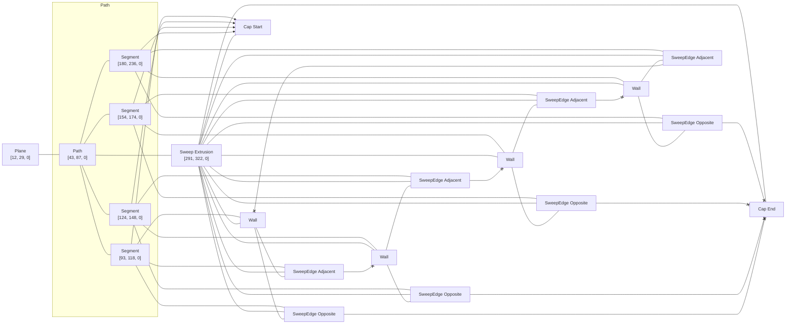

```mermaid
flowchart LR
  subgraph path2 [Path]
    2["Path<br>[43, 87, 0]"]
      %% [ProgramBodyItem { index: 1 }, VariableDeclarationDeclaration, VariableDeclarationInit, PipeBodyItem { index: 0 }]
    3["Segment<br>[93, 118, 0]"]
      %% [ProgramBodyItem { index: 1 }, VariableDeclarationDeclaration, VariableDeclarationInit, PipeBodyItem { index: 1 }]
    4["Segment<br>[124, 148, 0]"]
      %% [ProgramBodyItem { index: 1 }, VariableDeclarationDeclaration, VariableDeclarationInit, PipeBodyItem { index: 2 }]
    5["Segment<br>[154, 174, 0]"]
      %% [ProgramBodyItem { index: 1 }, VariableDeclarationDeclaration, VariableDeclarationInit, PipeBodyItem { index: 3 }]
    6["Segment<br>[180, 236, 0]"]
      %% [ProgramBodyItem { index: 1 }, VariableDeclarationDeclaration, VariableDeclarationInit, PipeBodyItem { index: 4 }]
  end
  1["Plane<br>[12, 29, 0]"]
    %% [ProgramBodyItem { index: 0 }, VariableDeclarationDeclaration, VariableDeclarationInit]
  7["Sweep Extrusion<br>[291, 322, 0]"]
    %% [ProgramBodyItem { index: 2 }, VariableDeclarationDeclaration, VariableDeclarationInit]
  8[Wall]
    %% face_code_ref=Missing NodePath
  9[Wall]
    %% face_code_ref=Missing NodePath
  10[Wall]
    %% face_code_ref=Missing NodePath
  11[Wall]
    %% face_code_ref=Missing NodePath
  12["Cap Start"]
    %% face_code_ref=Missing NodePath
  13["Cap End"]
    %% face_code_ref=Missing NodePath
  14["SweepEdge Opposite"]
  15["SweepEdge Adjacent"]
  16["SweepEdge Opposite"]
  17["SweepEdge Adjacent"]
  18["SweepEdge Opposite"]
  19["SweepEdge Adjacent"]
  20["SweepEdge Opposite"]
  21["SweepEdge Adjacent"]
  1 --- 2
  2 --- 3
  2 --- 4
  2 --- 5
  2 --- 6
  2 ---- 7
  3 --- 11
  3 x--> 12
  3 --- 20
  3 --- 21
  4 --- 10
  4 x--> 12
  4 --- 18
  4 --- 19
  5 --- 9
  5 x--> 12
  5 --- 16
  5 --- 17
  6 --- 8
  6 x--> 12
  6 --- 14
  6 --- 15
  7 --- 8
  7 --- 9
  7 --- 10
  7 --- 11
  7 --- 12
  7 --- 13
  7 --- 14
  7 --- 15
  7 --- 16
  7 --- 17
  7 --- 18
  7 --- 19
  7 --- 20
  7 --- 21
  8 --- 14
  8 --- 15
  17 <--x 8
  9 --- 16
  9 --- 17
  19 <--x 9
  10 --- 18
  10 --- 19
  21 <--x 10
  15 <--x 11
  11 --- 20
  11 --- 21
  14 <--x 13
  16 <--x 13
  18 <--x 13
  20 <--x 13
```
