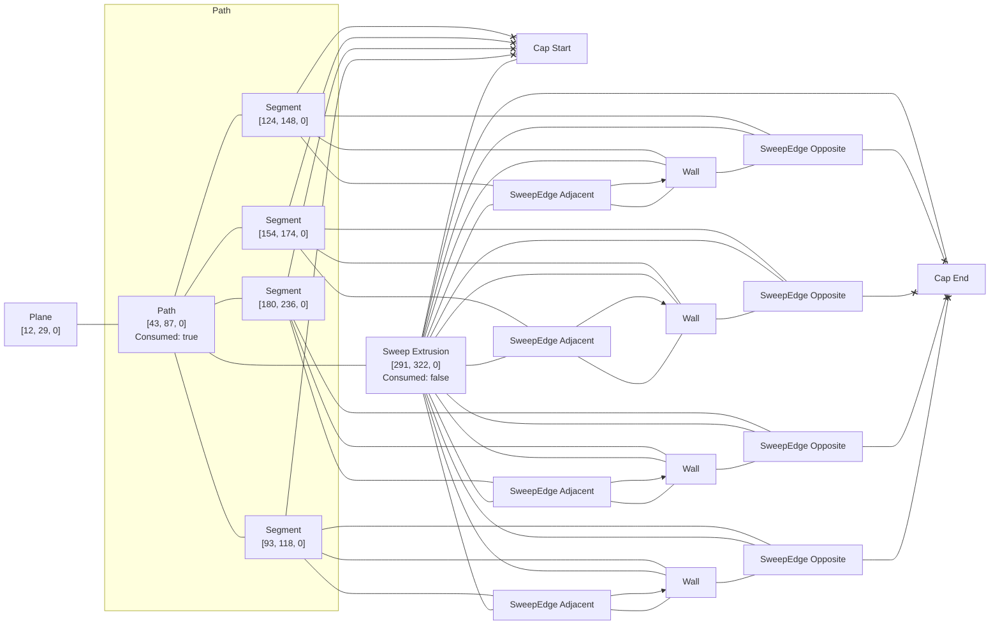

```mermaid
flowchart LR
  subgraph path3 [Path]
    3["Path<br>[43, 87, 0]<br>Consumed: true"]
      %% [ProgramBodyItem { index: 1 }, VariableDeclarationDeclaration, VariableDeclarationInit, PipeBodyItem { index: 0 }]
    5["Segment<br>[124, 148, 0]"]
      %% [ProgramBodyItem { index: 1 }, VariableDeclarationDeclaration, VariableDeclarationInit, PipeBodyItem { index: 2 }]
    6["Segment<br>[154, 174, 0]"]
      %% [ProgramBodyItem { index: 1 }, VariableDeclarationDeclaration, VariableDeclarationInit, PipeBodyItem { index: 3 }]
    7["Segment<br>[180, 236, 0]"]
      %% [ProgramBodyItem { index: 1 }, VariableDeclarationDeclaration, VariableDeclarationInit, PipeBodyItem { index: 4 }]
    8["Segment<br>[93, 118, 0]"]
      %% [ProgramBodyItem { index: 1 }, VariableDeclarationDeclaration, VariableDeclarationInit, PipeBodyItem { index: 1 }]
  end
  1["Cap End"]
    %% face_code_ref=Missing NodePath
  2["Cap Start"]
    %% face_code_ref=Missing NodePath
  4["Plane<br>[12, 29, 0]"]
    %% [ProgramBodyItem { index: 0 }, VariableDeclarationDeclaration, VariableDeclarationInit]
  9["Sweep Extrusion<br>[291, 322, 0]<br>Consumed: false"]
    %% [ProgramBodyItem { index: 2 }, VariableDeclarationDeclaration, VariableDeclarationInit]
  10["SweepEdge Adjacent"]
  11["SweepEdge Adjacent"]
  12["SweepEdge Adjacent"]
  13["SweepEdge Adjacent"]
  14["SweepEdge Opposite"]
  15["SweepEdge Opposite"]
  16["SweepEdge Opposite"]
  17["SweepEdge Opposite"]
  18[Wall]
    %% face_code_ref=Missing NodePath
  19[Wall]
    %% face_code_ref=Missing NodePath
  20[Wall]
    %% face_code_ref=Missing NodePath
  21[Wall]
    %% face_code_ref=Missing NodePath
  9 --- 1
  14 <--x 1
  15 <--x 1
  16 <--x 1
  17 <--x 1
  5 <--x 2
  6 <--x 2
  7 <--x 2
  8 <--x 2
  9 --- 2
  4 --- 3
  3 --- 5
  3 --- 6
  3 --- 7
  3 --- 8
  3 ---- 9
  5 --- 10
  5 --- 14
  5 --- 18
  6 --- 11
  6 --- 15
  6 --- 19
  7 --- 12
  7 --- 16
  7 --- 20
  8 --- 13
  8 --- 17
  8 --- 21
  9 --- 10
  9 --- 11
  9 --- 12
  9 --- 13
  9 --- 14
  9 --- 15
  9 --- 16
  9 --- 17
  9 --- 18
  9 --- 19
  9 --- 20
  9 --- 21
  18 --- 10
  10 x--> 18
  19 --- 11
  11 x--> 19
  20 --- 12
  12 x--> 20
  13 x--> 21
  21 --- 13
  18 --- 14
  19 --- 15
  20 --- 16
  21 --- 17
```
