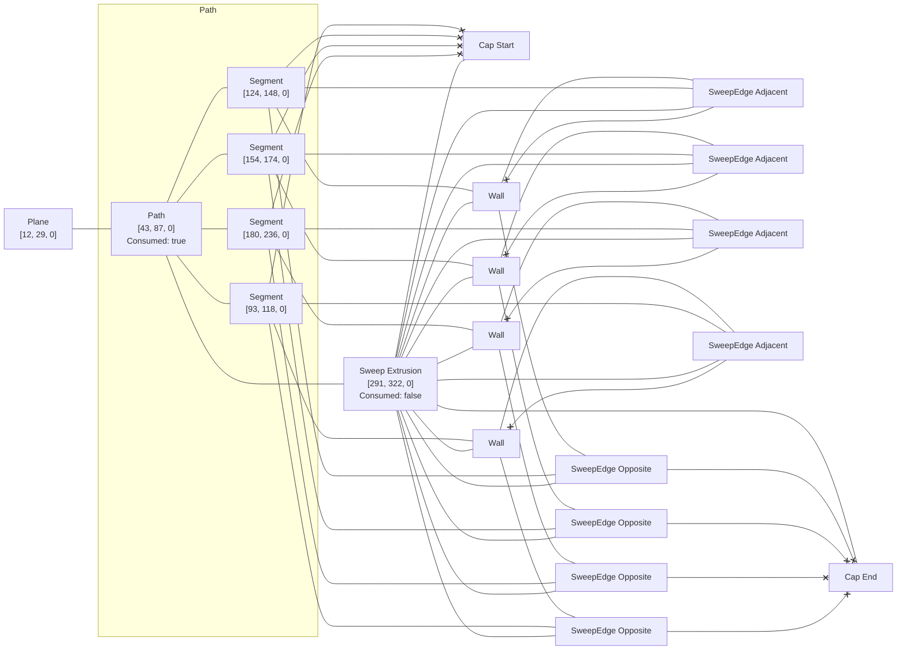

```mermaid
flowchart LR
  subgraph path8 [Path]
    8["Path<br>[43, 87, 0]<br>Consumed: true"]
      %% [ProgramBodyItem { index: 1 }, VariableDeclarationDeclaration, VariableDeclarationInit, PipeBodyItem { index: 0 }]
    9["Segment<br>[93, 118, 0]"]
      %% [ProgramBodyItem { index: 1 }, VariableDeclarationDeclaration, VariableDeclarationInit, PipeBodyItem { index: 1 }]
    10["Segment<br>[124, 148, 0]"]
      %% [ProgramBodyItem { index: 1 }, VariableDeclarationDeclaration, VariableDeclarationInit, PipeBodyItem { index: 2 }]
    11["Segment<br>[154, 174, 0]"]
      %% [ProgramBodyItem { index: 1 }, VariableDeclarationDeclaration, VariableDeclarationInit, PipeBodyItem { index: 3 }]
    12["Segment<br>[180, 236, 0]"]
      %% [ProgramBodyItem { index: 1 }, VariableDeclarationDeclaration, VariableDeclarationInit, PipeBodyItem { index: 4 }]
  end
  1["Cap End"]
    %% face_code_ref=Missing NodePath
  2["Cap Start"]
    %% face_code_ref=Missing NodePath
  3[Wall]
    %% face_code_ref=Missing NodePath
  4[Wall]
    %% face_code_ref=Missing NodePath
  5[Wall]
    %% face_code_ref=Missing NodePath
  6[Wall]
    %% face_code_ref=Missing NodePath
  7["Plane<br>[12, 29, 0]"]
    %% [ProgramBodyItem { index: 0 }, VariableDeclarationDeclaration, VariableDeclarationInit]
  13["Sweep Extrusion<br>[291, 322, 0]<br>Consumed: false"]
    %% [ProgramBodyItem { index: 2 }, VariableDeclarationDeclaration, VariableDeclarationInit]
  14["SweepEdge Adjacent"]
  15["SweepEdge Adjacent"]
  16["SweepEdge Adjacent"]
  17["SweepEdge Adjacent"]
  18["SweepEdge Opposite"]
  19["SweepEdge Opposite"]
  20["SweepEdge Opposite"]
  21["SweepEdge Opposite"]
  13 --- 1
  18 <--x 1
  19 <--x 1
  20 <--x 1
  21 <--x 1
  9 <--x 2
  10 <--x 2
  11 <--x 2
  12 <--x 2
  13 --- 2
  10 --- 3
  13 --- 3
  3 --- 14
  14 <--x 3
  3 --- 18
  11 --- 4
  13 --- 4
  4 --- 15
  15 <--x 4
  4 --- 19
  12 --- 5
  13 --- 5
  5 --- 16
  16 <--x 5
  5 --- 20
  9 --- 6
  13 --- 6
  6 --- 17
  17 <--x 6
  6 --- 21
  7 --- 8
  8 --- 9
  8 --- 10
  8 --- 11
  8 --- 12
  8 ---- 13
  9 --- 17
  9 --- 21
  10 --- 14
  10 --- 18
  11 --- 15
  11 --- 19
  12 --- 16
  12 --- 20
  13 --- 14
  13 --- 15
  13 --- 16
  13 --- 17
  13 --- 18
  13 --- 19
  13 --- 20
  13 --- 21
```
