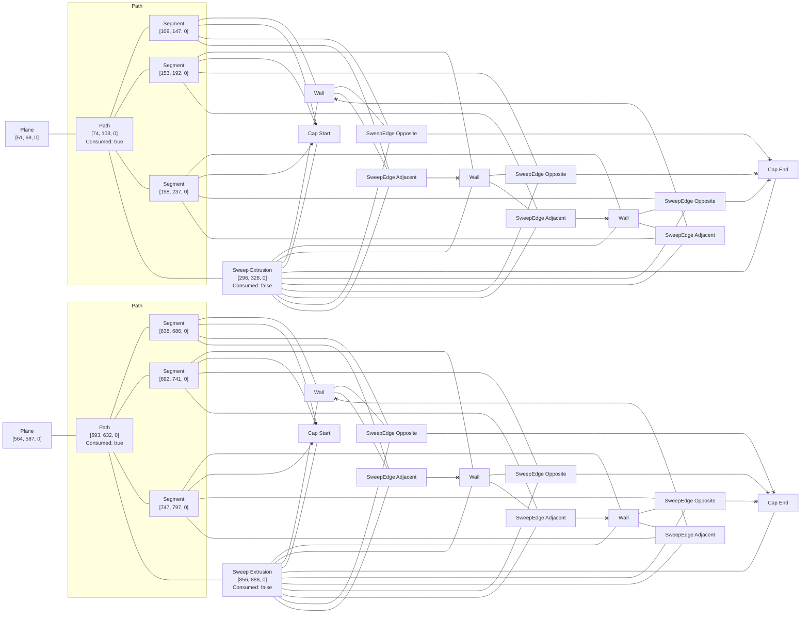

```mermaid
flowchart LR
  subgraph path2 [Path]
    2["Path<br>[74, 103, 0]<br>Consumed: true"]
      %% [ProgramBodyItem { index: 0 }, VariableDeclarationDeclaration, VariableDeclarationInit, PipeBodyItem { index: 1 }]
    3["Segment<br>[109, 147, 0]"]
      %% [ProgramBodyItem { index: 0 }, VariableDeclarationDeclaration, VariableDeclarationInit, PipeBodyItem { index: 2 }]
    4["Segment<br>[153, 192, 0]"]
      %% [ProgramBodyItem { index: 0 }, VariableDeclarationDeclaration, VariableDeclarationInit, PipeBodyItem { index: 3 }]
    5["Segment<br>[198, 237, 0]"]
      %% [ProgramBodyItem { index: 0 }, VariableDeclarationDeclaration, VariableDeclarationInit, PipeBodyItem { index: 4 }]
  end
  subgraph path19 [Path]
    19["Path<br>[593, 632, 0]<br>Consumed: true"]
      %% [ProgramBodyItem { index: 3 }, VariableDeclarationDeclaration, VariableDeclarationInit, PipeBodyItem { index: 1 }]
    20["Segment<br>[638, 686, 0]"]
      %% [ProgramBodyItem { index: 3 }, VariableDeclarationDeclaration, VariableDeclarationInit, PipeBodyItem { index: 2 }]
    21["Segment<br>[692, 741, 0]"]
      %% [ProgramBodyItem { index: 3 }, VariableDeclarationDeclaration, VariableDeclarationInit, PipeBodyItem { index: 3 }]
    22["Segment<br>[747, 797, 0]"]
      %% [ProgramBodyItem { index: 3 }, VariableDeclarationDeclaration, VariableDeclarationInit, PipeBodyItem { index: 4 }]
  end
  1["Plane<br>[51, 68, 0]"]
    %% [ProgramBodyItem { index: 0 }, VariableDeclarationDeclaration, VariableDeclarationInit, PipeBodyItem { index: 0 }]
  6["Sweep Extrusion<br>[296, 328, 0]<br>Consumed: false"]
    %% [ProgramBodyItem { index: 1 }, VariableDeclarationDeclaration, VariableDeclarationInit]
  7[Wall]
    %% face_code_ref=Missing NodePath
  8[Wall]
    %% face_code_ref=Missing NodePath
  9[Wall]
    %% face_code_ref=Missing NodePath
  10["Cap Start"]
    %% face_code_ref=Missing NodePath
  11["Cap End"]
    %% face_code_ref=Missing NodePath
  12["SweepEdge Opposite"]
  13["SweepEdge Adjacent"]
  14["SweepEdge Opposite"]
  15["SweepEdge Adjacent"]
  16["SweepEdge Opposite"]
  17["SweepEdge Adjacent"]
  18["Plane<br>[564, 587, 0]"]
    %% [ProgramBodyItem { index: 3 }, VariableDeclarationDeclaration, VariableDeclarationInit, PipeBodyItem { index: 0 }]
  23["Sweep Extrusion<br>[856, 888, 0]<br>Consumed: false"]
    %% [ProgramBodyItem { index: 4 }, VariableDeclarationDeclaration, VariableDeclarationInit]
  24[Wall]
    %% face_code_ref=Missing NodePath
  25[Wall]
    %% face_code_ref=Missing NodePath
  26[Wall]
    %% face_code_ref=Missing NodePath
  27["Cap Start"]
    %% face_code_ref=Missing NodePath
  28["Cap End"]
    %% face_code_ref=Missing NodePath
  29["SweepEdge Opposite"]
  30["SweepEdge Adjacent"]
  31["SweepEdge Opposite"]
  32["SweepEdge Adjacent"]
  33["SweepEdge Opposite"]
  34["SweepEdge Adjacent"]
  1 --- 2
  2 --- 3
  2 --- 4
  2 --- 5
  2 ---- 6
  3 --- 9
  3 x--> 10
  3 --- 16
  3 --- 17
  4 --- 8
  4 x--> 10
  4 --- 14
  4 --- 15
  5 --- 7
  5 x--> 10
  5 --- 12
  5 --- 13
  6 --- 7
  6 --- 8
  6 --- 9
  6 --- 10
  6 --- 11
  6 --- 12
  6 --- 13
  6 --- 14
  6 --- 15
  6 --- 16
  6 --- 17
  7 --- 12
  7 --- 13
  15 <--x 7
  8 --- 14
  8 --- 15
  17 <--x 8
  13 <--x 9
  9 --- 16
  9 --- 17
  12 <--x 11
  14 <--x 11
  16 <--x 11
  18 --- 19
  19 --- 20
  19 --- 21
  19 --- 22
  19 ---- 23
  20 --- 26
  20 x--> 27
  20 --- 33
  20 --- 34
  21 --- 25
  21 x--> 27
  21 --- 31
  21 --- 32
  22 --- 24
  22 x--> 27
  22 --- 29
  22 --- 30
  23 --- 24
  23 --- 25
  23 --- 26
  23 --- 27
  23 --- 28
  23 --- 29
  23 --- 30
  23 --- 31
  23 --- 32
  23 --- 33
  23 --- 34
  24 --- 29
  24 --- 30
  32 <--x 24
  25 --- 31
  25 --- 32
  34 <--x 25
  30 <--x 26
  26 --- 33
  26 --- 34
  29 <--x 28
  31 <--x 28
  33 <--x 28
```
