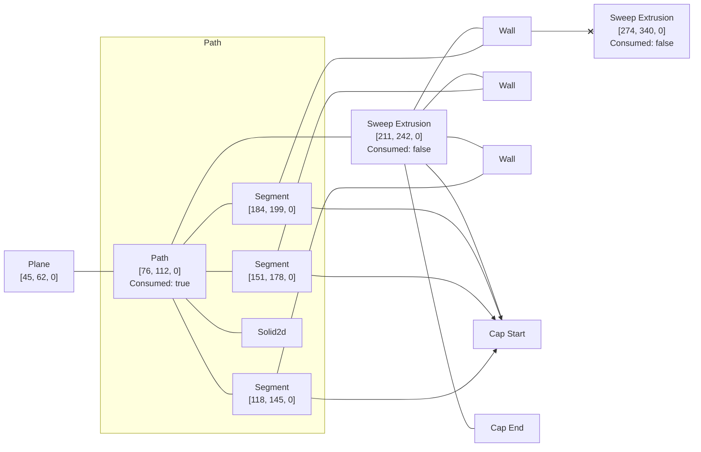

```mermaid
flowchart LR
  subgraph path2 [Path]
    2["Path<br>[76, 112, 0]<br>Consumed: true"]
      %% [ProgramBodyItem { index: 1 }, VariableDeclarationDeclaration, VariableDeclarationInit, PipeBodyItem { index: 0 }]
    3["Segment<br>[118, 145, 0]"]
      %% [ProgramBodyItem { index: 1 }, VariableDeclarationDeclaration, VariableDeclarationInit, PipeBodyItem { index: 1 }]
    4["Segment<br>[151, 178, 0]"]
      %% [ProgramBodyItem { index: 1 }, VariableDeclarationDeclaration, VariableDeclarationInit, PipeBodyItem { index: 2 }]
    5["Segment<br>[184, 199, 0]"]
      %% [ProgramBodyItem { index: 1 }, VariableDeclarationDeclaration, VariableDeclarationInit, PipeBodyItem { index: 3 }]
    6[Solid2d]
  end
  1["Plane<br>[45, 62, 0]"]
    %% [ProgramBodyItem { index: 0 }, VariableDeclarationDeclaration, VariableDeclarationInit]
  7["Sweep Extrusion<br>[211, 242, 0]<br>Consumed: false"]
    %% [ProgramBodyItem { index: 2 }, VariableDeclarationDeclaration, VariableDeclarationInit]
  8[Wall]
    %% face_code_ref=Missing NodePath
  9[Wall]
    %% face_code_ref=Missing NodePath
  10[Wall]
    %% face_code_ref=Missing NodePath
  11["Cap Start"]
    %% face_code_ref=Missing NodePath
  12["Cap End"]
    %% face_code_ref=Missing NodePath
  13["Sweep Extrusion<br>[274, 340, 0]<br>Consumed: false"]
    %% [ProgramBodyItem { index: 3 }, ExpressionStatementExpr, PipeBodyItem { index: 0 }]
  1 --- 2
  2 --- 3
  2 --- 4
  2 --- 5
  2 --- 6
  2 ---- 7
  3 --- 10
  3 x--> 11
  4 --- 9
  4 x--> 11
  5 --- 8
  5 x--> 11
  7 --- 8
  7 --- 9
  7 --- 10
  7 --- 11
  7 --- 12
  8 <--x 13
```
