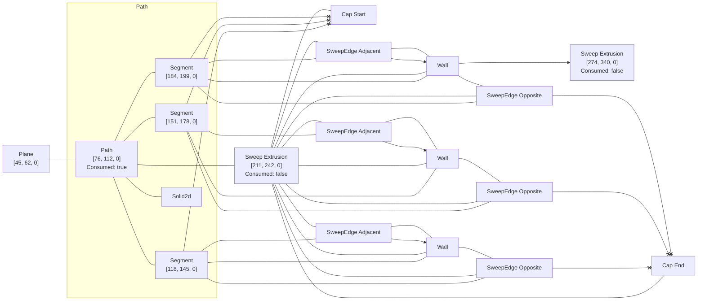

```mermaid
flowchart LR
  subgraph path3 [Path]
    3["Path<br>[76, 112, 0]<br>Consumed: true"]
      %% [ProgramBodyItem { index: 1 }, VariableDeclarationDeclaration, VariableDeclarationInit, PipeBodyItem { index: 0 }]
    5["Segment<br>[118, 145, 0]"]
      %% [ProgramBodyItem { index: 1 }, VariableDeclarationDeclaration, VariableDeclarationInit, PipeBodyItem { index: 1 }]
    6["Segment<br>[151, 178, 0]"]
      %% [ProgramBodyItem { index: 1 }, VariableDeclarationDeclaration, VariableDeclarationInit, PipeBodyItem { index: 2 }]
    7["Segment<br>[184, 199, 0]"]
      %% [ProgramBodyItem { index: 1 }, VariableDeclarationDeclaration, VariableDeclarationInit, PipeBodyItem { index: 3 }]
    8[Solid2d]
  end
  4["Plane<br>[45, 62, 0]"]
    %% [ProgramBodyItem { index: 0 }, VariableDeclarationDeclaration, VariableDeclarationInit]
  9["Sweep Extrusion<br>[211, 242, 0]<br>Consumed: false"]
    %% [ProgramBodyItem { index: 2 }, VariableDeclarationDeclaration, VariableDeclarationInit]
  19[Wall]
    %% face_code_ref=Missing NodePath
  18[Wall]
    %% face_code_ref=Missing NodePath
  17[Wall]
    %% face_code_ref=Missing NodePath
  2["Cap Start"]
    %% face_code_ref=Missing NodePath
  1["Cap End"]
    %% face_code_ref=Missing NodePath
  16["SweepEdge Opposite"]
  13["SweepEdge Adjacent"]
  15["SweepEdge Opposite"]
  12["SweepEdge Adjacent"]
  14["SweepEdge Opposite"]
  11["SweepEdge Adjacent"]
  10["Sweep Extrusion<br>[274, 340, 0]<br>Consumed: false"]
    %% [ProgramBodyItem { index: 3 }, ExpressionStatementExpr, PipeBodyItem { index: 0 }]
  9 --- 1
  14 <--x 1
  15 <--x 1
  16 <--x 1
  5 <--x 2
  6 <--x 2
  7 <--x 2
  9 --- 2
  4 --- 3
  3 --- 5
  3 --- 6
  3 --- 7
  3 --- 8
  3 ---- 9
  5 --- 11
  5 --- 14
  5 --- 17
  6 --- 12
  6 --- 15
  6 --- 18
  7 --- 13
  7 --- 16
  7 --- 19
  9 --- 11
  9 --- 12
  9 --- 13
  9 --- 14
  9 --- 15
  9 --- 16
  9 --- 17
  9 --- 18
  9 --- 19
  19 x--> 10
  17 --- 11
  11 x--> 17
  18 --- 12
  12 x--> 18
  19 --- 13
  13 x--> 19
  17 --- 14
  18 --- 15
  19 --- 16
```
