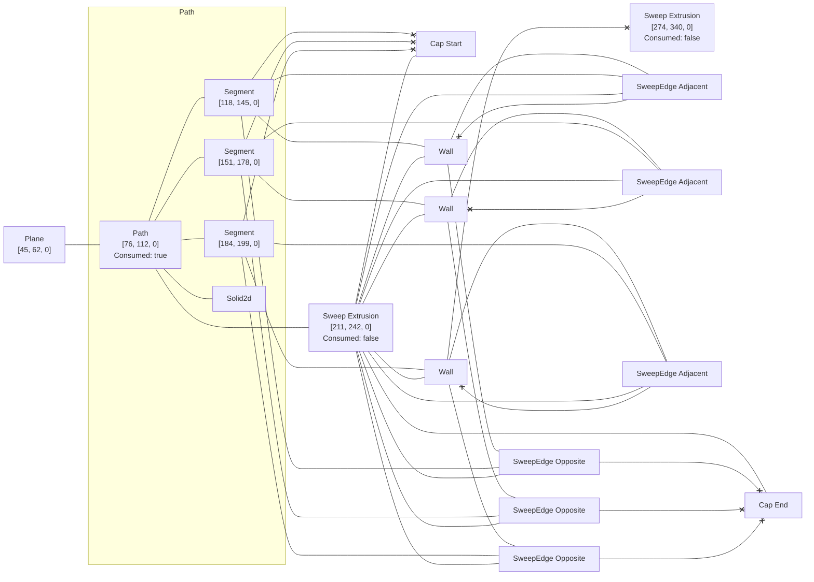

```mermaid
flowchart LR
  subgraph path7 [Path]
    7["Path<br>[76, 112, 0]<br>Consumed: true"]
      %% [ProgramBodyItem { index: 1 }, VariableDeclarationDeclaration, VariableDeclarationInit, PipeBodyItem { index: 0 }]
    8["Segment<br>[118, 145, 0]"]
      %% [ProgramBodyItem { index: 1 }, VariableDeclarationDeclaration, VariableDeclarationInit, PipeBodyItem { index: 1 }]
    9["Segment<br>[151, 178, 0]"]
      %% [ProgramBodyItem { index: 1 }, VariableDeclarationDeclaration, VariableDeclarationInit, PipeBodyItem { index: 2 }]
    10["Segment<br>[184, 199, 0]"]
      %% [ProgramBodyItem { index: 1 }, VariableDeclarationDeclaration, VariableDeclarationInit, PipeBodyItem { index: 3 }]
    13[Solid2d]
  end
  1["Cap End"]
    %% face_code_ref=Missing NodePath
  2["Cap Start"]
    %% face_code_ref=Missing NodePath
  3[Wall]
    %% face_code_ref=Missing NodePath
  4[Wall]
    %% face_code_ref=Missing NodePath
  5[Wall]
    %% face_code_ref=Missing NodePath
  6["Plane<br>[45, 62, 0]"]
    %% [ProgramBodyItem { index: 0 }, VariableDeclarationDeclaration, VariableDeclarationInit]
  11["Sweep Extrusion<br>[211, 242, 0]<br>Consumed: false"]
    %% [ProgramBodyItem { index: 2 }, VariableDeclarationDeclaration, VariableDeclarationInit]
  12["Sweep Extrusion<br>[274, 340, 0]<br>Consumed: false"]
    %% [ProgramBodyItem { index: 3 }, ExpressionStatementExpr, PipeBodyItem { index: 0 }]
  14["SweepEdge Adjacent"]
  15["SweepEdge Adjacent"]
  16["SweepEdge Adjacent"]
  17["SweepEdge Opposite"]
  18["SweepEdge Opposite"]
  19["SweepEdge Opposite"]
  11 --- 1
  17 <--x 1
  18 <--x 1
  19 <--x 1
  8 <--x 2
  9 <--x 2
  10 <--x 2
  11 --- 2
  8 --- 3
  11 --- 3
  3 --- 14
  14 <--x 3
  3 --- 17
  9 --- 4
  11 --- 4
  4 --- 15
  15 <--x 4
  4 --- 18
  10 --- 5
  11 --- 5
  5 <--x 12
  5 --- 16
  16 <--x 5
  5 --- 19
  6 --- 7
  7 --- 8
  7 --- 9
  7 --- 10
  7 ---- 11
  7 --- 13
  8 --- 14
  8 --- 17
  9 --- 15
  9 --- 18
  10 --- 16
  10 --- 19
  11 --- 14
  11 --- 15
  11 --- 16
  11 --- 17
  11 --- 18
  11 --- 19
```
