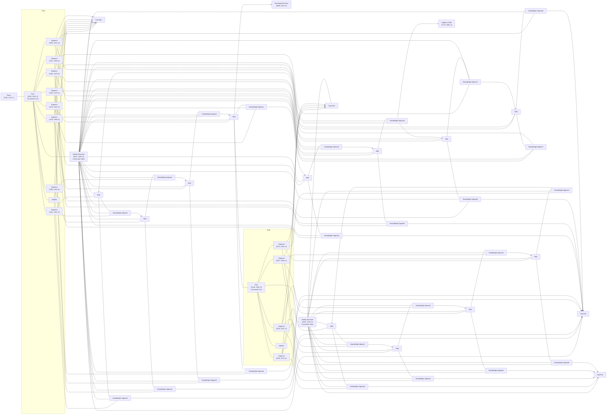

```mermaid
flowchart LR
  subgraph path2 [Path]
    2["Path<br>[1155, 1193, 0]<br>Consumed: true"]
      %% [ProgramBodyItem { index: 11 }, VariableDeclarationDeclaration, VariableDeclarationInit, FunctionExpressionBody, FunctionExpressionBodyItem { index: 0 }, VariableDeclarationDeclaration, VariableDeclarationInit, PipeBodyItem { index: 1 }]
    3["Segment<br>[1201, 1251, 0]"]
      %% [ProgramBodyItem { index: 11 }, VariableDeclarationDeclaration, VariableDeclarationInit, FunctionExpressionBody, FunctionExpressionBodyItem { index: 0 }, VariableDeclarationDeclaration, VariableDeclarationInit, PipeBodyItem { index: 2 }]
    4["Segment<br>[1259, 1308, 0]"]
      %% [ProgramBodyItem { index: 11 }, VariableDeclarationDeclaration, VariableDeclarationInit, FunctionExpressionBody, FunctionExpressionBodyItem { index: 0 }, VariableDeclarationDeclaration, VariableDeclarationInit, PipeBodyItem { index: 3 }]
    5["Segment<br>[1316, 1368, 0]"]
      %% [ProgramBodyItem { index: 11 }, VariableDeclarationDeclaration, VariableDeclarationInit, FunctionExpressionBody, FunctionExpressionBodyItem { index: 0 }, VariableDeclarationDeclaration, VariableDeclarationInit, PipeBodyItem { index: 4 }]
    6["Segment<br>[1376, 1424, 0]"]
      %% [ProgramBodyItem { index: 11 }, VariableDeclarationDeclaration, VariableDeclarationInit, FunctionExpressionBody, FunctionExpressionBodyItem { index: 0 }, VariableDeclarationDeclaration, VariableDeclarationInit, PipeBodyItem { index: 5 }]
    7["Segment<br>[1432, 1476, 0]"]
      %% [ProgramBodyItem { index: 11 }, VariableDeclarationDeclaration, VariableDeclarationInit, FunctionExpressionBody, FunctionExpressionBodyItem { index: 0 }, VariableDeclarationDeclaration, VariableDeclarationInit, PipeBodyItem { index: 6 }]
    8["Segment<br>[1484, 1529, 0]"]
      %% [ProgramBodyItem { index: 11 }, VariableDeclarationDeclaration, VariableDeclarationInit, FunctionExpressionBody, FunctionExpressionBodyItem { index: 0 }, VariableDeclarationDeclaration, VariableDeclarationInit, PipeBodyItem { index: 7 }]
    9["Segment<br>[1537, 1586, 0]"]
      %% [ProgramBodyItem { index: 11 }, VariableDeclarationDeclaration, VariableDeclarationInit, FunctionExpressionBody, FunctionExpressionBodyItem { index: 0 }, VariableDeclarationDeclaration, VariableDeclarationInit, PipeBodyItem { index: 8 }]
    10["Segment<br>[1594, 1613, 0]"]
      %% [ProgramBodyItem { index: 11 }, VariableDeclarationDeclaration, VariableDeclarationInit, FunctionExpressionBody, FunctionExpressionBodyItem { index: 0 }, VariableDeclarationDeclaration, VariableDeclarationInit, PipeBodyItem { index: 9 }]
    11[Solid2d]
  end
  subgraph path40 [Path]
    40["Path<br>[2148, 2188, 0]<br>Consumed: true"]
      %% [ProgramBodyItem { index: 14 }, VariableDeclarationDeclaration, VariableDeclarationInit, PipeBodyItem { index: 1 }]
    41["Segment<br>[2194, 2214, 0]"]
      %% [ProgramBodyItem { index: 14 }, VariableDeclarationDeclaration, VariableDeclarationInit, PipeBodyItem { index: 2 }]
    42["Segment<br>[2220, 2241, 0]"]
      %% [ProgramBodyItem { index: 14 }, VariableDeclarationDeclaration, VariableDeclarationInit, PipeBodyItem { index: 3 }]
    43["Segment<br>[2247, 2268, 0]"]
      %% [ProgramBodyItem { index: 14 }, VariableDeclarationDeclaration, VariableDeclarationInit, PipeBodyItem { index: 4 }]
    44["Segment<br>[2274, 2281, 0]"]
      %% [ProgramBodyItem { index: 14 }, VariableDeclarationDeclaration, VariableDeclarationInit, PipeBodyItem { index: 5 }]
    45[Solid2d]
  end
  1["Plane<br>[1120, 1147, 0]"]
    %% [ProgramBodyItem { index: 11 }, VariableDeclarationDeclaration, VariableDeclarationInit, FunctionExpressionBody, FunctionExpressionBodyItem { index: 0 }, VariableDeclarationDeclaration, VariableDeclarationInit, PipeBodyItem { index: 0 }]
  12["Sweep Extrusion<br>[1621, 1655, 0]<br>Consumed: false"]
    %% [ProgramBodyItem { index: 11 }, VariableDeclarationDeclaration, VariableDeclarationInit, FunctionExpressionBody, FunctionExpressionBodyItem { index: 0 }, VariableDeclarationDeclaration, VariableDeclarationInit, PipeBodyItem { index: 10 }]
  13[Wall]
    %% face_code_ref=Missing NodePath
  14[Wall]
    %% face_code_ref=Missing NodePath
  15[Wall]
    %% face_code_ref=Missing NodePath
  16[Wall]
    %% face_code_ref=[ProgramBodyItem { index: 14 }, VariableDeclarationDeclaration, VariableDeclarationInit, PipeBodyItem { index: 0 }]
  17[Wall]
    %% face_code_ref=Missing NodePath
  18[Wall]
    %% face_code_ref=Missing NodePath
  19[Wall]
    %% face_code_ref=Missing NodePath
  20[Wall]
    %% face_code_ref=Missing NodePath
  21["Cap Start"]
    %% face_code_ref=Missing NodePath
  22["Cap End"]
    %% face_code_ref=Missing NodePath
  23["SweepEdge Opposite"]
  24["SweepEdge Adjacent"]
  25["SweepEdge Opposite"]
  26["SweepEdge Adjacent"]
  27["SweepEdge Opposite"]
  28["SweepEdge Adjacent"]
  29["SweepEdge Opposite"]
  30["SweepEdge Adjacent"]
  31["SweepEdge Opposite"]
  32["SweepEdge Adjacent"]
  33["SweepEdge Opposite"]
  34["SweepEdge Adjacent"]
  35["SweepEdge Opposite"]
  36["SweepEdge Adjacent"]
  37["SweepEdge Opposite"]
  38["SweepEdge Adjacent"]
  39["EdgeCut Fillet<br>[1775, 2062, 0]"]
    %% [ProgramBodyItem { index: 13 }, VariableDeclarationDeclaration, VariableDeclarationInit, PipeBodyItem { index: 1 }]
  46["Sweep Extrusion<br>[2287, 2315, 0]<br>Consumed: false"]
    %% [ProgramBodyItem { index: 14 }, VariableDeclarationDeclaration, VariableDeclarationInit, PipeBodyItem { index: 6 }]
  47[Wall]
    %% face_code_ref=Missing NodePath
  48[Wall]
    %% face_code_ref=Missing NodePath
  49[Wall]
    %% face_code_ref=Missing NodePath
  50[Wall]
    %% face_code_ref=Missing NodePath
  51["Cap Start"]
    %% face_code_ref=Missing NodePath
  52["Cap End"]
    %% face_code_ref=Missing NodePath
  53["SweepEdge Opposite"]
  54["SweepEdge Adjacent"]
  55["SweepEdge Opposite"]
  56["SweepEdge Adjacent"]
  57["SweepEdge Opposite"]
  58["SweepEdge Adjacent"]
  59["SweepEdge Opposite"]
  60["SweepEdge Adjacent"]
  61["StartSketchOnFace<br>[2096, 2142, 0]"]
    %% [ProgramBodyItem { index: 14 }, VariableDeclarationDeclaration, VariableDeclarationInit, PipeBodyItem { index: 0 }]
  1 --- 2
  2 --- 3
  2 --- 4
  2 --- 5
  2 --- 6
  2 --- 7
  2 --- 8
  2 --- 9
  2 --- 10
  2 --- 11
  2 ---- 12
  3 --- 13
  3 x--> 21
  3 --- 23
  3 --- 24
  4 --- 14
  4 x--> 21
  4 --- 25
  4 --- 26
  5 --- 15
  5 x--> 21
  5 --- 27
  5 --- 28
  6 --- 16
  6 x--> 21
  6 --- 29
  6 --- 30
  7 --- 17
  7 x--> 21
  7 --- 31
  7 --- 32
  8 --- 18
  8 x--> 21
  8 --- 33
  8 --- 34
  9 --- 19
  9 x--> 21
  9 --- 35
  9 --- 36
  10 --- 20
  10 x--> 21
  10 --- 37
  10 --- 38
  12 --- 13
  12 --- 14
  12 --- 15
  12 --- 16
  12 --- 17
  12 --- 18
  12 --- 19
  12 --- 20
  12 --- 21
  12 --- 22
  12 --- 23
  12 --- 24
  12 --- 25
  12 --- 26
  12 --- 27
  12 --- 28
  12 --- 29
  12 --- 30
  12 --- 31
  12 --- 32
  12 --- 33
  12 --- 34
  12 --- 35
  12 --- 36
  12 --- 37
  12 --- 38
  13 --- 23
  13 --- 24
  38 <--x 13
  24 <--x 14
  14 --- 25
  14 --- 26
  26 <--x 15
  15 --- 27
  15 --- 28
  28 <--x 16
  16 --- 29
  16 --- 30
  16 --- 40
  16 <--x 61
  30 <--x 17
  17 --- 31
  17 --- 32
  32 <--x 18
  18 --- 33
  18 --- 34
  34 <--x 19
  19 --- 35
  19 --- 36
  36 <--x 20
  20 --- 37
  20 --- 38
  23 <--x 22
  25 <--x 22
  27 <--x 22
  29 <--x 22
  31 <--x 22
  33 <--x 22
  35 <--x 22
  37 <--x 22
  34 <--x 39
  40 --- 41
  40 --- 42
  40 --- 43
  40 --- 44
  40 --- 45
  40 ---- 46
  41 --- 47
  41 x--> 51
  41 --- 53
  41 --- 54
  42 --- 48
  42 x--> 51
  42 --- 55
  42 --- 56
  43 --- 49
  43 x--> 51
  43 --- 57
  43 --- 58
  44 --- 50
  44 x--> 51
  44 --- 59
  44 --- 60
  46 --- 47
  46 --- 48
  46 --- 49
  46 --- 50
  46 --- 51
  46 --- 52
  46 --- 53
  46 --- 54
  46 --- 55
  46 --- 56
  46 --- 57
  46 --- 58
  46 --- 59
  46 --- 60
  47 --- 53
  47 --- 54
  60 <--x 47
  54 <--x 48
  48 --- 55
  48 --- 56
  56 <--x 49
  49 --- 57
  49 --- 58
  58 <--x 50
  50 --- 59
  50 --- 60
  53 <--x 52
  55 <--x 52
  57 <--x 52
  59 <--x 52
```
