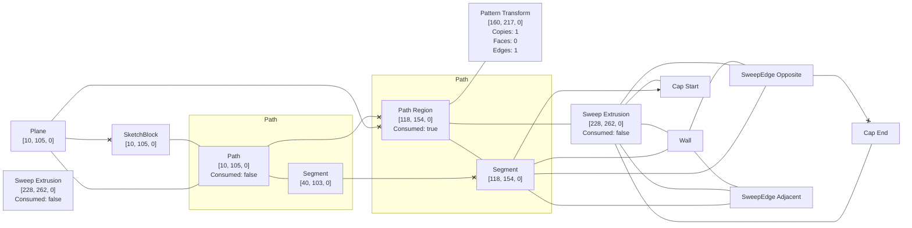

```mermaid
flowchart LR
  subgraph path2 [Path]
    2["Path<br>[10, 105, 0]<br>Consumed: false"]
      %% [ProgramBodyItem { index: 0 }, VariableDeclarationDeclaration, VariableDeclarationInit]
    3["Segment<br>[40, 103, 0]"]
      %% [ProgramBodyItem { index: 0 }, VariableDeclarationDeclaration, VariableDeclarationInit, SketchBlockBody, SketchBlockBodyItem { index: 0 }, VariableDeclarationDeclaration, VariableDeclarationInit]
  end
  subgraph path4 [Path]
    4["Path Region<br>[118, 154, 0]<br>Consumed: true"]
      %% [ProgramBodyItem { index: 1 }, VariableDeclarationDeclaration, VariableDeclarationInit, PipeBodyItem { index: 0 }]
    5["Segment<br>[118, 154, 0]"]
      %% [ProgramBodyItem { index: 1 }, VariableDeclarationDeclaration, VariableDeclarationInit, PipeBodyItem { index: 0 }]
  end
  1["Plane<br>[10, 105, 0]"]
    %% [ProgramBodyItem { index: 0 }, VariableDeclarationDeclaration, VariableDeclarationInit]
  6["Pattern Transform<br>[160, 217, 0]<br>Copies: 1<br>Faces: 0<br>Edges: 1"]
    %% [ProgramBodyItem { index: 1 }, VariableDeclarationDeclaration, VariableDeclarationInit, PipeBodyItem { index: 1 }]
  7["Sweep Extrusion<br>[228, 262, 0]<br>Consumed: false"]
    %% [ProgramBodyItem { index: 2 }, VariableDeclarationDeclaration, VariableDeclarationInit]
  8[Wall]
    %% face_code_ref=Missing NodePath
  9["Cap Start"]
    %% face_code_ref=Missing NodePath
  10["Cap End"]
    %% face_code_ref=Missing NodePath
  11["SweepEdge Opposite"]
  12["SweepEdge Adjacent"]
  13["Sweep Extrusion<br>[228, 262, 0]<br>Consumed: false"]
    %% [ProgramBodyItem { index: 2 }, VariableDeclarationDeclaration, VariableDeclarationInit]
  14["SketchBlock<br>[10, 105, 0]"]
    %% [ProgramBodyItem { index: 0 }, VariableDeclarationDeclaration, VariableDeclarationInit]
  1 --- 2
  1 <--x 4
  1 <--x 14
  2 --- 3
  2 <--x 4
  14 --- 2
  3 <--x 5
  4 --- 5
  4 --- 6
  4 ---- 7
  5 --- 8
  5 x--> 9
  5 --- 11
  5 --- 12
  7 --- 8
  7 --- 9
  7 --- 10
  7 --- 11
  7 --- 12
  8 --- 11
  8 --- 12
  11 <--x 10
```
