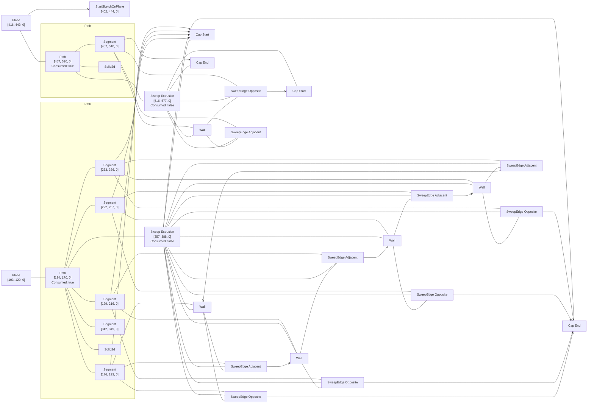

```mermaid
flowchart LR
  subgraph path2 [Path]
    2["Path<br>[134, 170, 0]<br>Consumed: true"]
      %% [ProgramBodyItem { index: 1 }, VariableDeclarationDeclaration, VariableDeclarationInit, PipeBodyItem { index: 0 }]
    3["Segment<br>[176, 193, 0]"]
      %% [ProgramBodyItem { index: 1 }, VariableDeclarationDeclaration, VariableDeclarationInit, PipeBodyItem { index: 1 }]
    4["Segment<br>[199, 216, 0]"]
      %% [ProgramBodyItem { index: 1 }, VariableDeclarationDeclaration, VariableDeclarationInit, PipeBodyItem { index: 2 }]
    5["Segment<br>[222, 257, 0]"]
      %% [ProgramBodyItem { index: 1 }, VariableDeclarationDeclaration, VariableDeclarationInit, PipeBodyItem { index: 3 }]
    6["Segment<br>[263, 336, 0]"]
      %% [ProgramBodyItem { index: 1 }, VariableDeclarationDeclaration, VariableDeclarationInit, PipeBodyItem { index: 4 }]
    7["Segment<br>[342, 349, 0]"]
      %% [ProgramBodyItem { index: 1 }, VariableDeclarationDeclaration, VariableDeclarationInit, PipeBodyItem { index: 5 }]
    8[Solid2d]
  end
  subgraph path25 [Path]
    25["Path<br>[457, 510, 0]<br>Consumed: true"]
      %% [ProgramBodyItem { index: 4 }, VariableDeclarationDeclaration, VariableDeclarationInit]
    26["Segment<br>[457, 510, 0]"]
      %% [ProgramBodyItem { index: 4 }, VariableDeclarationDeclaration, VariableDeclarationInit]
    27[Solid2d]
  end
  1["Plane<br>[103, 120, 0]"]
    %% [ProgramBodyItem { index: 0 }, VariableDeclarationDeclaration, VariableDeclarationInit]
  9["Sweep Extrusion<br>[357, 388, 0]<br>Consumed: false"]
    %% [ProgramBodyItem { index: 2 }, VariableDeclarationDeclaration, VariableDeclarationInit]
  10[Wall]
    %% face_code_ref=Missing NodePath
  11[Wall]
    %% face_code_ref=Missing NodePath
  12[Wall]
    %% face_code_ref=Missing NodePath
  13[Wall]
    %% face_code_ref=Missing NodePath
  14["Cap Start"]
    %% face_code_ref=Missing NodePath
  15["Cap End"]
    %% face_code_ref=Missing NodePath
  16["SweepEdge Opposite"]
  17["SweepEdge Adjacent"]
  18["SweepEdge Opposite"]
  19["SweepEdge Adjacent"]
  20["SweepEdge Opposite"]
  21["SweepEdge Adjacent"]
  22["SweepEdge Opposite"]
  23["SweepEdge Adjacent"]
  24["Plane<br>[416, 443, 0]"]
    %% [ProgramBodyItem { index: 3 }, VariableDeclarationDeclaration, VariableDeclarationInit, CallKwUnlabeledArg]
  28["Sweep Extrusion<br>[516, 577, 0]<br>Consumed: false"]
    %% [ProgramBodyItem { index: 5 }, VariableDeclarationDeclaration, VariableDeclarationInit]
  29[Wall]
    %% face_code_ref=Missing NodePath
  30["Cap Start"]
    %% face_code_ref=Missing NodePath
  31["Cap End"]
    %% face_code_ref=Missing NodePath
  32["SweepEdge Opposite"]
  33["SweepEdge Adjacent"]
  34["StartSketchOnPlane<br>[402, 444, 0]"]
    %% [ProgramBodyItem { index: 3 }, VariableDeclarationDeclaration, VariableDeclarationInit]
  1 --- 2
  2 --- 3
  2 --- 4
  2 --- 5
  2 --- 6
  2 --- 7
  2 --- 8
  2 ---- 9
  3 --- 13
  3 x--> 14
  3 --- 22
  3 --- 23
  4 --- 12
  4 x--> 14
  4 --- 20
  4 --- 21
  5 --- 11
  5 x--> 14
  5 --- 18
  5 --- 19
  6 --- 10
  6 x--> 14
  6 --- 16
  6 --- 17
  9 --- 10
  9 --- 11
  9 --- 12
  9 --- 13
  9 --- 14
  9 --- 15
  9 --- 16
  9 --- 17
  9 --- 18
  9 --- 19
  9 --- 20
  9 --- 21
  9 --- 22
  9 --- 23
  10 --- 16
  10 --- 17
  19 <--x 10
  11 --- 18
  11 --- 19
  21 <--x 11
  12 --- 20
  12 --- 21
  23 <--x 12
  17 <--x 13
  13 --- 22
  13 --- 23
  16 <--x 15
  18 <--x 15
  20 <--x 15
  22 <--x 15
  24 --- 25
  24 <--x 34
  25 --- 26
  25 --- 27
  25 ---- 28
  26 --- 29
  26 x--> 31
  26 --- 32
  26 --- 33
  28 --- 29
  28 --- 30
  28 --- 31
  28 --- 32
  28 --- 33
  29 --- 32
  29 --- 33
  32 <--x 30
```
