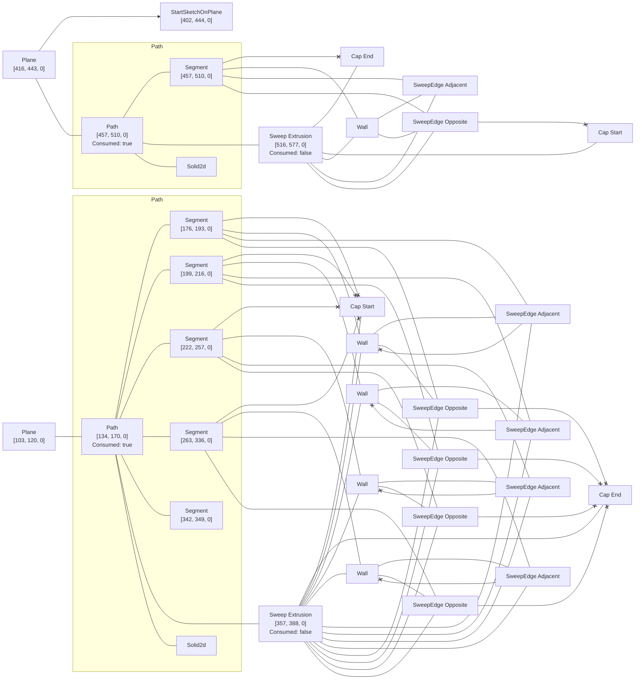

```mermaid
flowchart LR
  subgraph path11 [Path]
    11["Path<br>[134, 170, 0]<br>Consumed: true"]
      %% [ProgramBodyItem { index: 1 }, VariableDeclarationDeclaration, VariableDeclarationInit, PipeBodyItem { index: 0 }]
    12["Segment<br>[176, 193, 0]"]
      %% [ProgramBodyItem { index: 1 }, VariableDeclarationDeclaration, VariableDeclarationInit, PipeBodyItem { index: 1 }]
    13["Segment<br>[199, 216, 0]"]
      %% [ProgramBodyItem { index: 1 }, VariableDeclarationDeclaration, VariableDeclarationInit, PipeBodyItem { index: 2 }]
    14["Segment<br>[222, 257, 0]"]
      %% [ProgramBodyItem { index: 1 }, VariableDeclarationDeclaration, VariableDeclarationInit, PipeBodyItem { index: 3 }]
    15["Segment<br>[263, 336, 0]"]
      %% [ProgramBodyItem { index: 1 }, VariableDeclarationDeclaration, VariableDeclarationInit, PipeBodyItem { index: 4 }]
    16["Segment<br>[342, 349, 0]"]
      %% [ProgramBodyItem { index: 1 }, VariableDeclarationDeclaration, VariableDeclarationInit, PipeBodyItem { index: 5 }]
    23[Solid2d]
  end
  subgraph path20 [Path]
    20["Path<br>[457, 510, 0]<br>Consumed: true"]
      %% [ProgramBodyItem { index: 4 }, VariableDeclarationDeclaration, VariableDeclarationInit]
    21["Segment<br>[457, 510, 0]"]
      %% [ProgramBodyItem { index: 4 }, VariableDeclarationDeclaration, VariableDeclarationInit]
    24[Solid2d]
  end
  1["Cap End"]
    %% face_code_ref=Missing NodePath
  2["Cap End"]
    %% face_code_ref=Missing NodePath
  3["Cap Start"]
    %% face_code_ref=Missing NodePath
  4["Cap Start"]
    %% face_code_ref=Missing NodePath
  5[Wall]
    %% face_code_ref=Missing NodePath
  6[Wall]
    %% face_code_ref=Missing NodePath
  7[Wall]
    %% face_code_ref=Missing NodePath
  8[Wall]
    %% face_code_ref=Missing NodePath
  9[Wall]
    %% face_code_ref=Missing NodePath
  10["Plane<br>[103, 120, 0]"]
    %% [ProgramBodyItem { index: 0 }, VariableDeclarationDeclaration, VariableDeclarationInit]
  17["Sweep Extrusion<br>[357, 388, 0]<br>Consumed: false"]
    %% [ProgramBodyItem { index: 2 }, VariableDeclarationDeclaration, VariableDeclarationInit]
  18["StartSketchOnPlane<br>[402, 444, 0]"]
    %% [ProgramBodyItem { index: 3 }, VariableDeclarationDeclaration, VariableDeclarationInit]
  19["Plane<br>[416, 443, 0]"]
    %% [ProgramBodyItem { index: 3 }, VariableDeclarationDeclaration, VariableDeclarationInit, CallKwUnlabeledArg]
  22["Sweep Extrusion<br>[516, 577, 0]<br>Consumed: false"]
    %% [ProgramBodyItem { index: 5 }, VariableDeclarationDeclaration, VariableDeclarationInit]
  25["SweepEdge Adjacent"]
  26["SweepEdge Adjacent"]
  27["SweepEdge Adjacent"]
  28["SweepEdge Adjacent"]
  29["SweepEdge Adjacent"]
  30["SweepEdge Opposite"]
  31["SweepEdge Opposite"]
  32["SweepEdge Opposite"]
  33["SweepEdge Opposite"]
  34["SweepEdge Opposite"]
  17 --- 1
  30 <--x 1
  31 <--x 1
  32 <--x 1
  33 <--x 1
  21 <--x 2
  22 --- 2
  12 <--x 3
  13 <--x 3
  14 <--x 3
  15 <--x 3
  17 --- 3
  22 --- 4
  34 <--x 4
  12 --- 5
  17 --- 5
  5 --- 25
  25 <--x 5
  5 --- 30
  13 --- 6
  17 --- 6
  6 --- 26
  26 <--x 6
  6 --- 31
  14 --- 7
  17 --- 7
  7 --- 27
  27 <--x 7
  7 --- 32
  15 --- 8
  17 --- 8
  8 --- 28
  28 <--x 8
  8 --- 33
  21 --- 9
  22 --- 9
  9 --- 29
  9 --- 34
  10 --- 11
  11 --- 12
  11 --- 13
  11 --- 14
  11 --- 15
  11 --- 16
  11 ---- 17
  11 --- 23
  12 --- 25
  12 --- 30
  13 --- 26
  13 --- 31
  14 --- 27
  14 --- 32
  15 --- 28
  15 --- 33
  17 --- 25
  17 --- 26
  17 --- 27
  17 --- 28
  17 --- 30
  17 --- 31
  17 --- 32
  17 --- 33
  19 x--> 18
  19 --- 20
  20 --- 21
  20 ---- 22
  20 --- 24
  21 --- 29
  21 --- 34
  22 --- 29
  22 --- 34
```
