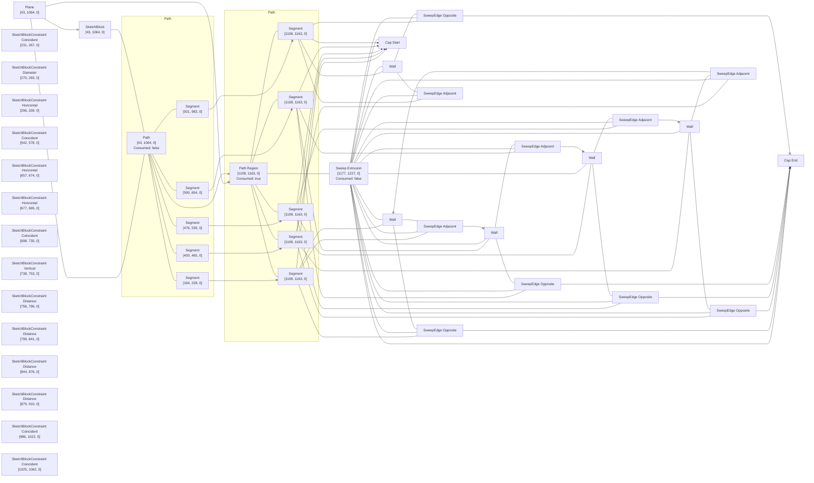

```mermaid
flowchart LR
  subgraph path2 [Path]
    2["Path<br>[43, 1064, 0]<br>Consumed: false"]
      %% [ProgramBodyItem { index: 0 }, VariableDeclarationDeclaration, VariableDeclarationInit]
    3["Segment<br>[164, 228, 0]"]
      %% [ProgramBodyItem { index: 0 }, VariableDeclarationDeclaration, VariableDeclarationInit, SketchBlockBody, SketchBlockBodyItem { index: 0 }, VariableDeclarationDeclaration, VariableDeclarationInit]
    4["Segment<br>[400, 465, 0]"]
      %% [ProgramBodyItem { index: 0 }, VariableDeclarationDeclaration, VariableDeclarationInit, SketchBlockBody, SketchBlockBodyItem { index: 4 }, VariableDeclarationDeclaration, VariableDeclarationInit]
    5["Segment<br>[476, 539, 0]"]
      %% [ProgramBodyItem { index: 0 }, VariableDeclarationDeclaration, VariableDeclarationInit, SketchBlockBody, SketchBlockBodyItem { index: 5 }, VariableDeclarationDeclaration, VariableDeclarationInit]
    6["Segment<br>[590, 654, 0]"]
      %% [ProgramBodyItem { index: 0 }, VariableDeclarationDeclaration, VariableDeclarationInit, SketchBlockBody, SketchBlockBodyItem { index: 7 }, VariableDeclarationDeclaration, VariableDeclarationInit]
    7["Segment<br>[921, 983, 0]"]
      %% [ProgramBodyItem { index: 0 }, VariableDeclarationDeclaration, VariableDeclarationInit, SketchBlockBody, SketchBlockBodyItem { index: 16 }, VariableDeclarationDeclaration, VariableDeclarationInit]
  end
  subgraph path8 [Path]
    8["Path Region<br>[1108, 1163, 0]<br>Consumed: true"]
      %% [ProgramBodyItem { index: 2 }, VariableDeclarationDeclaration, VariableDeclarationInit]
    9["Segment<br>[1108, 1163, 0]"]
      %% [ProgramBodyItem { index: 2 }, VariableDeclarationDeclaration, VariableDeclarationInit]
    10["Segment<br>[1108, 1163, 0]"]
      %% [ProgramBodyItem { index: 2 }, VariableDeclarationDeclaration, VariableDeclarationInit]
    11["Segment<br>[1108, 1163, 0]"]
      %% [ProgramBodyItem { index: 2 }, VariableDeclarationDeclaration, VariableDeclarationInit]
    12["Segment<br>[1108, 1163, 0]"]
      %% [ProgramBodyItem { index: 2 }, VariableDeclarationDeclaration, VariableDeclarationInit]
    13["Segment<br>[1108, 1163, 0]"]
      %% [ProgramBodyItem { index: 2 }, VariableDeclarationDeclaration, VariableDeclarationInit]
  end
  1["Plane<br>[43, 1064, 0]"]
    %% [ProgramBodyItem { index: 0 }, VariableDeclarationDeclaration, VariableDeclarationInit]
  14["Sweep Extrusion<br>[1177, 1227, 0]<br>Consumed: false"]
    %% [ProgramBodyItem { index: 3 }, VariableDeclarationDeclaration, VariableDeclarationInit]
  15[Wall]
    %% face_code_ref=Missing NodePath
  16[Wall]
    %% face_code_ref=Missing NodePath
  17[Wall]
    %% face_code_ref=Missing NodePath
  18[Wall]
    %% face_code_ref=Missing NodePath
  19[Wall]
    %% face_code_ref=Missing NodePath
  20["Cap Start"]
    %% face_code_ref=Missing NodePath
  21["Cap End"]
    %% face_code_ref=Missing NodePath
  22["SweepEdge Opposite"]
  23["SweepEdge Adjacent"]
  24["SweepEdge Opposite"]
  25["SweepEdge Adjacent"]
  26["SweepEdge Opposite"]
  27["SweepEdge Adjacent"]
  28["SweepEdge Opposite"]
  29["SweepEdge Adjacent"]
  30["SweepEdge Opposite"]
  31["SweepEdge Adjacent"]
  32["SketchBlock<br>[43, 1064, 0]"]
    %% [ProgramBodyItem { index: 0 }, VariableDeclarationDeclaration, VariableDeclarationInit]
  33["SketchBlockConstraint Coincident<br>[231, 267, 0]"]
    %% [ProgramBodyItem { index: 0 }, VariableDeclarationDeclaration, VariableDeclarationInit, SketchBlockBody, SketchBlockBodyItem { index: 1 }, ExpressionStatementExpr]
  34["SketchBlockConstraint Diameter<br>[270, 293, 0]"]
    %% [ProgramBodyItem { index: 0 }, VariableDeclarationDeclaration, VariableDeclarationInit, SketchBlockBody, SketchBlockBodyItem { index: 2 }, ExpressionStatementExpr]
  35["SketchBlockConstraint Horizontal<br>[296, 339, 0]"]
    %% [ProgramBodyItem { index: 0 }, VariableDeclarationDeclaration, VariableDeclarationInit, SketchBlockBody, SketchBlockBodyItem { index: 3 }, ExpressionStatementExpr]
  36["SketchBlockConstraint Coincident<br>[542, 578, 0]"]
    %% [ProgramBodyItem { index: 0 }, VariableDeclarationDeclaration, VariableDeclarationInit, SketchBlockBody, SketchBlockBodyItem { index: 6 }, ExpressionStatementExpr]
  37["SketchBlockConstraint Horizontal<br>[657, 674, 0]"]
    %% [ProgramBodyItem { index: 0 }, VariableDeclarationDeclaration, VariableDeclarationInit, SketchBlockBody, SketchBlockBodyItem { index: 8 }, ExpressionStatementExpr]
  38["SketchBlockConstraint Horizontal<br>[677, 695, 0]"]
    %% [ProgramBodyItem { index: 0 }, VariableDeclarationDeclaration, VariableDeclarationInit, SketchBlockBody, SketchBlockBodyItem { index: 9 }, ExpressionStatementExpr]
  39["SketchBlockConstraint Coincident<br>[698, 735, 0]"]
    %% [ProgramBodyItem { index: 0 }, VariableDeclarationDeclaration, VariableDeclarationInit, SketchBlockBody, SketchBlockBodyItem { index: 10 }, ExpressionStatementExpr]
  40["SketchBlockConstraint Vertical<br>[738, 753, 0]"]
    %% [ProgramBodyItem { index: 0 }, VariableDeclarationDeclaration, VariableDeclarationInit, SketchBlockBody, SketchBlockBodyItem { index: 11 }, ExpressionStatementExpr]
  41["SketchBlockConstraint Distance<br>[756, 796, 0]"]
    %% [ProgramBodyItem { index: 0 }, VariableDeclarationDeclaration, VariableDeclarationInit, SketchBlockBody, SketchBlockBodyItem { index: 12 }, ExpressionStatementExpr]
  42["SketchBlockConstraint Distance<br>[799, 841, 0]"]
    %% [ProgramBodyItem { index: 0 }, VariableDeclarationDeclaration, VariableDeclarationInit, SketchBlockBody, SketchBlockBodyItem { index: 13 }, ExpressionStatementExpr]
  43["SketchBlockConstraint Distance<br>[844, 876, 0]"]
    %% [ProgramBodyItem { index: 0 }, VariableDeclarationDeclaration, VariableDeclarationInit, SketchBlockBody, SketchBlockBodyItem { index: 14 }, ExpressionStatementExpr]
  44["SketchBlockConstraint Distance<br>[879, 910, 0]"]
    %% [ProgramBodyItem { index: 0 }, VariableDeclarationDeclaration, VariableDeclarationInit, SketchBlockBody, SketchBlockBodyItem { index: 15 }, ExpressionStatementExpr]
  45["SketchBlockConstraint Coincident<br>[986, 1022, 0]"]
    %% [ProgramBodyItem { index: 0 }, VariableDeclarationDeclaration, VariableDeclarationInit, SketchBlockBody, SketchBlockBodyItem { index: 17 }, ExpressionStatementExpr]
  46["SketchBlockConstraint Coincident<br>[1025, 1062, 0]"]
    %% [ProgramBodyItem { index: 0 }, VariableDeclarationDeclaration, VariableDeclarationInit, SketchBlockBody, SketchBlockBodyItem { index: 18 }, ExpressionStatementExpr]
  1 --- 2
  1 <--x 8
  1 <--x 32
  2 --- 3
  2 --- 4
  2 --- 5
  2 --- 6
  2 --- 7
  2 <--x 8
  32 --- 2
  3 <--x 9
  4 <--x 10
  5 <--x 11
  6 <--x 12
  7 <--x 13
  8 --- 9
  8 --- 10
  8 --- 11
  8 --- 12
  8 --- 13
  8 ---- 14
  9 --- 15
  9 x--> 20
  9 --- 22
  9 --- 23
  10 --- 16
  10 x--> 20
  10 --- 24
  10 --- 25
  11 --- 17
  11 x--> 20
  11 --- 26
  11 --- 27
  12 --- 18
  12 x--> 20
  12 --- 28
  12 --- 29
  13 --- 19
  13 x--> 20
  13 --- 30
  13 --- 31
  14 --- 15
  14 --- 16
  14 --- 17
  14 --- 18
  14 --- 19
  14 --- 20
  14 --- 21
  14 --- 22
  14 --- 23
  14 --- 24
  14 --- 25
  14 --- 26
  14 --- 27
  14 --- 28
  14 --- 29
  14 --- 30
  14 --- 31
  15 --- 22
  15 --- 23
  25 <--x 15
  16 --- 24
  16 --- 25
  27 <--x 16
  17 --- 26
  17 --- 27
  29 <--x 17
  23 <--x 18
  18 --- 28
  18 --- 29
  19 --- 30
  19 --- 31
  22 <--x 21
  24 <--x 21
  26 <--x 21
  28 <--x 21
  30 <--x 21
```
