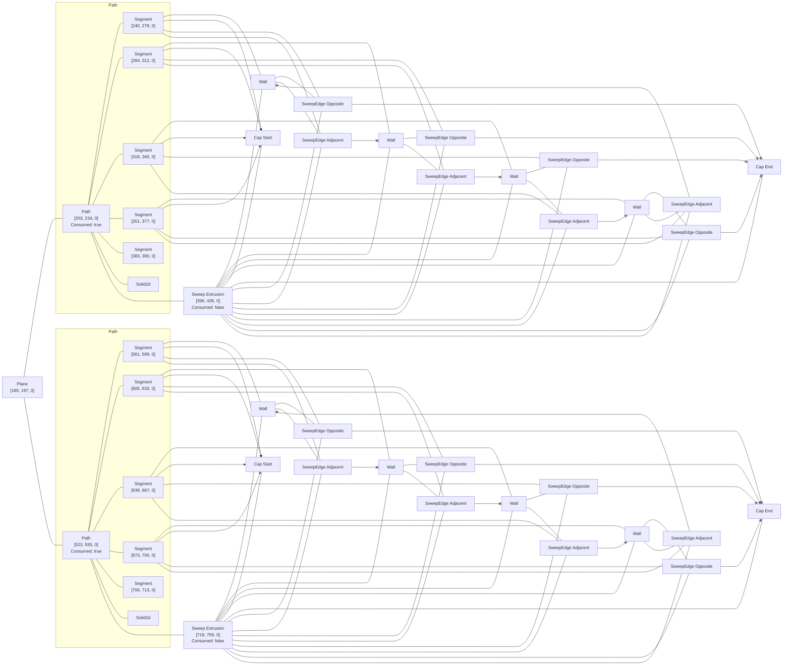

```mermaid
flowchart LR
  subgraph path2 [Path]
    2["Path<br>[203, 234, 0]<br>Consumed: true"]
      %% [ProgramBodyItem { index: 1 }, VariableDeclarationDeclaration, VariableDeclarationInit, PipeBodyItem { index: 0 }]
    3["Segment<br>[240, 278, 0]"]
      %% [ProgramBodyItem { index: 1 }, VariableDeclarationDeclaration, VariableDeclarationInit, PipeBodyItem { index: 1 }]
    4["Segment<br>[284, 312, 0]"]
      %% [ProgramBodyItem { index: 1 }, VariableDeclarationDeclaration, VariableDeclarationInit, PipeBodyItem { index: 2 }]
    5["Segment<br>[318, 345, 0]"]
      %% [ProgramBodyItem { index: 1 }, VariableDeclarationDeclaration, VariableDeclarationInit, PipeBodyItem { index: 3 }]
    6["Segment<br>[351, 377, 0]"]
      %% [ProgramBodyItem { index: 1 }, VariableDeclarationDeclaration, VariableDeclarationInit, PipeBodyItem { index: 4 }]
    7["Segment<br>[383, 390, 0]"]
      %% [ProgramBodyItem { index: 1 }, VariableDeclarationDeclaration, VariableDeclarationInit, PipeBodyItem { index: 5 }]
    8[Solid2d]
  end
  subgraph path24 [Path]
    24["Path<br>[523, 555, 0]<br>Consumed: true"]
      %% [ProgramBodyItem { index: 2 }, VariableDeclarationDeclaration, VariableDeclarationInit, PipeBodyItem { index: 0 }]
    25["Segment<br>[561, 599, 0]"]
      %% [ProgramBodyItem { index: 2 }, VariableDeclarationDeclaration, VariableDeclarationInit, PipeBodyItem { index: 1 }]
    26["Segment<br>[605, 633, 0]"]
      %% [ProgramBodyItem { index: 2 }, VariableDeclarationDeclaration, VariableDeclarationInit, PipeBodyItem { index: 2 }]
    27["Segment<br>[639, 667, 0]"]
      %% [ProgramBodyItem { index: 2 }, VariableDeclarationDeclaration, VariableDeclarationInit, PipeBodyItem { index: 3 }]
    28["Segment<br>[673, 700, 0]"]
      %% [ProgramBodyItem { index: 2 }, VariableDeclarationDeclaration, VariableDeclarationInit, PipeBodyItem { index: 4 }]
    29["Segment<br>[706, 713, 0]"]
      %% [ProgramBodyItem { index: 2 }, VariableDeclarationDeclaration, VariableDeclarationInit, PipeBodyItem { index: 5 }]
    30[Solid2d]
  end
  1["Plane<br>[180, 197, 0]"]
    %% [ProgramBodyItem { index: 0 }, VariableDeclarationDeclaration, VariableDeclarationInit]
  9["Sweep Extrusion<br>[396, 436, 0]<br>Consumed: false"]
    %% [ProgramBodyItem { index: 1 }, VariableDeclarationDeclaration, VariableDeclarationInit, PipeBodyItem { index: 6 }]
  10[Wall]
    %% face_code_ref=Missing NodePath
  11[Wall]
    %% face_code_ref=Missing NodePath
  12[Wall]
    %% face_code_ref=Missing NodePath
  13[Wall]
    %% face_code_ref=Missing NodePath
  14["Cap Start"]
    %% face_code_ref=Missing NodePath
  15["Cap End"]
    %% face_code_ref=Missing NodePath
  16["SweepEdge Opposite"]
  17["SweepEdge Adjacent"]
  18["SweepEdge Opposite"]
  19["SweepEdge Adjacent"]
  20["SweepEdge Opposite"]
  21["SweepEdge Adjacent"]
  22["SweepEdge Opposite"]
  23["SweepEdge Adjacent"]
  31["Sweep Extrusion<br>[719, 759, 0]<br>Consumed: false"]
    %% [ProgramBodyItem { index: 2 }, VariableDeclarationDeclaration, VariableDeclarationInit, PipeBodyItem { index: 6 }]
  32[Wall]
    %% face_code_ref=Missing NodePath
  33[Wall]
    %% face_code_ref=Missing NodePath
  34[Wall]
    %% face_code_ref=Missing NodePath
  35[Wall]
    %% face_code_ref=Missing NodePath
  36["Cap Start"]
    %% face_code_ref=Missing NodePath
  37["Cap End"]
    %% face_code_ref=Missing NodePath
  38["SweepEdge Opposite"]
  39["SweepEdge Adjacent"]
  40["SweepEdge Opposite"]
  41["SweepEdge Adjacent"]
  42["SweepEdge Opposite"]
  43["SweepEdge Adjacent"]
  44["SweepEdge Opposite"]
  45["SweepEdge Adjacent"]
  1 --- 2
  1 --- 24
  2 --- 3
  2 --- 4
  2 --- 5
  2 --- 6
  2 --- 7
  2 --- 8
  2 ---- 9
  3 --- 10
  3 x--> 14
  3 --- 16
  3 --- 17
  4 --- 11
  4 x--> 14
  4 --- 18
  4 --- 19
  5 --- 12
  5 x--> 14
  5 --- 20
  5 --- 21
  6 --- 13
  6 x--> 14
  6 --- 22
  6 --- 23
  9 --- 10
  9 --- 11
  9 --- 12
  9 --- 13
  9 --- 14
  9 --- 15
  9 --- 16
  9 --- 17
  9 --- 18
  9 --- 19
  9 --- 20
  9 --- 21
  9 --- 22
  9 --- 23
  10 --- 16
  10 --- 17
  23 <--x 10
  17 <--x 11
  11 --- 18
  11 --- 19
  19 <--x 12
  12 --- 20
  12 --- 21
  21 <--x 13
  13 --- 22
  13 --- 23
  16 <--x 15
  18 <--x 15
  20 <--x 15
  22 <--x 15
  24 --- 25
  24 --- 26
  24 --- 27
  24 --- 28
  24 --- 29
  24 --- 30
  24 ---- 31
  25 --- 32
  25 x--> 36
  25 --- 38
  25 --- 39
  26 --- 33
  26 x--> 36
  26 --- 40
  26 --- 41
  27 --- 34
  27 x--> 36
  27 --- 42
  27 --- 43
  28 --- 35
  28 x--> 36
  28 --- 44
  28 --- 45
  31 --- 32
  31 --- 33
  31 --- 34
  31 --- 35
  31 --- 36
  31 --- 37
  31 --- 38
  31 --- 39
  31 --- 40
  31 --- 41
  31 --- 42
  31 --- 43
  31 --- 44
  31 --- 45
  32 --- 38
  32 --- 39
  45 <--x 32
  39 <--x 33
  33 --- 40
  33 --- 41
  41 <--x 34
  34 --- 42
  34 --- 43
  43 <--x 35
  35 --- 44
  35 --- 45
  38 <--x 37
  40 <--x 37
  42 <--x 37
  44 <--x 37
```
