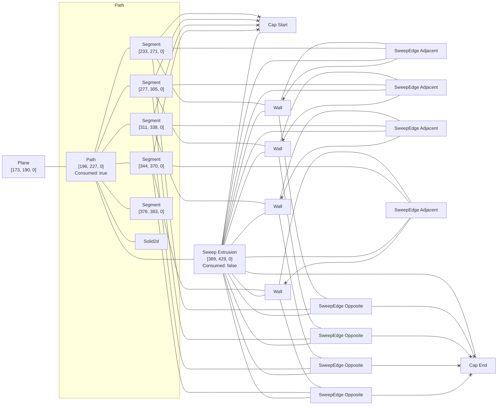

```mermaid
flowchart LR
  subgraph path8 [Path]
    8["Path<br>[196, 227, 0]<br>Consumed: true"]
      %% [ProgramBodyItem { index: 1 }, VariableDeclarationDeclaration, VariableDeclarationInit, PipeBodyItem { index: 0 }]
    9["Segment<br>[233, 271, 0]"]
      %% [ProgramBodyItem { index: 1 }, VariableDeclarationDeclaration, VariableDeclarationInit, PipeBodyItem { index: 1 }]
    10["Segment<br>[277, 305, 0]"]
      %% [ProgramBodyItem { index: 1 }, VariableDeclarationDeclaration, VariableDeclarationInit, PipeBodyItem { index: 2 }]
    11["Segment<br>[311, 338, 0]"]
      %% [ProgramBodyItem { index: 1 }, VariableDeclarationDeclaration, VariableDeclarationInit, PipeBodyItem { index: 3 }]
    12["Segment<br>[344, 370, 0]"]
      %% [ProgramBodyItem { index: 1 }, VariableDeclarationDeclaration, VariableDeclarationInit, PipeBodyItem { index: 4 }]
    13["Segment<br>[376, 383, 0]"]
      %% [ProgramBodyItem { index: 1 }, VariableDeclarationDeclaration, VariableDeclarationInit, PipeBodyItem { index: 5 }]
    15[Solid2d]
  end
  1["Cap End"]
    %% face_code_ref=Missing NodePath
  2["Cap Start"]
    %% face_code_ref=Missing NodePath
  3[Wall]
    %% face_code_ref=Missing NodePath
  4[Wall]
    %% face_code_ref=Missing NodePath
  5[Wall]
    %% face_code_ref=Missing NodePath
  6[Wall]
    %% face_code_ref=Missing NodePath
  7["Plane<br>[173, 190, 0]"]
    %% [ProgramBodyItem { index: 0 }, VariableDeclarationDeclaration, VariableDeclarationInit]
  14["Sweep Extrusion<br>[389, 429, 0]<br>Consumed: false"]
    %% [ProgramBodyItem { index: 1 }, VariableDeclarationDeclaration, VariableDeclarationInit, PipeBodyItem { index: 6 }]
  16["SweepEdge Adjacent"]
  17["SweepEdge Adjacent"]
  18["SweepEdge Adjacent"]
  19["SweepEdge Adjacent"]
  20["SweepEdge Opposite"]
  21["SweepEdge Opposite"]
  22["SweepEdge Opposite"]
  23["SweepEdge Opposite"]
  14 --- 1
  20 <--x 1
  21 <--x 1
  22 <--x 1
  23 <--x 1
  9 <--x 2
  10 <--x 2
  11 <--x 2
  12 <--x 2
  14 --- 2
  9 --- 3
  14 --- 3
  3 --- 16
  16 <--x 3
  3 --- 20
  10 --- 4
  14 --- 4
  4 --- 17
  17 <--x 4
  4 --- 21
  11 --- 5
  14 --- 5
  5 --- 18
  18 <--x 5
  5 --- 22
  12 --- 6
  14 --- 6
  6 --- 19
  19 <--x 6
  6 --- 23
  7 --- 8
  8 --- 9
  8 --- 10
  8 --- 11
  8 --- 12
  8 --- 13
  8 ---- 14
  8 --- 15
  9 --- 16
  9 --- 20
  10 --- 17
  10 --- 21
  11 --- 18
  11 --- 22
  12 --- 19
  12 --- 23
  14 --- 16
  14 --- 17
  14 --- 18
  14 --- 19
  14 --- 20
  14 --- 21
  14 --- 22
  14 --- 23
```
