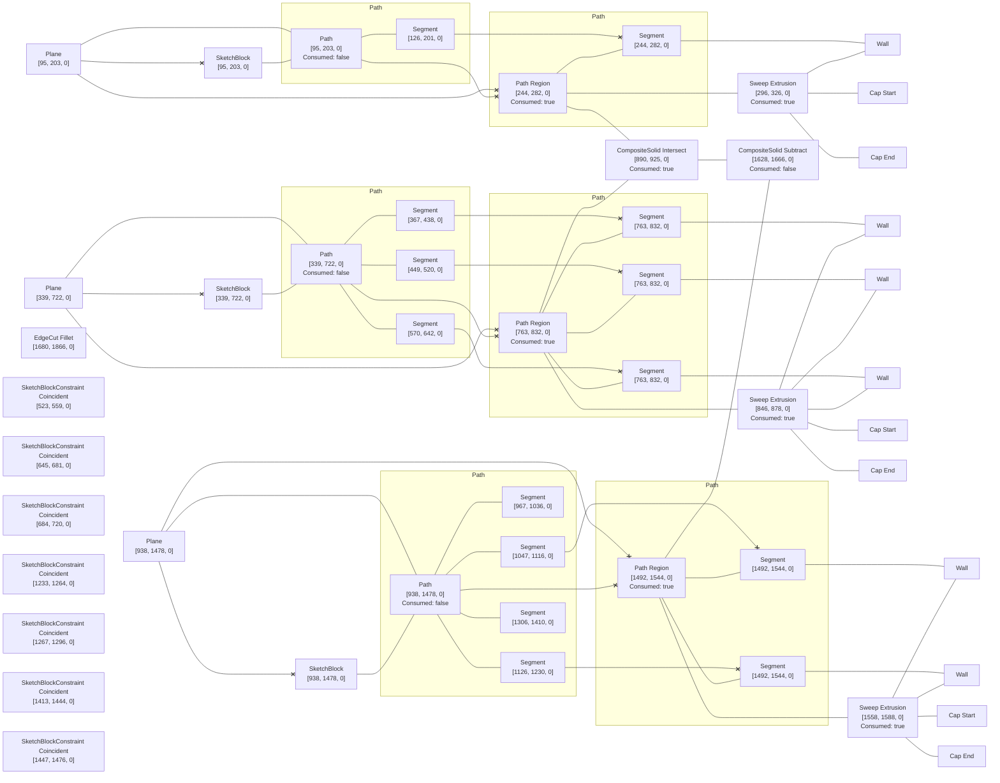

```mermaid
flowchart LR
  subgraph path2 [Path]
    2["Path<br>[95, 203, 0]<br>Consumed: false"]
      %% [ProgramBodyItem { index: 0 }, VariableDeclarationDeclaration, VariableDeclarationInit]
    3["Segment<br>[126, 201, 0]"]
      %% [ProgramBodyItem { index: 0 }, VariableDeclarationDeclaration, VariableDeclarationInit, SketchBlockBody, SketchBlockBodyItem { index: 0 }, VariableDeclarationDeclaration, VariableDeclarationInit]
  end
  subgraph path4 [Path]
    4["Path Region<br>[244, 282, 0]<br>Consumed: true"]
      %% [ProgramBodyItem { index: 2 }, VariableDeclarationDeclaration, VariableDeclarationInit]
    5["Segment<br>[244, 282, 0]"]
      %% [ProgramBodyItem { index: 2 }, VariableDeclarationDeclaration, VariableDeclarationInit]
  end
  subgraph path11 [Path]
    11["Path<br>[339, 722, 0]<br>Consumed: false"]
      %% [ProgramBodyItem { index: 4 }, VariableDeclarationDeclaration, VariableDeclarationInit]
    12["Segment<br>[367, 438, 0]"]
      %% [ProgramBodyItem { index: 4 }, VariableDeclarationDeclaration, VariableDeclarationInit, SketchBlockBody, SketchBlockBodyItem { index: 0 }, VariableDeclarationDeclaration, VariableDeclarationInit]
    13["Segment<br>[449, 520, 0]"]
      %% [ProgramBodyItem { index: 4 }, VariableDeclarationDeclaration, VariableDeclarationInit, SketchBlockBody, SketchBlockBodyItem { index: 1 }, VariableDeclarationDeclaration, VariableDeclarationInit]
    14["Segment<br>[570, 642, 0]"]
      %% [ProgramBodyItem { index: 4 }, VariableDeclarationDeclaration, VariableDeclarationInit, SketchBlockBody, SketchBlockBodyItem { index: 3 }, VariableDeclarationDeclaration, VariableDeclarationInit]
  end
  subgraph path15 [Path]
    15["Path Region<br>[763, 832, 0]<br>Consumed: true"]
      %% [ProgramBodyItem { index: 6 }, VariableDeclarationDeclaration, VariableDeclarationInit]
    16["Segment<br>[763, 832, 0]"]
      %% [ProgramBodyItem { index: 6 }, VariableDeclarationDeclaration, VariableDeclarationInit]
    17["Segment<br>[763, 832, 0]"]
      %% [ProgramBodyItem { index: 6 }, VariableDeclarationDeclaration, VariableDeclarationInit]
    18["Segment<br>[763, 832, 0]"]
      %% [ProgramBodyItem { index: 6 }, VariableDeclarationDeclaration, VariableDeclarationInit]
  end
  subgraph path27 [Path]
    27["Path<br>[938, 1478, 0]<br>Consumed: false"]
      %% [ProgramBodyItem { index: 9 }, VariableDeclarationDeclaration, VariableDeclarationInit]
    28["Segment<br>[967, 1036, 0]"]
      %% [ProgramBodyItem { index: 9 }, VariableDeclarationDeclaration, VariableDeclarationInit, SketchBlockBody, SketchBlockBodyItem { index: 0 }, VariableDeclarationDeclaration, VariableDeclarationInit]
    29["Segment<br>[1047, 1116, 0]"]
      %% [ProgramBodyItem { index: 9 }, VariableDeclarationDeclaration, VariableDeclarationInit, SketchBlockBody, SketchBlockBodyItem { index: 1 }, VariableDeclarationDeclaration, VariableDeclarationInit]
    30["Segment<br>[1126, 1230, 0]"]
      %% [ProgramBodyItem { index: 9 }, VariableDeclarationDeclaration, VariableDeclarationInit, SketchBlockBody, SketchBlockBodyItem { index: 2 }, VariableDeclarationDeclaration, VariableDeclarationInit]
    31["Segment<br>[1306, 1410, 0]"]
      %% [ProgramBodyItem { index: 9 }, VariableDeclarationDeclaration, VariableDeclarationInit, SketchBlockBody, SketchBlockBodyItem { index: 5 }, VariableDeclarationDeclaration, VariableDeclarationInit]
  end
  subgraph path32 [Path]
    32["Path Region<br>[1492, 1544, 0]<br>Consumed: true"]
      %% [ProgramBodyItem { index: 10 }, VariableDeclarationDeclaration, VariableDeclarationInit]
    33["Segment<br>[1492, 1544, 0]"]
      %% [ProgramBodyItem { index: 10 }, VariableDeclarationDeclaration, VariableDeclarationInit]
    34["Segment<br>[1492, 1544, 0]"]
      %% [ProgramBodyItem { index: 10 }, VariableDeclarationDeclaration, VariableDeclarationInit]
  end
  1["Plane<br>[95, 203, 0]"]
    %% [ProgramBodyItem { index: 0 }, VariableDeclarationDeclaration, VariableDeclarationInit]
  6["Sweep Extrusion<br>[296, 326, 0]<br>Consumed: true"]
    %% [ProgramBodyItem { index: 3 }, VariableDeclarationDeclaration, VariableDeclarationInit]
  7[Wall]
    %% face_code_ref=Missing NodePath
  8["Cap Start"]
    %% face_code_ref=Missing NodePath
  9["Cap End"]
    %% face_code_ref=Missing NodePath
  10["Plane<br>[339, 722, 0]"]
    %% [ProgramBodyItem { index: 4 }, VariableDeclarationDeclaration, VariableDeclarationInit]
  19["Sweep Extrusion<br>[846, 878, 0]<br>Consumed: true"]
    %% [ProgramBodyItem { index: 7 }, VariableDeclarationDeclaration, VariableDeclarationInit]
  20[Wall]
    %% face_code_ref=Missing NodePath
  21[Wall]
    %% face_code_ref=Missing NodePath
  22[Wall]
    %% face_code_ref=Missing NodePath
  23["Cap Start"]
    %% face_code_ref=Missing NodePath
  24["Cap End"]
    %% face_code_ref=Missing NodePath
  25["CompositeSolid Intersect<br>[890, 925, 0]<br>Consumed: true"]
    %% [ProgramBodyItem { index: 8 }, VariableDeclarationDeclaration, VariableDeclarationInit]
  26["Plane<br>[938, 1478, 0]"]
    %% [ProgramBodyItem { index: 9 }, VariableDeclarationDeclaration, VariableDeclarationInit]
  35["Sweep Extrusion<br>[1558, 1588, 0]<br>Consumed: true"]
    %% [ProgramBodyItem { index: 11 }, VariableDeclarationDeclaration, VariableDeclarationInit]
  36[Wall]
    %% face_code_ref=Missing NodePath
  37[Wall]
    %% face_code_ref=Missing NodePath
  38["Cap Start"]
    %% face_code_ref=Missing NodePath
  39["Cap End"]
    %% face_code_ref=Missing NodePath
  40["CompositeSolid Subtract<br>[1628, 1666, 0]<br>Consumed: false"]
    %% [ProgramBodyItem { index: 13 }, VariableDeclarationDeclaration, VariableDeclarationInit]
  41["EdgeCut Fillet<br>[1680, 1866, 0]"]
    %% [ProgramBodyItem { index: 14 }, VariableDeclarationDeclaration, VariableDeclarationInit]
  42["SketchBlock<br>[95, 203, 0]"]
    %% [ProgramBodyItem { index: 0 }, VariableDeclarationDeclaration, VariableDeclarationInit]
  43["SketchBlock<br>[339, 722, 0]"]
    %% [ProgramBodyItem { index: 4 }, VariableDeclarationDeclaration, VariableDeclarationInit]
  44["SketchBlockConstraint Coincident<br>[523, 559, 0]"]
    %% [ProgramBodyItem { index: 4 }, VariableDeclarationDeclaration, VariableDeclarationInit, SketchBlockBody, SketchBlockBodyItem { index: 2 }, ExpressionStatementExpr]
  45["SketchBlockConstraint Coincident<br>[645, 681, 0]"]
    %% [ProgramBodyItem { index: 4 }, VariableDeclarationDeclaration, VariableDeclarationInit, SketchBlockBody, SketchBlockBodyItem { index: 4 }, ExpressionStatementExpr]
  46["SketchBlockConstraint Coincident<br>[684, 720, 0]"]
    %% [ProgramBodyItem { index: 4 }, VariableDeclarationDeclaration, VariableDeclarationInit, SketchBlockBody, SketchBlockBodyItem { index: 5 }, ExpressionStatementExpr]
  47["SketchBlock<br>[938, 1478, 0]"]
    %% [ProgramBodyItem { index: 9 }, VariableDeclarationDeclaration, VariableDeclarationInit]
  48["SketchBlockConstraint Coincident<br>[1233, 1264, 0]"]
    %% [ProgramBodyItem { index: 9 }, VariableDeclarationDeclaration, VariableDeclarationInit, SketchBlockBody, SketchBlockBodyItem { index: 3 }, ExpressionStatementExpr]
  49["SketchBlockConstraint Coincident<br>[1267, 1296, 0]"]
    %% [ProgramBodyItem { index: 9 }, VariableDeclarationDeclaration, VariableDeclarationInit, SketchBlockBody, SketchBlockBodyItem { index: 4 }, ExpressionStatementExpr]
  50["SketchBlockConstraint Coincident<br>[1413, 1444, 0]"]
    %% [ProgramBodyItem { index: 9 }, VariableDeclarationDeclaration, VariableDeclarationInit, SketchBlockBody, SketchBlockBodyItem { index: 6 }, ExpressionStatementExpr]
  51["SketchBlockConstraint Coincident<br>[1447, 1476, 0]"]
    %% [ProgramBodyItem { index: 9 }, VariableDeclarationDeclaration, VariableDeclarationInit, SketchBlockBody, SketchBlockBodyItem { index: 7 }, ExpressionStatementExpr]
  1 --- 2
  1 <--x 4
  1 <--x 42
  2 --- 3
  2 <--x 4
  42 --- 2
  3 <--x 5
  4 --- 5
  4 ---- 6
  4 --- 25
  5 --- 7
  6 --- 7
  6 --- 8
  6 --- 9
  10 --- 11
  10 <--x 15
  10 <--x 43
  11 --- 12
  11 --- 13
  11 --- 14
  11 <--x 15
  43 --- 11
  12 <--x 16
  13 <--x 17
  14 <--x 18
  15 --- 16
  15 --- 17
  15 --- 18
  15 ---- 19
  15 --- 25
  16 --- 20
  17 --- 21
  18 --- 22
  19 --- 20
  19 --- 21
  19 --- 22
  19 --- 23
  19 --- 24
  25 --- 40
  26 --- 27
  26 <--x 32
  26 <--x 47
  27 --- 28
  27 --- 29
  27 --- 30
  27 --- 31
  27 <--x 32
  47 --- 27
  29 <--x 33
  30 <--x 34
  32 --- 33
  32 --- 34
  32 ---- 35
  32 --- 40
  33 --- 36
  34 --- 37
  35 --- 36
  35 --- 37
  35 --- 38
  35 --- 39
```
