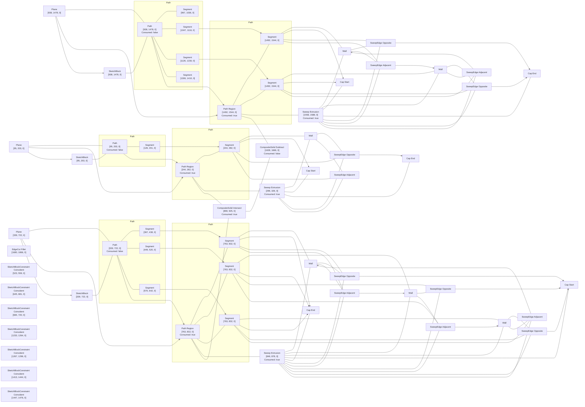

```mermaid
flowchart LR
  subgraph path2 [Path]
    2["Path<br>[95, 203, 0]<br>Consumed: false"]
      %% [ProgramBodyItem { index: 0 }, VariableDeclarationDeclaration, VariableDeclarationInit]
    3["Segment<br>[126, 201, 0]"]
      %% [ProgramBodyItem { index: 0 }, VariableDeclarationDeclaration, VariableDeclarationInit, SketchBlockBody, SketchBlockBodyItem { index: 0 }, VariableDeclarationDeclaration, VariableDeclarationInit]
  end
  subgraph path4 [Path]
    4["Path Region<br>[244, 282, 0]<br>Consumed: true"]
      %% [ProgramBodyItem { index: 2 }, VariableDeclarationDeclaration, VariableDeclarationInit]
    5["Segment<br>[244, 282, 0]"]
      %% [ProgramBodyItem { index: 2 }, VariableDeclarationDeclaration, VariableDeclarationInit]
  end
  subgraph path13 [Path]
    13["Path<br>[339, 722, 0]<br>Consumed: false"]
      %% [ProgramBodyItem { index: 4 }, VariableDeclarationDeclaration, VariableDeclarationInit]
    14["Segment<br>[367, 438, 0]"]
      %% [ProgramBodyItem { index: 4 }, VariableDeclarationDeclaration, VariableDeclarationInit, SketchBlockBody, SketchBlockBodyItem { index: 0 }, VariableDeclarationDeclaration, VariableDeclarationInit]
    15["Segment<br>[449, 520, 0]"]
      %% [ProgramBodyItem { index: 4 }, VariableDeclarationDeclaration, VariableDeclarationInit, SketchBlockBody, SketchBlockBodyItem { index: 1 }, VariableDeclarationDeclaration, VariableDeclarationInit]
    16["Segment<br>[570, 642, 0]"]
      %% [ProgramBodyItem { index: 4 }, VariableDeclarationDeclaration, VariableDeclarationInit, SketchBlockBody, SketchBlockBodyItem { index: 3 }, VariableDeclarationDeclaration, VariableDeclarationInit]
  end
  subgraph path17 [Path]
    17["Path Region<br>[763, 832, 0]<br>Consumed: true"]
      %% [ProgramBodyItem { index: 6 }, VariableDeclarationDeclaration, VariableDeclarationInit]
    18["Segment<br>[763, 832, 0]"]
      %% [ProgramBodyItem { index: 6 }, VariableDeclarationDeclaration, VariableDeclarationInit]
    19["Segment<br>[763, 832, 0]"]
      %% [ProgramBodyItem { index: 6 }, VariableDeclarationDeclaration, VariableDeclarationInit]
    20["Segment<br>[763, 832, 0]"]
      %% [ProgramBodyItem { index: 6 }, VariableDeclarationDeclaration, VariableDeclarationInit]
  end
  subgraph path35 [Path]
    35["Path<br>[938, 1478, 0]<br>Consumed: false"]
      %% [ProgramBodyItem { index: 9 }, VariableDeclarationDeclaration, VariableDeclarationInit]
    36["Segment<br>[967, 1036, 0]"]
      %% [ProgramBodyItem { index: 9 }, VariableDeclarationDeclaration, VariableDeclarationInit, SketchBlockBody, SketchBlockBodyItem { index: 0 }, VariableDeclarationDeclaration, VariableDeclarationInit]
    37["Segment<br>[1047, 1116, 0]"]
      %% [ProgramBodyItem { index: 9 }, VariableDeclarationDeclaration, VariableDeclarationInit, SketchBlockBody, SketchBlockBodyItem { index: 1 }, VariableDeclarationDeclaration, VariableDeclarationInit]
    38["Segment<br>[1126, 1230, 0]"]
      %% [ProgramBodyItem { index: 9 }, VariableDeclarationDeclaration, VariableDeclarationInit, SketchBlockBody, SketchBlockBodyItem { index: 2 }, VariableDeclarationDeclaration, VariableDeclarationInit]
    39["Segment<br>[1306, 1410, 0]"]
      %% [ProgramBodyItem { index: 9 }, VariableDeclarationDeclaration, VariableDeclarationInit, SketchBlockBody, SketchBlockBodyItem { index: 5 }, VariableDeclarationDeclaration, VariableDeclarationInit]
  end
  subgraph path40 [Path]
    40["Path Region<br>[1492, 1544, 0]<br>Consumed: true"]
      %% [ProgramBodyItem { index: 10 }, VariableDeclarationDeclaration, VariableDeclarationInit]
    41["Segment<br>[1492, 1544, 0]"]
      %% [ProgramBodyItem { index: 10 }, VariableDeclarationDeclaration, VariableDeclarationInit]
    42["Segment<br>[1492, 1544, 0]"]
      %% [ProgramBodyItem { index: 10 }, VariableDeclarationDeclaration, VariableDeclarationInit]
  end
  1["Plane<br>[95, 203, 0]"]
    %% [ProgramBodyItem { index: 0 }, VariableDeclarationDeclaration, VariableDeclarationInit]
  6["Sweep Extrusion<br>[296, 326, 0]<br>Consumed: true"]
    %% [ProgramBodyItem { index: 3 }, VariableDeclarationDeclaration, VariableDeclarationInit]
  7[Wall]
    %% face_code_ref=Missing NodePath
  8["Cap Start"]
    %% face_code_ref=Missing NodePath
  9["Cap End"]
    %% face_code_ref=Missing NodePath
  10["SweepEdge Opposite"]
  11["SweepEdge Adjacent"]
  12["Plane<br>[339, 722, 0]"]
    %% [ProgramBodyItem { index: 4 }, VariableDeclarationDeclaration, VariableDeclarationInit]
  21["Sweep Extrusion<br>[846, 878, 0]<br>Consumed: true"]
    %% [ProgramBodyItem { index: 7 }, VariableDeclarationDeclaration, VariableDeclarationInit]
  22[Wall]
    %% face_code_ref=Missing NodePath
  23[Wall]
    %% face_code_ref=Missing NodePath
  24[Wall]
    %% face_code_ref=Missing NodePath
  25["Cap Start"]
    %% face_code_ref=Missing NodePath
  26["Cap End"]
    %% face_code_ref=Missing NodePath
  27["SweepEdge Opposite"]
  28["SweepEdge Adjacent"]
  29["SweepEdge Opposite"]
  30["SweepEdge Adjacent"]
  31["SweepEdge Opposite"]
  32["SweepEdge Adjacent"]
  33["CompositeSolid Intersect<br>[890, 925, 0]<br>Consumed: true"]
    %% [ProgramBodyItem { index: 8 }, VariableDeclarationDeclaration, VariableDeclarationInit]
  34["Plane<br>[938, 1478, 0]"]
    %% [ProgramBodyItem { index: 9 }, VariableDeclarationDeclaration, VariableDeclarationInit]
  43["Sweep Extrusion<br>[1558, 1588, 0]<br>Consumed: true"]
    %% [ProgramBodyItem { index: 11 }, VariableDeclarationDeclaration, VariableDeclarationInit]
  44[Wall]
    %% face_code_ref=Missing NodePath
  45[Wall]
    %% face_code_ref=Missing NodePath
  46["Cap Start"]
    %% face_code_ref=Missing NodePath
  47["Cap End"]
    %% face_code_ref=Missing NodePath
  48["SweepEdge Opposite"]
  49["SweepEdge Adjacent"]
  50["SweepEdge Opposite"]
  51["SweepEdge Adjacent"]
  52["CompositeSolid Subtract<br>[1628, 1666, 0]<br>Consumed: false"]
    %% [ProgramBodyItem { index: 13 }, VariableDeclarationDeclaration, VariableDeclarationInit]
  53["EdgeCut Fillet<br>[1680, 1866, 0]"]
    %% [ProgramBodyItem { index: 14 }, VariableDeclarationDeclaration, VariableDeclarationInit]
  54["SketchBlock<br>[95, 203, 0]"]
    %% [ProgramBodyItem { index: 0 }, VariableDeclarationDeclaration, VariableDeclarationInit]
  55["SketchBlock<br>[339, 722, 0]"]
    %% [ProgramBodyItem { index: 4 }, VariableDeclarationDeclaration, VariableDeclarationInit]
  56["SketchBlockConstraint Coincident<br>[523, 559, 0]"]
    %% [ProgramBodyItem { index: 4 }, VariableDeclarationDeclaration, VariableDeclarationInit, SketchBlockBody, SketchBlockBodyItem { index: 2 }, ExpressionStatementExpr]
  57["SketchBlockConstraint Coincident<br>[645, 681, 0]"]
    %% [ProgramBodyItem { index: 4 }, VariableDeclarationDeclaration, VariableDeclarationInit, SketchBlockBody, SketchBlockBodyItem { index: 4 }, ExpressionStatementExpr]
  58["SketchBlockConstraint Coincident<br>[684, 720, 0]"]
    %% [ProgramBodyItem { index: 4 }, VariableDeclarationDeclaration, VariableDeclarationInit, SketchBlockBody, SketchBlockBodyItem { index: 5 }, ExpressionStatementExpr]
  59["SketchBlock<br>[938, 1478, 0]"]
    %% [ProgramBodyItem { index: 9 }, VariableDeclarationDeclaration, VariableDeclarationInit]
  60["SketchBlockConstraint Coincident<br>[1233, 1264, 0]"]
    %% [ProgramBodyItem { index: 9 }, VariableDeclarationDeclaration, VariableDeclarationInit, SketchBlockBody, SketchBlockBodyItem { index: 3 }, ExpressionStatementExpr]
  61["SketchBlockConstraint Coincident<br>[1267, 1296, 0]"]
    %% [ProgramBodyItem { index: 9 }, VariableDeclarationDeclaration, VariableDeclarationInit, SketchBlockBody, SketchBlockBodyItem { index: 4 }, ExpressionStatementExpr]
  62["SketchBlockConstraint Coincident<br>[1413, 1444, 0]"]
    %% [ProgramBodyItem { index: 9 }, VariableDeclarationDeclaration, VariableDeclarationInit, SketchBlockBody, SketchBlockBodyItem { index: 6 }, ExpressionStatementExpr]
  63["SketchBlockConstraint Coincident<br>[1447, 1476, 0]"]
    %% [ProgramBodyItem { index: 9 }, VariableDeclarationDeclaration, VariableDeclarationInit, SketchBlockBody, SketchBlockBodyItem { index: 7 }, ExpressionStatementExpr]
  1 --- 2
  1 <--x 4
  1 <--x 54
  2 --- 3
  2 <--x 4
  54 --- 2
  3 <--x 5
  4 --- 5
  4 ---- 6
  4 --- 33
  5 --- 7
  5 x--> 8
  5 --- 10
  5 --- 11
  6 --- 7
  6 --- 8
  6 --- 9
  6 --- 10
  6 --- 11
  7 --- 10
  7 --- 11
  10 <--x 9
  12 --- 13
  12 <--x 17
  12 <--x 55
  13 --- 14
  13 --- 15
  13 --- 16
  13 <--x 17
  55 --- 13
  14 <--x 18
  15 <--x 19
  16 <--x 20
  17 --- 18
  17 --- 19
  17 --- 20
  17 ---- 21
  17 --- 33
  18 --- 22
  18 x--> 26
  18 --- 27
  18 --- 28
  19 --- 23
  19 x--> 26
  19 --- 29
  19 --- 30
  20 --- 24
  20 x--> 26
  20 --- 31
  20 --- 32
  21 --- 22
  21 --- 23
  21 --- 24
  21 --- 25
  21 --- 26
  21 --- 27
  21 --- 28
  21 --- 29
  21 --- 30
  21 --- 31
  21 --- 32
  22 --- 27
  22 --- 28
  32 <--x 22
  28 <--x 23
  23 --- 29
  23 --- 30
  30 <--x 24
  24 --- 31
  24 --- 32
  27 <--x 25
  29 <--x 25
  31 <--x 25
  33 --- 52
  34 --- 35
  34 <--x 40
  34 <--x 59
  35 --- 36
  35 --- 37
  35 --- 38
  35 --- 39
  35 <--x 40
  59 --- 35
  37 <--x 41
  38 <--x 42
  40 --- 41
  40 --- 42
  40 ---- 43
  40 --- 52
  41 --- 44
  41 x--> 46
  41 --- 48
  41 --- 49
  42 --- 45
  42 x--> 46
  42 --- 50
  42 --- 51
  43 --- 44
  43 --- 45
  43 --- 46
  43 --- 47
  43 --- 48
  43 --- 49
  43 --- 50
  43 --- 51
  44 --- 48
  44 --- 49
  51 <--x 44
  49 <--x 45
  45 --- 50
  45 --- 51
  48 <--x 47
  50 <--x 47
```
