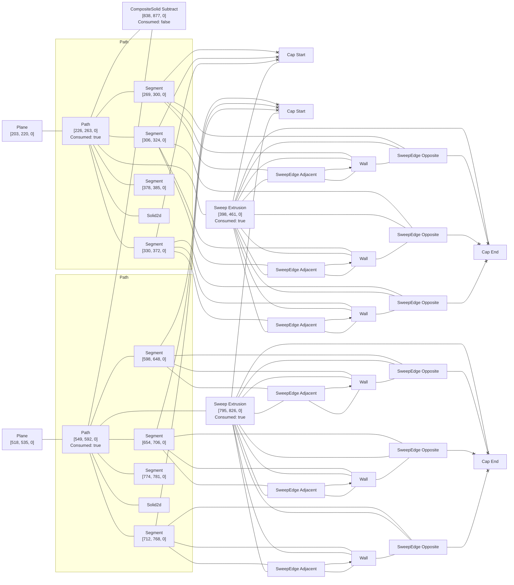

```mermaid
flowchart LR
  subgraph path6 [Path]
    6["Path<br>[226, 263, 0]<br>Consumed: true"]
      %% [ProgramBodyItem { index: 2 }, VariableDeclarationDeclaration, VariableDeclarationInit, PipeBodyItem { index: 0 }]
    10["Segment<br>[269, 300, 0]"]
      %% [ProgramBodyItem { index: 2 }, VariableDeclarationDeclaration, VariableDeclarationInit, PipeBodyItem { index: 1 }]
    11["Segment<br>[306, 324, 0]"]
      %% [ProgramBodyItem { index: 2 }, VariableDeclarationDeclaration, VariableDeclarationInit, PipeBodyItem { index: 2 }]
    12["Segment<br>[330, 372, 0]"]
      %% [ProgramBodyItem { index: 2 }, VariableDeclarationDeclaration, VariableDeclarationInit, PipeBodyItem { index: 3 }]
    13["Segment<br>[378, 385, 0]"]
      %% [ProgramBodyItem { index: 2 }, VariableDeclarationDeclaration, VariableDeclarationInit, PipeBodyItem { index: 4 }]
    18[Solid2d]
  end
  subgraph path7 [Path]
    7["Path<br>[549, 592, 0]<br>Consumed: true"]
      %% [ProgramBodyItem { index: 6 }, VariableDeclarationDeclaration, VariableDeclarationInit, PipeBodyItem { index: 0 }]
    14["Segment<br>[598, 648, 0]"]
      %% [ProgramBodyItem { index: 6 }, VariableDeclarationDeclaration, VariableDeclarationInit, PipeBodyItem { index: 1 }]
    15["Segment<br>[654, 706, 0]"]
      %% [ProgramBodyItem { index: 6 }, VariableDeclarationDeclaration, VariableDeclarationInit, PipeBodyItem { index: 2 }]
    16["Segment<br>[712, 768, 0]"]
      %% [ProgramBodyItem { index: 6 }, VariableDeclarationDeclaration, VariableDeclarationInit, PipeBodyItem { index: 3 }]
    17["Segment<br>[774, 781, 0]"]
      %% [ProgramBodyItem { index: 6 }, VariableDeclarationDeclaration, VariableDeclarationInit, PipeBodyItem { index: 4 }]
    19[Solid2d]
  end
  8["Plane<br>[203, 220, 0]"]
    %% [ProgramBodyItem { index: 1 }, VariableDeclarationDeclaration, VariableDeclarationInit]
  20["Sweep Extrusion<br>[398, 461, 0]<br>Consumed: true"]
    %% [ProgramBodyItem { index: 3 }, VariableDeclarationDeclaration, VariableDeclarationInit]
  34[Wall]
    %% face_code_ref=Missing NodePath
  35[Wall]
    %% face_code_ref=Missing NodePath
  36[Wall]
    %% face_code_ref=Missing NodePath
  3["Cap Start"]
    %% face_code_ref=Missing NodePath
  1["Cap End"]
    %% face_code_ref=Missing NodePath
  28["SweepEdge Opposite"]
  22["SweepEdge Adjacent"]
  29["SweepEdge Opposite"]
  23["SweepEdge Adjacent"]
  30["SweepEdge Opposite"]
  24["SweepEdge Adjacent"]
  9["Plane<br>[518, 535, 0]"]
    %% [ProgramBodyItem { index: 5 }, VariableDeclarationDeclaration, VariableDeclarationInit]
  21["Sweep Extrusion<br>[795, 826, 0]<br>Consumed: true"]
    %% [ProgramBodyItem { index: 7 }, VariableDeclarationDeclaration, VariableDeclarationInit]
  39[Wall]
    %% face_code_ref=Missing NodePath
  38[Wall]
    %% face_code_ref=Missing NodePath
  37[Wall]
    %% face_code_ref=Missing NodePath
  4["Cap Start"]
    %% face_code_ref=Missing NodePath
  2["Cap End"]
    %% face_code_ref=Missing NodePath
  33["SweepEdge Opposite"]
  27["SweepEdge Adjacent"]
  32["SweepEdge Opposite"]
  26["SweepEdge Adjacent"]
  31["SweepEdge Opposite"]
  25["SweepEdge Adjacent"]
  5["CompositeSolid Subtract<br>[838, 877, 0]<br>Consumed: false"]
    %% [ProgramBodyItem { index: 8 }, VariableDeclarationDeclaration, VariableDeclarationInit]
  20 --- 1
  28 <--x 1
  29 <--x 1
  30 <--x 1
  21 --- 2
  31 <--x 2
  32 <--x 2
  33 <--x 2
  10 <--x 3
  11 <--x 3
  12 <--x 3
  20 --- 3
  14 <--x 4
  15 <--x 4
  16 <--x 4
  21 --- 4
  6 --- 5
  7 --- 5
  8 --- 6
  6 --- 10
  6 --- 11
  6 --- 12
  6 --- 13
  6 --- 18
  6 ---- 20
  9 --- 7
  7 --- 14
  7 --- 15
  7 --- 16
  7 --- 17
  7 --- 19
  7 ---- 21
  10 --- 22
  10 --- 28
  10 --- 34
  11 --- 23
  11 --- 29
  11 --- 35
  12 --- 24
  12 --- 30
  12 --- 36
  14 --- 25
  14 --- 31
  14 --- 37
  15 --- 26
  15 --- 32
  15 --- 38
  16 --- 27
  16 --- 33
  16 --- 39
  20 --- 22
  20 --- 23
  20 --- 24
  20 --- 28
  20 --- 29
  20 --- 30
  20 --- 34
  20 --- 35
  20 --- 36
  21 --- 25
  21 --- 26
  21 --- 27
  21 --- 31
  21 --- 32
  21 --- 33
  21 --- 37
  21 --- 38
  21 --- 39
  34 --- 22
  22 x--> 34
  35 --- 23
  23 x--> 35
  36 --- 24
  24 x--> 36
  37 --- 25
  25 x--> 37
  38 --- 26
  26 x--> 38
  39 --- 27
  27 x--> 39
  34 --- 28
  35 --- 29
  36 --- 30
  37 --- 31
  38 --- 32
  39 --- 33
```
