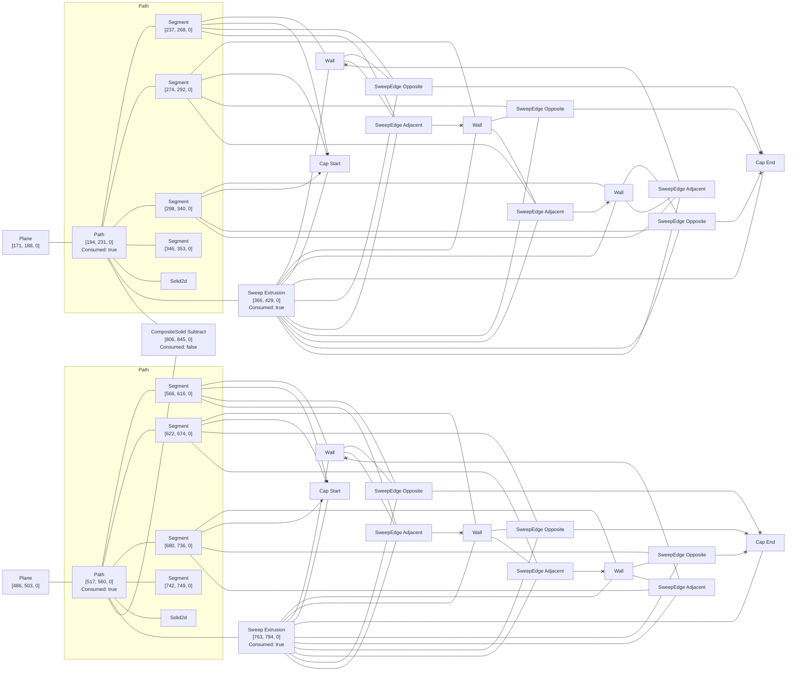

```mermaid
flowchart LR
  subgraph path2 [Path]
    2["Path<br>[194, 231, 0]<br>Consumed: true"]
      %% [ProgramBodyItem { index: 2 }, VariableDeclarationDeclaration, VariableDeclarationInit, PipeBodyItem { index: 0 }]
    3["Segment<br>[237, 268, 0]"]
      %% [ProgramBodyItem { index: 2 }, VariableDeclarationDeclaration, VariableDeclarationInit, PipeBodyItem { index: 1 }]
    4["Segment<br>[274, 292, 0]"]
      %% [ProgramBodyItem { index: 2 }, VariableDeclarationDeclaration, VariableDeclarationInit, PipeBodyItem { index: 2 }]
    5["Segment<br>[298, 340, 0]"]
      %% [ProgramBodyItem { index: 2 }, VariableDeclarationDeclaration, VariableDeclarationInit, PipeBodyItem { index: 3 }]
    6["Segment<br>[346, 353, 0]"]
      %% [ProgramBodyItem { index: 2 }, VariableDeclarationDeclaration, VariableDeclarationInit, PipeBodyItem { index: 4 }]
    7[Solid2d]
  end
  subgraph path21 [Path]
    21["Path<br>[517, 560, 0]<br>Consumed: true"]
      %% [ProgramBodyItem { index: 6 }, VariableDeclarationDeclaration, VariableDeclarationInit, PipeBodyItem { index: 0 }]
    22["Segment<br>[566, 616, 0]"]
      %% [ProgramBodyItem { index: 6 }, VariableDeclarationDeclaration, VariableDeclarationInit, PipeBodyItem { index: 1 }]
    23["Segment<br>[622, 674, 0]"]
      %% [ProgramBodyItem { index: 6 }, VariableDeclarationDeclaration, VariableDeclarationInit, PipeBodyItem { index: 2 }]
    24["Segment<br>[680, 736, 0]"]
      %% [ProgramBodyItem { index: 6 }, VariableDeclarationDeclaration, VariableDeclarationInit, PipeBodyItem { index: 3 }]
    25["Segment<br>[742, 749, 0]"]
      %% [ProgramBodyItem { index: 6 }, VariableDeclarationDeclaration, VariableDeclarationInit, PipeBodyItem { index: 4 }]
    26[Solid2d]
  end
  1["Plane<br>[171, 188, 0]"]
    %% [ProgramBodyItem { index: 1 }, VariableDeclarationDeclaration, VariableDeclarationInit]
  8["Sweep Extrusion<br>[366, 429, 0]<br>Consumed: true"]
    %% [ProgramBodyItem { index: 3 }, VariableDeclarationDeclaration, VariableDeclarationInit]
  9[Wall]
    %% face_code_ref=Missing NodePath
  10[Wall]
    %% face_code_ref=Missing NodePath
  11[Wall]
    %% face_code_ref=Missing NodePath
  12["Cap Start"]
    %% face_code_ref=Missing NodePath
  13["Cap End"]
    %% face_code_ref=Missing NodePath
  14["SweepEdge Opposite"]
  15["SweepEdge Adjacent"]
  16["SweepEdge Opposite"]
  17["SweepEdge Adjacent"]
  18["SweepEdge Opposite"]
  19["SweepEdge Adjacent"]
  20["Plane<br>[486, 503, 0]"]
    %% [ProgramBodyItem { index: 5 }, VariableDeclarationDeclaration, VariableDeclarationInit]
  27["Sweep Extrusion<br>[763, 794, 0]<br>Consumed: true"]
    %% [ProgramBodyItem { index: 7 }, VariableDeclarationDeclaration, VariableDeclarationInit]
  28[Wall]
    %% face_code_ref=Missing NodePath
  29[Wall]
    %% face_code_ref=Missing NodePath
  30[Wall]
    %% face_code_ref=Missing NodePath
  31["Cap Start"]
    %% face_code_ref=Missing NodePath
  32["Cap End"]
    %% face_code_ref=Missing NodePath
  33["SweepEdge Opposite"]
  34["SweepEdge Adjacent"]
  35["SweepEdge Opposite"]
  36["SweepEdge Adjacent"]
  37["SweepEdge Opposite"]
  38["SweepEdge Adjacent"]
  39["CompositeSolid Subtract<br>[806, 845, 0]<br>Consumed: false"]
    %% [ProgramBodyItem { index: 8 }, VariableDeclarationDeclaration, VariableDeclarationInit]
  1 --- 2
  2 --- 3
  2 --- 4
  2 --- 5
  2 --- 6
  2 --- 7
  2 ---- 8
  2 --- 39
  3 --- 9
  3 x--> 12
  3 --- 14
  3 --- 15
  4 --- 10
  4 x--> 12
  4 --- 16
  4 --- 17
  5 --- 11
  5 x--> 12
  5 --- 18
  5 --- 19
  8 --- 9
  8 --- 10
  8 --- 11
  8 --- 12
  8 --- 13
  8 --- 14
  8 --- 15
  8 --- 16
  8 --- 17
  8 --- 18
  8 --- 19
  9 --- 14
  9 --- 15
  19 <--x 9
  15 <--x 10
  10 --- 16
  10 --- 17
  17 <--x 11
  11 --- 18
  11 --- 19
  14 <--x 13
  16 <--x 13
  18 <--x 13
  20 --- 21
  21 --- 22
  21 --- 23
  21 --- 24
  21 --- 25
  21 --- 26
  21 ---- 27
  21 --- 39
  22 --- 30
  22 x--> 31
  22 --- 37
  22 --- 38
  23 --- 29
  23 x--> 31
  23 --- 35
  23 --- 36
  24 --- 28
  24 x--> 31
  24 --- 33
  24 --- 34
  27 --- 28
  27 --- 29
  27 --- 30
  27 --- 31
  27 --- 32
  27 --- 33
  27 --- 34
  27 --- 35
  27 --- 36
  27 --- 37
  27 --- 38
  28 --- 33
  28 --- 34
  36 <--x 28
  29 --- 35
  29 --- 36
  38 <--x 29
  34 <--x 30
  30 --- 37
  30 --- 38
  33 <--x 32
  35 <--x 32
  37 <--x 32
```
