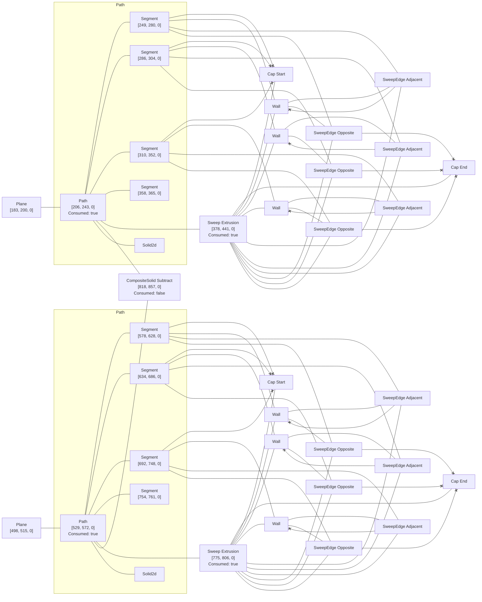

```mermaid
flowchart LR
  subgraph path12 [Path]
    12["Path<br>[206, 243, 0]<br>Consumed: true"]
      %% [ProgramBodyItem { index: 2 }, VariableDeclarationDeclaration, VariableDeclarationInit, PipeBodyItem { index: 0 }]
    13["Segment<br>[249, 280, 0]"]
      %% [ProgramBodyItem { index: 2 }, VariableDeclarationDeclaration, VariableDeclarationInit, PipeBodyItem { index: 1 }]
    14["Segment<br>[286, 304, 0]"]
      %% [ProgramBodyItem { index: 2 }, VariableDeclarationDeclaration, VariableDeclarationInit, PipeBodyItem { index: 2 }]
    15["Segment<br>[310, 352, 0]"]
      %% [ProgramBodyItem { index: 2 }, VariableDeclarationDeclaration, VariableDeclarationInit, PipeBodyItem { index: 3 }]
    16["Segment<br>[358, 365, 0]"]
      %% [ProgramBodyItem { index: 2 }, VariableDeclarationDeclaration, VariableDeclarationInit, PipeBodyItem { index: 4 }]
    26[Solid2d]
  end
  subgraph path19 [Path]
    19["Path<br>[529, 572, 0]<br>Consumed: true"]
      %% [ProgramBodyItem { index: 6 }, VariableDeclarationDeclaration, VariableDeclarationInit, PipeBodyItem { index: 0 }]
    20["Segment<br>[578, 628, 0]"]
      %% [ProgramBodyItem { index: 6 }, VariableDeclarationDeclaration, VariableDeclarationInit, PipeBodyItem { index: 1 }]
    21["Segment<br>[634, 686, 0]"]
      %% [ProgramBodyItem { index: 6 }, VariableDeclarationDeclaration, VariableDeclarationInit, PipeBodyItem { index: 2 }]
    22["Segment<br>[692, 748, 0]"]
      %% [ProgramBodyItem { index: 6 }, VariableDeclarationDeclaration, VariableDeclarationInit, PipeBodyItem { index: 3 }]
    23["Segment<br>[754, 761, 0]"]
      %% [ProgramBodyItem { index: 6 }, VariableDeclarationDeclaration, VariableDeclarationInit, PipeBodyItem { index: 4 }]
    27[Solid2d]
  end
  1["Cap End"]
    %% face_code_ref=Missing NodePath
  2["Cap End"]
    %% face_code_ref=Missing NodePath
  3["Cap Start"]
    %% face_code_ref=Missing NodePath
  4["Cap Start"]
    %% face_code_ref=Missing NodePath
  5[Wall]
    %% face_code_ref=Missing NodePath
  6[Wall]
    %% face_code_ref=Missing NodePath
  7[Wall]
    %% face_code_ref=Missing NodePath
  8[Wall]
    %% face_code_ref=Missing NodePath
  9[Wall]
    %% face_code_ref=Missing NodePath
  10[Wall]
    %% face_code_ref=Missing NodePath
  11["Plane<br>[183, 200, 0]"]
    %% [ProgramBodyItem { index: 1 }, VariableDeclarationDeclaration, VariableDeclarationInit]
  17["Sweep Extrusion<br>[378, 441, 0]<br>Consumed: true"]
    %% [ProgramBodyItem { index: 3 }, VariableDeclarationDeclaration, VariableDeclarationInit]
  18["Plane<br>[498, 515, 0]"]
    %% [ProgramBodyItem { index: 5 }, VariableDeclarationDeclaration, VariableDeclarationInit]
  24["Sweep Extrusion<br>[775, 806, 0]<br>Consumed: true"]
    %% [ProgramBodyItem { index: 7 }, VariableDeclarationDeclaration, VariableDeclarationInit]
  25["CompositeSolid Subtract<br>[818, 857, 0]<br>Consumed: false"]
    %% [ProgramBodyItem { index: 8 }, VariableDeclarationDeclaration, VariableDeclarationInit]
  28["SweepEdge Adjacent"]
  29["SweepEdge Adjacent"]
  30["SweepEdge Adjacent"]
  31["SweepEdge Adjacent"]
  32["SweepEdge Adjacent"]
  33["SweepEdge Adjacent"]
  34["SweepEdge Opposite"]
  35["SweepEdge Opposite"]
  36["SweepEdge Opposite"]
  37["SweepEdge Opposite"]
  38["SweepEdge Opposite"]
  39["SweepEdge Opposite"]
  17 --- 1
  34 <--x 1
  35 <--x 1
  36 <--x 1
  24 --- 2
  37 <--x 2
  38 <--x 2
  39 <--x 2
  13 <--x 3
  14 <--x 3
  15 <--x 3
  17 --- 3
  20 <--x 4
  21 <--x 4
  22 <--x 4
  24 --- 4
  13 --- 5
  17 --- 5
  5 --- 28
  28 <--x 5
  5 --- 34
  14 --- 6
  17 --- 6
  6 --- 29
  29 <--x 6
  6 --- 35
  15 --- 7
  17 --- 7
  7 --- 30
  30 <--x 7
  7 --- 36
  20 --- 8
  24 --- 8
  8 --- 31
  31 <--x 8
  8 --- 37
  21 --- 9
  24 --- 9
  9 --- 32
  32 <--x 9
  9 --- 38
  22 --- 10
  24 --- 10
  10 --- 33
  33 <--x 10
  10 --- 39
  11 --- 12
  12 --- 13
  12 --- 14
  12 --- 15
  12 --- 16
  12 ---- 17
  12 --- 25
  12 --- 26
  13 --- 28
  13 --- 34
  14 --- 29
  14 --- 35
  15 --- 30
  15 --- 36
  17 --- 28
  17 --- 29
  17 --- 30
  17 --- 34
  17 --- 35
  17 --- 36
  18 --- 19
  19 --- 20
  19 --- 21
  19 --- 22
  19 --- 23
  19 ---- 24
  19 --- 25
  19 --- 27
  20 --- 31
  20 --- 37
  21 --- 32
  21 --- 38
  22 --- 33
  22 --- 39
  24 --- 31
  24 --- 32
  24 --- 33
  24 --- 37
  24 --- 38
  24 --- 39
```
