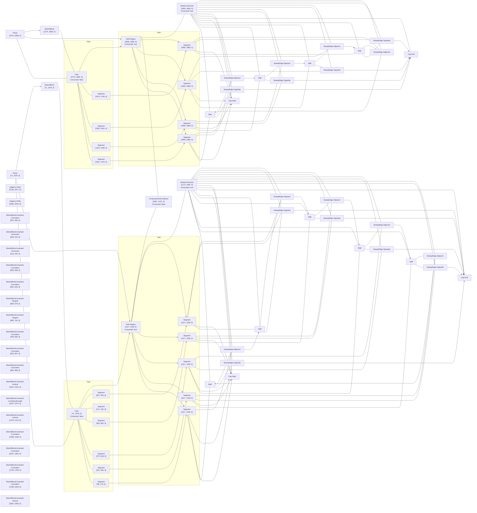

```mermaid
flowchart LR
  subgraph path2 [Path]
    2["Path<br>[71, 1076, 0]<br>Consumed: false"]
      %% [ProgramBodyItem { index: 0 }, VariableDeclarationDeclaration, VariableDeclarationInit]
    3["Segment<br>[99, 170, 0]"]
      %% [ProgramBodyItem { index: 0 }, VariableDeclarationDeclaration, VariableDeclarationInit, SketchBlockBody, SketchBlockBodyItem { index: 0 }, VariableDeclarationDeclaration, VariableDeclarationInit]
    4["Segment<br>[181, 255, 0]"]
      %% [ProgramBodyItem { index: 0 }, VariableDeclarationDeclaration, VariableDeclarationInit, SketchBlockBody, SketchBlockBodyItem { index: 1 }, VariableDeclarationDeclaration, VariableDeclarationInit]
    5["Segment<br>[275, 348, 0]"]
      %% [ProgramBodyItem { index: 0 }, VariableDeclarationDeclaration, VariableDeclarationInit, SketchBlockBody, SketchBlockBodyItem { index: 2 }, VariableDeclarationDeclaration, VariableDeclarationInit]
    6["Segment<br>[455, 560, 0]"]
      %% [ProgramBodyItem { index: 0 }, VariableDeclarationDeclaration, VariableDeclarationInit, SketchBlockBody, SketchBlockBodyItem { index: 6 }, VariableDeclarationDeclaration, VariableDeclarationInit]
    7["Segment<br>[717, 792, 0]"]
      %% [ProgramBodyItem { index: 0 }, VariableDeclarationDeclaration, VariableDeclarationInit, SketchBlockBody, SketchBlockBodyItem { index: 11 }, VariableDeclarationDeclaration, VariableDeclarationInit]
    8["Segment<br>[847, 920, 0]"]
      %% [ProgramBodyItem { index: 0 }, VariableDeclarationDeclaration, VariableDeclarationInit, SketchBlockBody, SketchBlockBodyItem { index: 13 }, VariableDeclarationDeclaration, VariableDeclarationInit]
  end
  subgraph path9 [Path]
    9["Path Region<br>[1117, 1159, 0]<br>Consumed: true"]
      %% [ProgramBodyItem { index: 2 }, VariableDeclarationDeclaration, VariableDeclarationInit]
    10["Segment<br>[1117, 1159, 0]"]
      %% [ProgramBodyItem { index: 2 }, VariableDeclarationDeclaration, VariableDeclarationInit]
    11["Segment<br>[1117, 1159, 0]"]
      %% [ProgramBodyItem { index: 2 }, VariableDeclarationDeclaration, VariableDeclarationInit]
    12["Segment<br>[1117, 1159, 0]"]
      %% [ProgramBodyItem { index: 2 }, VariableDeclarationDeclaration, VariableDeclarationInit]
    13["Segment<br>[1117, 1159, 0]"]
      %% [ProgramBodyItem { index: 2 }, VariableDeclarationDeclaration, VariableDeclarationInit]
    14["Segment<br>[1117, 1159, 0]"]
      %% [ProgramBodyItem { index: 2 }, VariableDeclarationDeclaration, VariableDeclarationInit]
  end
  subgraph path34 [Path]
    34["Path<br>[1274, 1865, 0]<br>Consumed: false"]
      %% [ProgramBodyItem { index: 4 }, VariableDeclarationDeclaration, VariableDeclarationInit]
    35["Segment<br>[1307, 1376, 0]"]
      %% [ProgramBodyItem { index: 4 }, VariableDeclarationDeclaration, VariableDeclarationInit, SketchBlockBody, SketchBlockBodyItem { index: 0 }, VariableDeclarationDeclaration, VariableDeclarationInit]
    36["Segment<br>[1424, 1495, 0]"]
      %% [ProgramBodyItem { index: 4 }, VariableDeclarationDeclaration, VariableDeclarationInit, SketchBlockBody, SketchBlockBodyItem { index: 2 }, VariableDeclarationDeclaration, VariableDeclarationInit]
    37["Segment<br>[1550, 1624, 0]"]
      %% [ProgramBodyItem { index: 4 }, VariableDeclarationDeclaration, VariableDeclarationInit, SketchBlockBody, SketchBlockBodyItem { index: 4 }, VariableDeclarationDeclaration, VariableDeclarationInit]
    38["Segment<br>[1674, 1746, 0]"]
      %% [ProgramBodyItem { index: 4 }, VariableDeclarationDeclaration, VariableDeclarationInit, SketchBlockBody, SketchBlockBodyItem { index: 6 }, VariableDeclarationDeclaration, VariableDeclarationInit]
  end
  subgraph path39 [Path]
    39["Path Region<br>[1906, 1980, 0]<br>Consumed: true"]
      %% [ProgramBodyItem { index: 6 }, VariableDeclarationDeclaration, VariableDeclarationInit]
    40["Segment<br>[1906, 1980, 0]"]
      %% [ProgramBodyItem { index: 6 }, VariableDeclarationDeclaration, VariableDeclarationInit]
    41["Segment<br>[1906, 1980, 0]"]
      %% [ProgramBodyItem { index: 6 }, VariableDeclarationDeclaration, VariableDeclarationInit]
    42["Segment<br>[1906, 1980, 0]"]
      %% [ProgramBodyItem { index: 6 }, VariableDeclarationDeclaration, VariableDeclarationInit]
    43["Segment<br>[1906, 1980, 0]"]
      %% [ProgramBodyItem { index: 6 }, VariableDeclarationDeclaration, VariableDeclarationInit]
  end
  1["Plane<br>[71, 1076, 0]"]
    %% [ProgramBodyItem { index: 0 }, VariableDeclarationDeclaration, VariableDeclarationInit]
  15["Sweep Extrusion<br>[1173, 1260, 0]<br>Consumed: true"]
    %% [ProgramBodyItem { index: 3 }, VariableDeclarationDeclaration, VariableDeclarationInit]
  16[Wall]
    %% face_code_ref=Missing NodePath
  17[Wall]
    %% face_code_ref=Missing NodePath
  18[Wall]
    %% face_code_ref=Missing NodePath
  19[Wall]
    %% face_code_ref=Missing NodePath
  20[Wall]
    %% face_code_ref=Missing NodePath
  21["Cap Start"]
    %% face_code_ref=Missing NodePath
  22["Cap End"]
    %% face_code_ref=Missing NodePath
  23["SweepEdge Opposite"]
  24["SweepEdge Adjacent"]
  25["SweepEdge Opposite"]
  26["SweepEdge Adjacent"]
  27["SweepEdge Opposite"]
  28["SweepEdge Adjacent"]
  29["SweepEdge Opposite"]
  30["SweepEdge Adjacent"]
  31["SweepEdge Opposite"]
  32["SweepEdge Adjacent"]
  33["Plane<br>[1274, 1865, 0]"]
    %% [ProgramBodyItem { index: 4 }, VariableDeclarationDeclaration, VariableDeclarationInit]
  44["Sweep Extrusion<br>[1994, 2069, 0]<br>Consumed: true"]
    %% [ProgramBodyItem { index: 7 }, VariableDeclarationDeclaration, VariableDeclarationInit]
  45[Wall]
    %% face_code_ref=Missing NodePath
  46[Wall]
    %% face_code_ref=Missing NodePath
  47[Wall]
    %% face_code_ref=Missing NodePath
  48[Wall]
    %% face_code_ref=Missing NodePath
  49["Cap Start"]
    %% face_code_ref=Missing NodePath
  50["Cap End"]
    %% face_code_ref=Missing NodePath
  51["SweepEdge Opposite"]
  52["SweepEdge Adjacent"]
  53["SweepEdge Opposite"]
  54["SweepEdge Adjacent"]
  55["SweepEdge Opposite"]
  56["SweepEdge Adjacent"]
  57["SweepEdge Opposite"]
  58["SweepEdge Adjacent"]
  59["CompositeSolid Subtract<br>[2081, 2121, 0]<br>Consumed: false"]
    %% [ProgramBodyItem { index: 8 }, VariableDeclarationDeclaration, VariableDeclarationInit]
  60["EdgeCut Fillet<br>[2135, 2377, 0]"]
    %% [ProgramBodyItem { index: 9 }, VariableDeclarationDeclaration, VariableDeclarationInit]
  61["EdgeCut Fillet<br>[2390, 2543, 0]"]
    %% [ProgramBodyItem { index: 10 }, VariableDeclarationDeclaration, VariableDeclarationInit]
  62["SketchBlock<br>[71, 1076, 0]"]
    %% [ProgramBodyItem { index: 0 }, VariableDeclarationDeclaration, VariableDeclarationInit]
  63["SketchBlockConstraint Coincident<br>[351, 396, 0]"]
    %% [ProgramBodyItem { index: 0 }, VariableDeclarationDeclaration, VariableDeclarationInit, SketchBlockBody, SketchBlockBodyItem { index: 3 }, ExpressionStatementExpr]
  64["SketchBlockConstraint Horizontal<br>[399, 416, 0]"]
    %% [ProgramBodyItem { index: 0 }, VariableDeclarationDeclaration, VariableDeclarationInit, SketchBlockBody, SketchBlockBodyItem { index: 4 }, ExpressionStatementExpr]
  65["SketchBlockConstraint Horizontal<br>[419, 445, 0]"]
    %% [ProgramBodyItem { index: 0 }, VariableDeclarationDeclaration, VariableDeclarationInit, SketchBlockBody, SketchBlockBodyItem { index: 5 }, ExpressionStatementExpr]
  66["SketchBlockConstraint Coincident<br>[563, 598, 0]"]
    %% [ProgramBodyItem { index: 0 }, VariableDeclarationDeclaration, VariableDeclarationInit, SketchBlockBody, SketchBlockBodyItem { index: 7 }, ExpressionStatementExpr]
  67["SketchBlockConstraint Coincident<br>[601, 645, 0]"]
    %% [ProgramBodyItem { index: 0 }, VariableDeclarationDeclaration, VariableDeclarationInit, SketchBlockBody, SketchBlockBodyItem { index: 8 }, ExpressionStatementExpr]
  68["SketchBlockConstraint Tangent<br>[648, 679, 0]"]
    %% [ProgramBodyItem { index: 0 }, VariableDeclarationDeclaration, VariableDeclarationInit, SketchBlockBody, SketchBlockBodyItem { index: 9 }, ExpressionStatementExpr]
  69["SketchBlockConstraint Tangent<br>[682, 704, 0]"]
    %% [ProgramBodyItem { index: 0 }, VariableDeclarationDeclaration, VariableDeclarationInit, SketchBlockBody, SketchBlockBodyItem { index: 10 }, ExpressionStatementExpr]
  70["SketchBlockConstraint Coincident<br>[795, 836, 0]"]
    %% [ProgramBodyItem { index: 0 }, VariableDeclarationDeclaration, VariableDeclarationInit, SketchBlockBody, SketchBlockBodyItem { index: 12 }, ExpressionStatementExpr]
  71["SketchBlockConstraint Coincident<br>[923, 957, 0]"]
    %% [ProgramBodyItem { index: 0 }, VariableDeclarationDeclaration, VariableDeclarationInit, SketchBlockBody, SketchBlockBodyItem { index: 14 }, ExpressionStatementExpr]
  72["SketchBlockConstraint Coincident<br>[960, 998, 0]"]
    %% [ProgramBodyItem { index: 0 }, VariableDeclarationDeclaration, VariableDeclarationInit, SketchBlockBody, SketchBlockBodyItem { index: 15 }, ExpressionStatementExpr]
  73["SketchBlockConstraint Vertical<br>[1001, 1044, 0]"]
    %% [ProgramBodyItem { index: 0 }, VariableDeclarationDeclaration, VariableDeclarationInit, SketchBlockBody, SketchBlockBodyItem { index: 16 }, ExpressionStatementExpr]
  74["SketchBlockConstraint LinesEqualLength<br>[1047, 1074, 0]"]
    %% [ProgramBodyItem { index: 0 }, VariableDeclarationDeclaration, VariableDeclarationInit, SketchBlockBody, SketchBlockBodyItem { index: 17 }, ExpressionStatementExpr]
  75["SketchBlock<br>[1274, 1865, 0]"]
    %% [ProgramBodyItem { index: 4 }, VariableDeclarationDeclaration, VariableDeclarationInit]
  76["SketchBlockConstraint Vertical<br>[1379, 1413, 0]"]
    %% [ProgramBodyItem { index: 4 }, VariableDeclarationDeclaration, VariableDeclarationInit, SketchBlockBody, SketchBlockBodyItem { index: 1 }, ExpressionStatementExpr]
  77["SketchBlockConstraint Coincident<br>[1498, 1539, 0]"]
    %% [ProgramBodyItem { index: 4 }, VariableDeclarationDeclaration, VariableDeclarationInit, SketchBlockBody, SketchBlockBodyItem { index: 3 }, ExpressionStatementExpr]
  78["SketchBlockConstraint Coincident<br>[1627, 1663, 0]"]
    %% [ProgramBodyItem { index: 4 }, VariableDeclarationDeclaration, VariableDeclarationInit, SketchBlockBody, SketchBlockBodyItem { index: 5 }, ExpressionStatementExpr]
  79["SketchBlockConstraint Coincident<br>[1749, 1785, 0]"]
    %% [ProgramBodyItem { index: 4 }, VariableDeclarationDeclaration, VariableDeclarationInit, SketchBlockBody, SketchBlockBodyItem { index: 7 }, ExpressionStatementExpr]
  80["SketchBlockConstraint Coincident<br>[1788, 1829, 0]"]
    %% [ProgramBodyItem { index: 4 }, VariableDeclarationDeclaration, VariableDeclarationInit, SketchBlockBody, SketchBlockBodyItem { index: 8 }, ExpressionStatementExpr]
  81["SketchBlockConstraint Vertical<br>[1832, 1863, 0]"]
    %% [ProgramBodyItem { index: 4 }, VariableDeclarationDeclaration, VariableDeclarationInit, SketchBlockBody, SketchBlockBodyItem { index: 9 }, ExpressionStatementExpr]
  1 --- 2
  1 <--x 9
  1 <--x 62
  2 --- 3
  2 --- 4
  2 --- 5
  2 --- 6
  2 --- 7
  2 --- 8
  2 <--x 9
  62 --- 2
  3 <--x 10
  4 <--x 11
  5 <--x 12
  6 <--x 13
  8 <--x 14
  9 <--x 10
  9 <--x 11
  9 <--x 12
  9 <--x 13
  9 <--x 14
  9 ---- 15
  9 --- 59
  10 --- 16
  10 x--> 21
  10 --- 23
  10 --- 24
  11 --- 17
  11 x--> 21
  11 --- 25
  11 --- 26
  12 --- 18
  12 x--> 21
  12 --- 27
  12 --- 28
  13 --- 19
  13 x--> 21
  13 --- 29
  13 --- 30
  14 --- 20
  14 x--> 21
  14 --- 31
  14 --- 32
  15 --- 16
  15 --- 17
  15 --- 18
  15 --- 19
  15 --- 20
  15 --- 21
  15 --- 22
  15 --- 23
  15 --- 24
  15 --- 25
  15 --- 26
  15 --- 27
  15 --- 28
  15 --- 29
  15 --- 30
  15 --- 31
  15 --- 32
  16 --- 23
  16 --- 24
  26 <--x 16
  17 --- 25
  17 --- 26
  28 <--x 17
  18 --- 27
  18 --- 28
  30 <--x 18
  19 --- 29
  19 --- 30
  32 <--x 19
  24 <--x 20
  20 --- 31
  20 --- 32
  23 <--x 22
  25 <--x 22
  27 <--x 22
  29 <--x 22
  31 <--x 22
  33 --- 34
  33 <--x 39
  33 <--x 75
  34 --- 35
  34 --- 36
  34 --- 37
  34 --- 38
  34 <--x 39
  75 --- 34
  35 <--x 40
  36 <--x 41
  37 <--x 42
  38 <--x 43
  39 <--x 40
  39 <--x 41
  39 <--x 42
  39 <--x 43
  39 ---- 44
  39 --- 59
  40 --- 45
  40 x--> 49
  40 --- 51
  40 --- 52
  41 --- 46
  41 x--> 49
  41 --- 53
  41 --- 54
  42 --- 47
  42 x--> 49
  42 --- 55
  42 --- 56
  43 --- 48
  43 x--> 49
  43 --- 57
  43 --- 58
  44 --- 45
  44 --- 46
  44 --- 47
  44 --- 48
  44 --- 49
  44 --- 50
  44 --- 51
  44 --- 52
  44 --- 53
  44 --- 54
  44 --- 55
  44 --- 56
  44 --- 57
  44 --- 58
  45 --- 51
  45 --- 52
  58 <--x 45
  52 <--x 46
  46 --- 53
  46 --- 54
  54 <--x 47
  47 --- 55
  47 --- 56
  56 <--x 48
  48 --- 57
  48 --- 58
  51 <--x 50
  53 <--x 50
  55 <--x 50
  57 <--x 50
```
