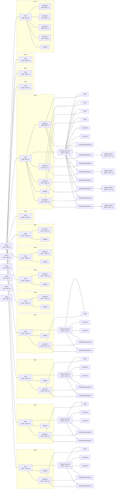

```mermaid
flowchart LR
  subgraph path7 [Path]
    7["Path<br>[396, 488, 0]"]
    8["Segment<br>[494, 585, 0]"]
    9["Segment<br>[591, 682, 0]"]
    10["Segment<br>[688, 781, 0]"]
    11["Segment<br>[787, 795, 0]"]
    12[Solid2d]
  end
  subgraph path13 [Path]
    13["Path<br>[829, 854, 0]"]
    14["Segment<br>[860, 908, 0]"]
    15["Segment<br>[914, 971, 0]"]
    16["Segment<br>[977, 1026, 0]"]
    17["Segment<br>[1032, 1051, 0]"]
    18[Solid2d]
  end
  subgraph path34 [Path]
    34["Path<br>[1364, 1389, 0]"]
  end
  subgraph path35 [Path]
    35["Path<br>[1397, 1434, 0]"]
    36["Segment<br>[1397, 1434, 0]"]
    37[Solid2d]
  end
  subgraph path38 [Path]
    38["Path<br>[1447, 1485, 0]"]
    39["Segment<br>[1447, 1485, 0]"]
    40[Solid2d]
  end
  subgraph path47 [Path]
    47["Path<br>[1364, 1389, 0]"]
  end
  subgraph path48 [Path]
    48["Path<br>[1397, 1434, 0]"]
    49["Segment<br>[1397, 1434, 0]"]
    50[Solid2d]
  end
  subgraph path51 [Path]
    51["Path<br>[1447, 1485, 0]"]
    52["Segment<br>[1447, 1485, 0]"]
    53[Solid2d]
  end
  subgraph path60 [Path]
    60["Path<br>[1364, 1389, 0]"]
  end
  subgraph path61 [Path]
    61["Path<br>[1397, 1434, 0]"]
    62["Segment<br>[1397, 1434, 0]"]
    63[Solid2d]
  end
  subgraph path64 [Path]
    64["Path<br>[1447, 1485, 0]"]
    65["Segment<br>[1447, 1485, 0]"]
    66[Solid2d]
  end
  subgraph path73 [Path]
    73["Path<br>[1364, 1389, 0]"]
  end
  subgraph path74 [Path]
    74["Path<br>[1397, 1434, 0]"]
    75["Segment<br>[1397, 1434, 0]"]
    76[Solid2d]
  end
  subgraph path77 [Path]
    77["Path<br>[1447, 1485, 0]"]
    78["Segment<br>[1447, 1485, 0]"]
    79[Solid2d]
  end
  1["Plane<br>[373, 390, 0]"]
  2["Plane<br>[373, 390, 0]"]
  3["Plane<br>[373, 390, 0]"]
  4["Plane<br>[373, 390, 0]"]
  5["Plane<br>[373, 390, 0]"]
  6["Plane<br>[373, 390, 0]"]
  19["Sweep Extrusion<br>[1057, 1085, 0]"]
  20[Wall]
  21[Wall]
  22[Wall]
  23[Wall]
  24["Cap Start"]
  25["Cap End"]
  26["SweepEdge Opposite"]
  27["SweepEdge Adjacent"]
  28["SweepEdge Opposite"]
  29["SweepEdge Adjacent"]
  30["SweepEdge Opposite"]
  31["SweepEdge Adjacent"]
  32["SweepEdge Opposite"]
  33["SweepEdge Adjacent"]
  41["Sweep Extrusion<br>[1497, 1521, 0]"]
  42[Wall]
  43["Cap Start"]
  44["Cap End"]
  45["SweepEdge Opposite"]
  46["SweepEdge Adjacent"]
  54["Sweep Extrusion<br>[1497, 1521, 0]"]
  55[Wall]
  56["Cap Start"]
  57["Cap End"]
  58["SweepEdge Opposite"]
  59["SweepEdge Adjacent"]
  67["Sweep Extrusion<br>[1497, 1521, 0]"]
  68[Wall]
  69["Cap Start"]
  70["Cap End"]
  71["SweepEdge Opposite"]
  72["SweepEdge Adjacent"]
  80["Sweep Extrusion<br>[1497, 1521, 0]"]
  81[Wall]
  82["Cap Start"]
  83["Cap End"]
  84["SweepEdge Opposite"]
  85["SweepEdge Adjacent"]
  86["EdgeCut Fillet<br>[1091, 1297, 0]"]
  87["EdgeCut Fillet<br>[1091, 1297, 0]"]
  88["EdgeCut Fillet<br>[1091, 1297, 0]"]
  89["EdgeCut Fillet<br>[1091, 1297, 0]"]
  1 --- 7
  1 --- 13
  1 --- 34
  1 --- 35
  1 --- 38
  1 --- 47
  1 --- 48
  1 --- 51
  1 --- 60
  1 --- 61
  1 --- 64
  1 --- 73
  1 --- 74
  1 --- 77
  7 --- 8
  7 --- 9
  7 --- 10
  7 --- 11
  7 --- 12
  13 --- 14
  13 --- 15
  13 --- 16
  13 --- 17
  13 ---- 19
  13 --- 18
  14 --- 20
  14 --- 26
  14 --- 27
  15 --- 21
  15 --- 28
  15 --- 29
  16 --- 22
  16 --- 30
  16 --- 31
  17 --- 23
  17 --- 32
  17 --- 33
  19 --- 20
  19 --- 21
  19 --- 22
  19 --- 23
  19 --- 24
  19 --- 25
  19 --- 26
  19 --- 27
  19 --- 28
  19 --- 29
  19 --- 30
  19 --- 31
  19 --- 32
  19 --- 33
  35 --- 36
  35 ---- 41
  35 --- 37
  36 --- 42
  36 --- 45
  36 --- 46
  38 --- 39
  38 --- 40
  41 --- 42
  41 --- 43
  41 --- 44
  41 --- 45
  41 --- 46
  48 --- 49
  48 ---- 54
  48 --- 50
  49 --- 55
  49 --- 58
  49 --- 59
  51 --- 52
  51 --- 53
  54 --- 55
  54 --- 56
  54 --- 57
  54 --- 58
  54 --- 59
  61 --- 62
  61 ---- 67
  61 --- 63
  62 --- 68
  62 --- 71
  62 --- 72
  64 --- 65
  64 --- 66
  67 --- 68
  67 --- 69
  67 --- 70
  67 --- 71
  67 --- 72
  74 --- 75
  74 ---- 80
  74 --- 76
  75 --- 81
  75 --- 84
  75 --- 85
  77 --- 78
  77 --- 79
  80 --- 81
  80 --- 82
  80 --- 83
  80 --- 84
  80 --- 85
  27 <--x 86
  29 <--x 87
  31 <--x 88
  33 <--x 89
```
