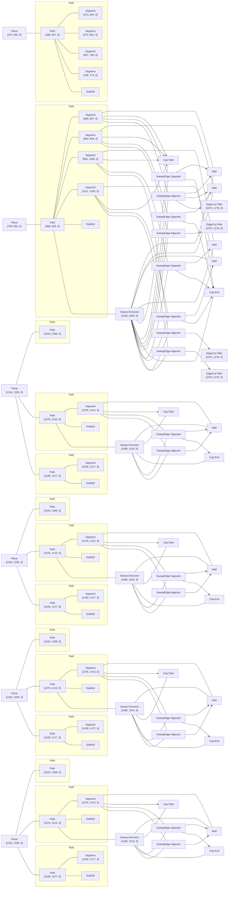

```mermaid
flowchart LR
  subgraph path7 [Path]
    7["Path<br>[396, 467, 0]"]
    21["Segment<br>[473, 564, 0]"]
    22["Segment<br>[570, 661, 0]"]
    23["Segment<br>[667, 760, 0]"]
    24["Segment<br>[766, 774, 0]"]
    40[Solid2d]
  end
  subgraph path8 [Path]
    8["Path<br>[808, 833, 0]"]
    25["Segment<br>[839, 887, 0]"]
    26["Segment<br>[893, 950, 0]"]
    27["Segment<br>[956, 1005, 0]"]
    28["Segment<br>[1011, 1030, 0]"]
    45[Solid2d]
  end
  subgraph path9 [Path]
    9["Path<br>[1343, 1368, 0]"]
  end
  subgraph path10 [Path]
    10["Path<br>[1343, 1368, 0]"]
  end
  subgraph path11 [Path]
    11["Path<br>[1343, 1368, 0]"]
  end
  subgraph path12 [Path]
    12["Path<br>[1343, 1368, 0]"]
  end
  subgraph path13 [Path]
    13["Path<br>[1376, 1413, 0]"]
    29["Segment<br>[1376, 1413, 0]"]
    38[Solid2d]
  end
  subgraph path14 [Path]
    14["Path<br>[1376, 1413, 0]"]
    31["Segment<br>[1376, 1413, 0]"]
    42[Solid2d]
  end
  subgraph path15 [Path]
    15["Path<br>[1376, 1413, 0]"]
    30["Segment<br>[1376, 1413, 0]"]
    44[Solid2d]
  end
  subgraph path16 [Path]
    16["Path<br>[1376, 1413, 0]"]
    32["Segment<br>[1376, 1413, 0]"]
    46[Solid2d]
  end
  subgraph path17 [Path]
    17["Path<br>[1439, 1477, 0]"]
    35["Segment<br>[1439, 1477, 0]"]
    37[Solid2d]
  end
  subgraph path18 [Path]
    18["Path<br>[1439, 1477, 0]"]
    34["Segment<br>[1439, 1477, 0]"]
    39[Solid2d]
  end
  subgraph path19 [Path]
    19["Path<br>[1439, 1477, 0]"]
    36["Segment<br>[1439, 1477, 0]"]
    41[Solid2d]
  end
  subgraph path20 [Path]
    20["Path<br>[1439, 1477, 0]"]
    33["Segment<br>[1439, 1477, 0]"]
    43[Solid2d]
  end
  1["Plane<br>[373, 390, 0]"]
  2["Plane<br>[783, 802, 0]"]
  3["Plane<br>[1316, 1335, 0]"]
  4["Plane<br>[1316, 1335, 0]"]
  5["Plane<br>[1316, 1335, 0]"]
  6["Plane<br>[1316, 1335, 0]"]
  47["Sweep Extrusion<br>[1036, 1064, 0]"]
  48["Sweep Extrusion<br>[1486, 1510, 0]"]
  49["Sweep Extrusion<br>[1486, 1510, 0]"]
  50["Sweep Extrusion<br>[1486, 1510, 0]"]
  51["Sweep Extrusion<br>[1486, 1510, 0]"]
  52[Wall]
  53[Wall]
  54[Wall]
  55[Wall]
  56[Wall]
  57[Wall]
  58[Wall]
  59[Wall]
  60["Cap Start"]
  61["Cap Start"]
  62["Cap Start"]
  63["Cap Start"]
  64["Cap Start"]
  65["Cap End"]
  66["Cap End"]
  67["Cap End"]
  68["Cap End"]
  69["Cap End"]
  70["SweepEdge Opposite"]
  71["SweepEdge Adjacent"]
  72["SweepEdge Opposite"]
  73["SweepEdge Adjacent"]
  74["SweepEdge Opposite"]
  75["SweepEdge Adjacent"]
  76["SweepEdge Opposite"]
  77["SweepEdge Adjacent"]
  78["SweepEdge Opposite"]
  79["SweepEdge Adjacent"]
  80["SweepEdge Opposite"]
  81["SweepEdge Adjacent"]
  82["SweepEdge Opposite"]
  83["SweepEdge Adjacent"]
  84["SweepEdge Opposite"]
  85["SweepEdge Adjacent"]
  86["EdgeCut Fillet<br>[1070, 1276, 0]"]
  87["EdgeCut Fillet<br>[1070, 1276, 0]"]
  88["EdgeCut Fillet<br>[1070, 1276, 0]"]
  89["EdgeCut Fillet<br>[1070, 1276, 0]"]
  1 --- 7
  2 --- 8
  3 --- 9
  3 --- 13
  3 --- 18
  4 --- 11
  4 --- 14
  4 --- 19
  5 --- 12
  5 --- 16
  5 --- 17
  6 --- 10
  6 --- 15
  6 --- 20
  7 --- 21
  7 --- 22
  7 --- 23
  7 --- 24
  7 --- 40
  8 --- 25
  8 --- 26
  8 --- 27
  8 --- 28
  8 --- 45
  8 ---- 47
  13 --- 29
  13 --- 38
  13 ---- 51
  14 --- 31
  14 --- 42
  14 ---- 48
  15 --- 30
  15 --- 44
  15 ---- 49
  16 --- 32
  16 --- 46
  16 ---- 50
  17 --- 35
  17 --- 37
  18 --- 34
  18 --- 39
  19 --- 36
  19 --- 41
  20 --- 33
  20 --- 43
  25 --- 55
  25 x--> 60
  25 --- 76
  25 --- 77
  26 --- 56
  26 x--> 60
  26 --- 78
  26 --- 79
  27 --- 58
  27 x--> 60
  27 --- 82
  27 --- 83
  28 --- 57
  28 x--> 60
  28 --- 80
  28 --- 81
  29 --- 59
  29 x--> 62
  29 --- 84
  29 --- 85
  30 --- 53
  30 x--> 64
  30 --- 72
  30 --- 73
  31 --- 52
  31 x--> 61
  31 --- 70
  31 --- 71
  32 --- 54
  32 x--> 63
  32 --- 74
  32 --- 75
  47 --- 55
  47 --- 56
  47 --- 57
  47 --- 58
  47 --- 60
  47 --- 65
  47 --- 76
  47 --- 77
  47 --- 78
  47 --- 79
  47 --- 80
  47 --- 81
  47 --- 82
  47 --- 83
  48 --- 52
  48 --- 61
  48 --- 66
  48 --- 70
  48 --- 71
  49 --- 53
  49 --- 64
  49 --- 69
  49 --- 72
  49 --- 73
  50 --- 54
  50 --- 63
  50 --- 68
  50 --- 74
  50 --- 75
  51 --- 59
  51 --- 62
  51 --- 67
  51 --- 84
  51 --- 85
  70 <--x 52
  71 <--x 52
  72 <--x 53
  73 <--x 53
  74 <--x 54
  75 <--x 54
  76 <--x 55
  77 <--x 55
  77 <--x 56
  78 <--x 56
  80 <--x 57
  82 <--x 58
  84 <--x 59
  85 <--x 59
  76 <--x 65
  78 <--x 65
  80 <--x 65
  82 <--x 65
  70 <--x 66
  84 <--x 67
  74 <--x 68
  72 <--x 69
  77 <--x 86
  79 <--x 87
  81 <--x 89
  83 <--x 88
```
