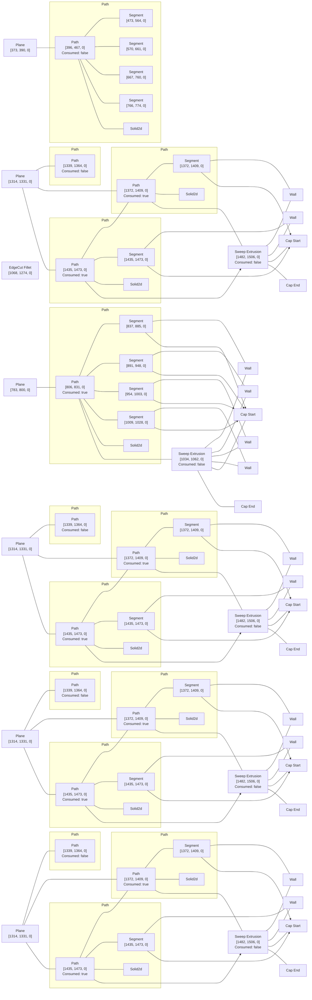

```mermaid
flowchart LR
  subgraph path2 [Path]
    2["Path<br>[396, 467, 0]<br>Consumed: false"]
      %% [ProgramBodyItem { index: 16 }, VariableDeclarationDeclaration, VariableDeclarationInit, PipeBodyItem { index: 1 }]
    3["Segment<br>[473, 564, 0]"]
      %% [ProgramBodyItem { index: 16 }, VariableDeclarationDeclaration, VariableDeclarationInit, PipeBodyItem { index: 2 }]
    4["Segment<br>[570, 661, 0]"]
      %% [ProgramBodyItem { index: 16 }, VariableDeclarationDeclaration, VariableDeclarationInit, PipeBodyItem { index: 3 }]
    5["Segment<br>[667, 760, 0]"]
      %% [ProgramBodyItem { index: 16 }, VariableDeclarationDeclaration, VariableDeclarationInit, PipeBodyItem { index: 4 }]
    6["Segment<br>[766, 774, 0]"]
      %% [ProgramBodyItem { index: 16 }, VariableDeclarationDeclaration, VariableDeclarationInit, PipeBodyItem { index: 5 }]
    7[Solid2d]
  end
  subgraph path9 [Path]
    9["Path<br>[806, 831, 0]<br>Consumed: true"]
      %% [ProgramBodyItem { index: 17 }, VariableDeclarationDeclaration, VariableDeclarationInit, PipeBodyItem { index: 1 }]
    10["Segment<br>[837, 885, 0]"]
      %% [ProgramBodyItem { index: 17 }, VariableDeclarationDeclaration, VariableDeclarationInit, PipeBodyItem { index: 2 }]
    11["Segment<br>[891, 948, 0]"]
      %% [ProgramBodyItem { index: 17 }, VariableDeclarationDeclaration, VariableDeclarationInit, PipeBodyItem { index: 3 }]
    12["Segment<br>[954, 1003, 0]"]
      %% [ProgramBodyItem { index: 17 }, VariableDeclarationDeclaration, VariableDeclarationInit, PipeBodyItem { index: 4 }]
    13["Segment<br>[1009, 1028, 0]"]
      %% [ProgramBodyItem { index: 17 }, VariableDeclarationDeclaration, VariableDeclarationInit, PipeBodyItem { index: 5 }]
    14[Solid2d]
  end
  subgraph path24 [Path]
    24["Path<br>[1339, 1364, 0]<br>Consumed: false"]
      %% [ProgramBodyItem { index: 18 }, VariableDeclarationDeclaration, VariableDeclarationInit, FunctionExpressionBody, FunctionExpressionBodyItem { index: 0 }, VariableDeclarationDeclaration, VariableDeclarationInit, PipeBodyItem { index: 1 }]
  end
  subgraph path25 [Path]
    25["Path<br>[1372, 1409, 0]<br>Consumed: true"]
      %% [ProgramBodyItem { index: 18 }, VariableDeclarationDeclaration, VariableDeclarationInit, FunctionExpressionBody, FunctionExpressionBodyItem { index: 0 }, VariableDeclarationDeclaration, VariableDeclarationInit, PipeBodyItem { index: 2 }]
    26["Segment<br>[1372, 1409, 0]"]
      %% [ProgramBodyItem { index: 18 }, VariableDeclarationDeclaration, VariableDeclarationInit, FunctionExpressionBody, FunctionExpressionBodyItem { index: 0 }, VariableDeclarationDeclaration, VariableDeclarationInit, PipeBodyItem { index: 2 }]
    27[Solid2d]
  end
  subgraph path28 [Path]
    28["Path<br>[1435, 1473, 0]<br>Consumed: true"]
      %% [ProgramBodyItem { index: 18 }, VariableDeclarationDeclaration, VariableDeclarationInit, FunctionExpressionBody, FunctionExpressionBodyItem { index: 0 }, VariableDeclarationDeclaration, VariableDeclarationInit, PipeBodyItem { index: 3 }, CallKwArg { index: 0 }]
    29["Segment<br>[1435, 1473, 0]"]
      %% [ProgramBodyItem { index: 18 }, VariableDeclarationDeclaration, VariableDeclarationInit, FunctionExpressionBody, FunctionExpressionBodyItem { index: 0 }, VariableDeclarationDeclaration, VariableDeclarationInit, PipeBodyItem { index: 3 }, CallKwArg { index: 0 }]
    30[Solid2d]
  end
  subgraph path37 [Path]
    37["Path<br>[1339, 1364, 0]<br>Consumed: false"]
      %% [ProgramBodyItem { index: 18 }, VariableDeclarationDeclaration, VariableDeclarationInit, FunctionExpressionBody, FunctionExpressionBodyItem { index: 0 }, VariableDeclarationDeclaration, VariableDeclarationInit, PipeBodyItem { index: 1 }]
  end
  subgraph path38 [Path]
    38["Path<br>[1372, 1409, 0]<br>Consumed: true"]
      %% [ProgramBodyItem { index: 18 }, VariableDeclarationDeclaration, VariableDeclarationInit, FunctionExpressionBody, FunctionExpressionBodyItem { index: 0 }, VariableDeclarationDeclaration, VariableDeclarationInit, PipeBodyItem { index: 2 }]
    39["Segment<br>[1372, 1409, 0]"]
      %% [ProgramBodyItem { index: 18 }, VariableDeclarationDeclaration, VariableDeclarationInit, FunctionExpressionBody, FunctionExpressionBodyItem { index: 0 }, VariableDeclarationDeclaration, VariableDeclarationInit, PipeBodyItem { index: 2 }]
    40[Solid2d]
  end
  subgraph path41 [Path]
    41["Path<br>[1435, 1473, 0]<br>Consumed: true"]
      %% [ProgramBodyItem { index: 18 }, VariableDeclarationDeclaration, VariableDeclarationInit, FunctionExpressionBody, FunctionExpressionBodyItem { index: 0 }, VariableDeclarationDeclaration, VariableDeclarationInit, PipeBodyItem { index: 3 }, CallKwArg { index: 0 }]
    42["Segment<br>[1435, 1473, 0]"]
      %% [ProgramBodyItem { index: 18 }, VariableDeclarationDeclaration, VariableDeclarationInit, FunctionExpressionBody, FunctionExpressionBodyItem { index: 0 }, VariableDeclarationDeclaration, VariableDeclarationInit, PipeBodyItem { index: 3 }, CallKwArg { index: 0 }]
    43[Solid2d]
  end
  subgraph path50 [Path]
    50["Path<br>[1339, 1364, 0]<br>Consumed: false"]
      %% [ProgramBodyItem { index: 18 }, VariableDeclarationDeclaration, VariableDeclarationInit, FunctionExpressionBody, FunctionExpressionBodyItem { index: 0 }, VariableDeclarationDeclaration, VariableDeclarationInit, PipeBodyItem { index: 1 }]
  end
  subgraph path51 [Path]
    51["Path<br>[1372, 1409, 0]<br>Consumed: true"]
      %% [ProgramBodyItem { index: 18 }, VariableDeclarationDeclaration, VariableDeclarationInit, FunctionExpressionBody, FunctionExpressionBodyItem { index: 0 }, VariableDeclarationDeclaration, VariableDeclarationInit, PipeBodyItem { index: 2 }]
    52["Segment<br>[1372, 1409, 0]"]
      %% [ProgramBodyItem { index: 18 }, VariableDeclarationDeclaration, VariableDeclarationInit, FunctionExpressionBody, FunctionExpressionBodyItem { index: 0 }, VariableDeclarationDeclaration, VariableDeclarationInit, PipeBodyItem { index: 2 }]
    53[Solid2d]
  end
  subgraph path54 [Path]
    54["Path<br>[1435, 1473, 0]<br>Consumed: true"]
      %% [ProgramBodyItem { index: 18 }, VariableDeclarationDeclaration, VariableDeclarationInit, FunctionExpressionBody, FunctionExpressionBodyItem { index: 0 }, VariableDeclarationDeclaration, VariableDeclarationInit, PipeBodyItem { index: 3 }, CallKwArg { index: 0 }]
    55["Segment<br>[1435, 1473, 0]"]
      %% [ProgramBodyItem { index: 18 }, VariableDeclarationDeclaration, VariableDeclarationInit, FunctionExpressionBody, FunctionExpressionBodyItem { index: 0 }, VariableDeclarationDeclaration, VariableDeclarationInit, PipeBodyItem { index: 3 }, CallKwArg { index: 0 }]
    56[Solid2d]
  end
  subgraph path63 [Path]
    63["Path<br>[1339, 1364, 0]<br>Consumed: false"]
      %% [ProgramBodyItem { index: 18 }, VariableDeclarationDeclaration, VariableDeclarationInit, FunctionExpressionBody, FunctionExpressionBodyItem { index: 0 }, VariableDeclarationDeclaration, VariableDeclarationInit, PipeBodyItem { index: 1 }]
  end
  subgraph path64 [Path]
    64["Path<br>[1372, 1409, 0]<br>Consumed: true"]
      %% [ProgramBodyItem { index: 18 }, VariableDeclarationDeclaration, VariableDeclarationInit, FunctionExpressionBody, FunctionExpressionBodyItem { index: 0 }, VariableDeclarationDeclaration, VariableDeclarationInit, PipeBodyItem { index: 2 }]
    65["Segment<br>[1372, 1409, 0]"]
      %% [ProgramBodyItem { index: 18 }, VariableDeclarationDeclaration, VariableDeclarationInit, FunctionExpressionBody, FunctionExpressionBodyItem { index: 0 }, VariableDeclarationDeclaration, VariableDeclarationInit, PipeBodyItem { index: 2 }]
    66[Solid2d]
  end
  subgraph path67 [Path]
    67["Path<br>[1435, 1473, 0]<br>Consumed: true"]
      %% [ProgramBodyItem { index: 18 }, VariableDeclarationDeclaration, VariableDeclarationInit, FunctionExpressionBody, FunctionExpressionBodyItem { index: 0 }, VariableDeclarationDeclaration, VariableDeclarationInit, PipeBodyItem { index: 3 }, CallKwArg { index: 0 }]
    68["Segment<br>[1435, 1473, 0]"]
      %% [ProgramBodyItem { index: 18 }, VariableDeclarationDeclaration, VariableDeclarationInit, FunctionExpressionBody, FunctionExpressionBodyItem { index: 0 }, VariableDeclarationDeclaration, VariableDeclarationInit, PipeBodyItem { index: 3 }, CallKwArg { index: 0 }]
    69[Solid2d]
  end
  1["Plane<br>[373, 390, 0]"]
    %% [ProgramBodyItem { index: 16 }, VariableDeclarationDeclaration, VariableDeclarationInit, PipeBodyItem { index: 0 }]
  8["Plane<br>[783, 800, 0]"]
    %% [ProgramBodyItem { index: 17 }, VariableDeclarationDeclaration, VariableDeclarationInit, PipeBodyItem { index: 0 }]
  15["Sweep Extrusion<br>[1034, 1062, 0]<br>Consumed: false"]
    %% [ProgramBodyItem { index: 17 }, VariableDeclarationDeclaration, VariableDeclarationInit, PipeBodyItem { index: 6 }]
  16[Wall]
    %% face_code_ref=Missing NodePath
  17[Wall]
    %% face_code_ref=Missing NodePath
  18[Wall]
    %% face_code_ref=Missing NodePath
  19[Wall]
    %% face_code_ref=Missing NodePath
  20["Cap Start"]
    %% face_code_ref=Missing NodePath
  21["Cap End"]
    %% face_code_ref=Missing NodePath
  22["EdgeCut Fillet<br>[1068, 1274, 0]"]
    %% [ProgramBodyItem { index: 17 }, VariableDeclarationDeclaration, VariableDeclarationInit, PipeBodyItem { index: 7 }]
  23["Plane<br>[1314, 1331, 0]"]
    %% [ProgramBodyItem { index: 18 }, VariableDeclarationDeclaration, VariableDeclarationInit, FunctionExpressionBody, FunctionExpressionBodyItem { index: 0 }, VariableDeclarationDeclaration, VariableDeclarationInit, PipeBodyItem { index: 0 }]
  31["Sweep Extrusion<br>[1482, 1506, 0]<br>Consumed: false"]
    %% [ProgramBodyItem { index: 18 }, VariableDeclarationDeclaration, VariableDeclarationInit, FunctionExpressionBody, FunctionExpressionBodyItem { index: 0 }, VariableDeclarationDeclaration, VariableDeclarationInit, PipeBodyItem { index: 4 }]
  32[Wall]
    %% face_code_ref=Missing NodePath
  33[Wall]
    %% face_code_ref=Missing NodePath
  34["Cap Start"]
    %% face_code_ref=Missing NodePath
  35["Cap End"]
    %% face_code_ref=Missing NodePath
  36["Plane<br>[1314, 1331, 0]"]
    %% [ProgramBodyItem { index: 18 }, VariableDeclarationDeclaration, VariableDeclarationInit, FunctionExpressionBody, FunctionExpressionBodyItem { index: 0 }, VariableDeclarationDeclaration, VariableDeclarationInit, PipeBodyItem { index: 0 }]
  44["Sweep Extrusion<br>[1482, 1506, 0]<br>Consumed: false"]
    %% [ProgramBodyItem { index: 18 }, VariableDeclarationDeclaration, VariableDeclarationInit, FunctionExpressionBody, FunctionExpressionBodyItem { index: 0 }, VariableDeclarationDeclaration, VariableDeclarationInit, PipeBodyItem { index: 4 }]
  45[Wall]
    %% face_code_ref=Missing NodePath
  46[Wall]
    %% face_code_ref=Missing NodePath
  47["Cap Start"]
    %% face_code_ref=Missing NodePath
  48["Cap End"]
    %% face_code_ref=Missing NodePath
  49["Plane<br>[1314, 1331, 0]"]
    %% [ProgramBodyItem { index: 18 }, VariableDeclarationDeclaration, VariableDeclarationInit, FunctionExpressionBody, FunctionExpressionBodyItem { index: 0 }, VariableDeclarationDeclaration, VariableDeclarationInit, PipeBodyItem { index: 0 }]
  57["Sweep Extrusion<br>[1482, 1506, 0]<br>Consumed: false"]
    %% [ProgramBodyItem { index: 18 }, VariableDeclarationDeclaration, VariableDeclarationInit, FunctionExpressionBody, FunctionExpressionBodyItem { index: 0 }, VariableDeclarationDeclaration, VariableDeclarationInit, PipeBodyItem { index: 4 }]
  58[Wall]
    %% face_code_ref=Missing NodePath
  59[Wall]
    %% face_code_ref=Missing NodePath
  60["Cap Start"]
    %% face_code_ref=Missing NodePath
  61["Cap End"]
    %% face_code_ref=Missing NodePath
  62["Plane<br>[1314, 1331, 0]"]
    %% [ProgramBodyItem { index: 18 }, VariableDeclarationDeclaration, VariableDeclarationInit, FunctionExpressionBody, FunctionExpressionBodyItem { index: 0 }, VariableDeclarationDeclaration, VariableDeclarationInit, PipeBodyItem { index: 0 }]
  70["Sweep Extrusion<br>[1482, 1506, 0]<br>Consumed: false"]
    %% [ProgramBodyItem { index: 18 }, VariableDeclarationDeclaration, VariableDeclarationInit, FunctionExpressionBody, FunctionExpressionBodyItem { index: 0 }, VariableDeclarationDeclaration, VariableDeclarationInit, PipeBodyItem { index: 4 }]
  71[Wall]
    %% face_code_ref=Missing NodePath
  72[Wall]
    %% face_code_ref=Missing NodePath
  73["Cap Start"]
    %% face_code_ref=Missing NodePath
  74["Cap End"]
    %% face_code_ref=Missing NodePath
  1 --- 2
  2 --- 3
  2 --- 4
  2 --- 5
  2 --- 6
  2 --- 7
  8 --- 9
  9 --- 10
  9 --- 11
  9 --- 12
  9 --- 13
  9 --- 14
  9 ---- 15
  10 --- 16
  10 x--> 20
  11 --- 17
  11 x--> 20
  12 --- 18
  12 x--> 20
  13 --- 19
  13 x--> 20
  15 --- 16
  15 --- 17
  15 --- 18
  15 --- 19
  15 --- 20
  15 --- 21
  23 --- 24
  23 --- 25
  23 --- 28
  25 --- 26
  25 --- 27
  28 --- 25
  25 ---- 31
  26 --- 32
  26 x--> 34
  28 --- 29
  28 --- 30
  28 x---> 31
  29 --- 33
  29 x--> 34
  31 --- 32
  31 --- 33
  31 --- 34
  31 --- 35
  36 --- 37
  36 --- 38
  36 --- 41
  38 --- 39
  38 --- 40
  41 --- 38
  38 ---- 44
  39 --- 45
  39 x--> 47
  41 --- 42
  41 --- 43
  41 x---> 44
  42 --- 46
  42 x--> 47
  44 --- 45
  44 --- 46
  44 --- 47
  44 --- 48
  49 --- 50
  49 --- 51
  49 --- 54
  51 --- 52
  51 --- 53
  54 --- 51
  51 ---- 57
  52 --- 58
  52 x--> 60
  54 --- 55
  54 --- 56
  54 x---> 57
  55 --- 59
  55 x--> 60
  57 --- 58
  57 --- 59
  57 --- 60
  57 --- 61
  62 --- 63
  62 --- 64
  62 --- 67
  64 --- 65
  64 --- 66
  67 --- 64
  64 ---- 70
  65 --- 71
  65 x--> 73
  67 --- 68
  67 --- 69
  67 x---> 70
  68 --- 72
  68 x--> 73
  70 --- 71
  70 --- 72
  70 --- 73
  70 --- 74
```
