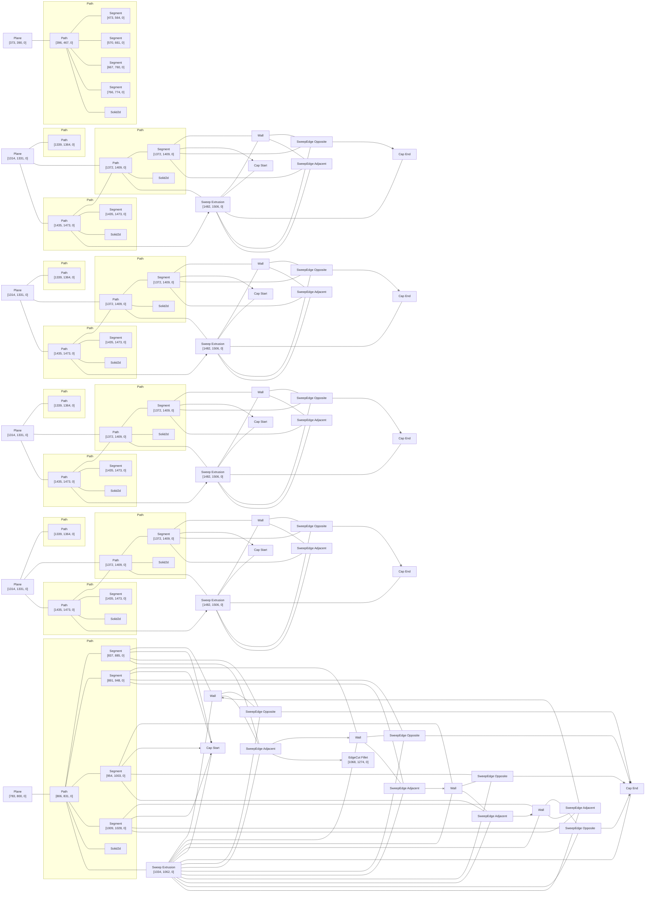

```mermaid
flowchart LR
  subgraph path2 [Path]
    2["Path<br>[396, 467, 0]"]
      %% [ProgramBodyItem { index: 16 }, VariableDeclarationDeclaration, VariableDeclarationInit, PipeBodyItem { index: 1 }]
    3["Segment<br>[473, 564, 0]"]
      %% [ProgramBodyItem { index: 16 }, VariableDeclarationDeclaration, VariableDeclarationInit, PipeBodyItem { index: 2 }]
    4["Segment<br>[570, 661, 0]"]
      %% [ProgramBodyItem { index: 16 }, VariableDeclarationDeclaration, VariableDeclarationInit, PipeBodyItem { index: 3 }]
    5["Segment<br>[667, 760, 0]"]
      %% [ProgramBodyItem { index: 16 }, VariableDeclarationDeclaration, VariableDeclarationInit, PipeBodyItem { index: 4 }]
    6["Segment<br>[766, 774, 0]"]
      %% [ProgramBodyItem { index: 16 }, VariableDeclarationDeclaration, VariableDeclarationInit, PipeBodyItem { index: 5 }]
    7[Solid2d]
  end
  subgraph path9 [Path]
    9["Path<br>[806, 831, 0]"]
      %% [ProgramBodyItem { index: 17 }, VariableDeclarationDeclaration, VariableDeclarationInit, PipeBodyItem { index: 1 }]
    10["Segment<br>[837, 885, 0]"]
      %% [ProgramBodyItem { index: 17 }, VariableDeclarationDeclaration, VariableDeclarationInit, PipeBodyItem { index: 2 }]
    11["Segment<br>[891, 948, 0]"]
      %% [ProgramBodyItem { index: 17 }, VariableDeclarationDeclaration, VariableDeclarationInit, PipeBodyItem { index: 3 }]
    12["Segment<br>[954, 1003, 0]"]
      %% [ProgramBodyItem { index: 17 }, VariableDeclarationDeclaration, VariableDeclarationInit, PipeBodyItem { index: 4 }]
    13["Segment<br>[1009, 1028, 0]"]
      %% [ProgramBodyItem { index: 17 }, VariableDeclarationDeclaration, VariableDeclarationInit, PipeBodyItem { index: 5 }]
    14[Solid2d]
  end
  subgraph path32 [Path]
    32["Path<br>[1339, 1364, 0]"]
      %% [ProgramBodyItem { index: 18 }, VariableDeclarationDeclaration, VariableDeclarationInit, FunctionExpressionBody, FunctionExpressionBodyItem { index: 0 }, VariableDeclarationDeclaration, VariableDeclarationInit, PipeBodyItem { index: 1 }]
  end
  subgraph path33 [Path]
    33["Path<br>[1372, 1409, 0]"]
      %% [ProgramBodyItem { index: 18 }, VariableDeclarationDeclaration, VariableDeclarationInit, FunctionExpressionBody, FunctionExpressionBodyItem { index: 0 }, VariableDeclarationDeclaration, VariableDeclarationInit, PipeBodyItem { index: 2 }]
    34["Segment<br>[1372, 1409, 0]"]
      %% [ProgramBodyItem { index: 18 }, VariableDeclarationDeclaration, VariableDeclarationInit, FunctionExpressionBody, FunctionExpressionBodyItem { index: 0 }, VariableDeclarationDeclaration, VariableDeclarationInit, PipeBodyItem { index: 2 }]
    35[Solid2d]
  end
  subgraph path36 [Path]
    36["Path<br>[1435, 1473, 0]"]
      %% [ProgramBodyItem { index: 18 }, VariableDeclarationDeclaration, VariableDeclarationInit, FunctionExpressionBody, FunctionExpressionBodyItem { index: 0 }, VariableDeclarationDeclaration, VariableDeclarationInit, PipeBodyItem { index: 3 }, CallKwArg { index: 0 }]
    37["Segment<br>[1435, 1473, 0]"]
      %% [ProgramBodyItem { index: 18 }, VariableDeclarationDeclaration, VariableDeclarationInit, FunctionExpressionBody, FunctionExpressionBodyItem { index: 0 }, VariableDeclarationDeclaration, VariableDeclarationInit, PipeBodyItem { index: 3 }, CallKwArg { index: 0 }]
    38[Solid2d]
  end
  subgraph path46 [Path]
    46["Path<br>[1339, 1364, 0]"]
      %% [ProgramBodyItem { index: 18 }, VariableDeclarationDeclaration, VariableDeclarationInit, FunctionExpressionBody, FunctionExpressionBodyItem { index: 0 }, VariableDeclarationDeclaration, VariableDeclarationInit, PipeBodyItem { index: 1 }]
  end
  subgraph path47 [Path]
    47["Path<br>[1372, 1409, 0]"]
      %% [ProgramBodyItem { index: 18 }, VariableDeclarationDeclaration, VariableDeclarationInit, FunctionExpressionBody, FunctionExpressionBodyItem { index: 0 }, VariableDeclarationDeclaration, VariableDeclarationInit, PipeBodyItem { index: 2 }]
    48["Segment<br>[1372, 1409, 0]"]
      %% [ProgramBodyItem { index: 18 }, VariableDeclarationDeclaration, VariableDeclarationInit, FunctionExpressionBody, FunctionExpressionBodyItem { index: 0 }, VariableDeclarationDeclaration, VariableDeclarationInit, PipeBodyItem { index: 2 }]
    49[Solid2d]
  end
  subgraph path50 [Path]
    50["Path<br>[1435, 1473, 0]"]
      %% [ProgramBodyItem { index: 18 }, VariableDeclarationDeclaration, VariableDeclarationInit, FunctionExpressionBody, FunctionExpressionBodyItem { index: 0 }, VariableDeclarationDeclaration, VariableDeclarationInit, PipeBodyItem { index: 3 }, CallKwArg { index: 0 }]
    51["Segment<br>[1435, 1473, 0]"]
      %% [ProgramBodyItem { index: 18 }, VariableDeclarationDeclaration, VariableDeclarationInit, FunctionExpressionBody, FunctionExpressionBodyItem { index: 0 }, VariableDeclarationDeclaration, VariableDeclarationInit, PipeBodyItem { index: 3 }, CallKwArg { index: 0 }]
    52[Solid2d]
  end
  subgraph path60 [Path]
    60["Path<br>[1339, 1364, 0]"]
      %% [ProgramBodyItem { index: 18 }, VariableDeclarationDeclaration, VariableDeclarationInit, FunctionExpressionBody, FunctionExpressionBodyItem { index: 0 }, VariableDeclarationDeclaration, VariableDeclarationInit, PipeBodyItem { index: 1 }]
  end
  subgraph path61 [Path]
    61["Path<br>[1372, 1409, 0]"]
      %% [ProgramBodyItem { index: 18 }, VariableDeclarationDeclaration, VariableDeclarationInit, FunctionExpressionBody, FunctionExpressionBodyItem { index: 0 }, VariableDeclarationDeclaration, VariableDeclarationInit, PipeBodyItem { index: 2 }]
    62["Segment<br>[1372, 1409, 0]"]
      %% [ProgramBodyItem { index: 18 }, VariableDeclarationDeclaration, VariableDeclarationInit, FunctionExpressionBody, FunctionExpressionBodyItem { index: 0 }, VariableDeclarationDeclaration, VariableDeclarationInit, PipeBodyItem { index: 2 }]
    63[Solid2d]
  end
  subgraph path64 [Path]
    64["Path<br>[1435, 1473, 0]"]
      %% [ProgramBodyItem { index: 18 }, VariableDeclarationDeclaration, VariableDeclarationInit, FunctionExpressionBody, FunctionExpressionBodyItem { index: 0 }, VariableDeclarationDeclaration, VariableDeclarationInit, PipeBodyItem { index: 3 }, CallKwArg { index: 0 }]
    65["Segment<br>[1435, 1473, 0]"]
      %% [ProgramBodyItem { index: 18 }, VariableDeclarationDeclaration, VariableDeclarationInit, FunctionExpressionBody, FunctionExpressionBodyItem { index: 0 }, VariableDeclarationDeclaration, VariableDeclarationInit, PipeBodyItem { index: 3 }, CallKwArg { index: 0 }]
    66[Solid2d]
  end
  subgraph path74 [Path]
    74["Path<br>[1339, 1364, 0]"]
      %% [ProgramBodyItem { index: 18 }, VariableDeclarationDeclaration, VariableDeclarationInit, FunctionExpressionBody, FunctionExpressionBodyItem { index: 0 }, VariableDeclarationDeclaration, VariableDeclarationInit, PipeBodyItem { index: 1 }]
  end
  subgraph path75 [Path]
    75["Path<br>[1372, 1409, 0]"]
      %% [ProgramBodyItem { index: 18 }, VariableDeclarationDeclaration, VariableDeclarationInit, FunctionExpressionBody, FunctionExpressionBodyItem { index: 0 }, VariableDeclarationDeclaration, VariableDeclarationInit, PipeBodyItem { index: 2 }]
    76["Segment<br>[1372, 1409, 0]"]
      %% [ProgramBodyItem { index: 18 }, VariableDeclarationDeclaration, VariableDeclarationInit, FunctionExpressionBody, FunctionExpressionBodyItem { index: 0 }, VariableDeclarationDeclaration, VariableDeclarationInit, PipeBodyItem { index: 2 }]
    77[Solid2d]
  end
  subgraph path78 [Path]
    78["Path<br>[1435, 1473, 0]"]
      %% [ProgramBodyItem { index: 18 }, VariableDeclarationDeclaration, VariableDeclarationInit, FunctionExpressionBody, FunctionExpressionBodyItem { index: 0 }, VariableDeclarationDeclaration, VariableDeclarationInit, PipeBodyItem { index: 3 }, CallKwArg { index: 0 }]
    79["Segment<br>[1435, 1473, 0]"]
      %% [ProgramBodyItem { index: 18 }, VariableDeclarationDeclaration, VariableDeclarationInit, FunctionExpressionBody, FunctionExpressionBodyItem { index: 0 }, VariableDeclarationDeclaration, VariableDeclarationInit, PipeBodyItem { index: 3 }, CallKwArg { index: 0 }]
    80[Solid2d]
  end
  1["Plane<br>[373, 390, 0]"]
    %% [ProgramBodyItem { index: 16 }, VariableDeclarationDeclaration, VariableDeclarationInit, PipeBodyItem { index: 0 }]
  8["Plane<br>[783, 800, 0]"]
    %% [ProgramBodyItem { index: 17 }, VariableDeclarationDeclaration, VariableDeclarationInit, PipeBodyItem { index: 0 }]
  15["Sweep Extrusion<br>[1034, 1062, 0]"]
    %% [ProgramBodyItem { index: 17 }, VariableDeclarationDeclaration, VariableDeclarationInit, PipeBodyItem { index: 6 }]
  16[Wall]
    %% face_code_ref=Missing NodePath
  17[Wall]
    %% face_code_ref=Missing NodePath
  18[Wall]
    %% face_code_ref=Missing NodePath
  19[Wall]
    %% face_code_ref=Missing NodePath
  20["Cap Start"]
    %% face_code_ref=Missing NodePath
  21["Cap End"]
    %% face_code_ref=Missing NodePath
  22["SweepEdge Opposite"]
  23["SweepEdge Adjacent"]
  24["SweepEdge Opposite"]
  25["SweepEdge Adjacent"]
  26["SweepEdge Opposite"]
  27["SweepEdge Adjacent"]
  28["SweepEdge Opposite"]
  29["SweepEdge Adjacent"]
  30["EdgeCut Fillet<br>[1068, 1274, 0]"]
    %% [ProgramBodyItem { index: 17 }, VariableDeclarationDeclaration, VariableDeclarationInit, PipeBodyItem { index: 7 }]
  31["Plane<br>[1314, 1331, 0]"]
    %% [ProgramBodyItem { index: 18 }, VariableDeclarationDeclaration, VariableDeclarationInit, FunctionExpressionBody, FunctionExpressionBodyItem { index: 0 }, VariableDeclarationDeclaration, VariableDeclarationInit, PipeBodyItem { index: 0 }]
  39["Sweep Extrusion<br>[1482, 1506, 0]"]
    %% [ProgramBodyItem { index: 18 }, VariableDeclarationDeclaration, VariableDeclarationInit, FunctionExpressionBody, FunctionExpressionBodyItem { index: 0 }, VariableDeclarationDeclaration, VariableDeclarationInit, PipeBodyItem { index: 4 }]
  40[Wall]
    %% face_code_ref=Missing NodePath
  41["Cap Start"]
    %% face_code_ref=Missing NodePath
  42["Cap End"]
    %% face_code_ref=Missing NodePath
  43["SweepEdge Opposite"]
  44["SweepEdge Adjacent"]
  45["Plane<br>[1314, 1331, 0]"]
    %% [ProgramBodyItem { index: 18 }, VariableDeclarationDeclaration, VariableDeclarationInit, FunctionExpressionBody, FunctionExpressionBodyItem { index: 0 }, VariableDeclarationDeclaration, VariableDeclarationInit, PipeBodyItem { index: 0 }]
  53["Sweep Extrusion<br>[1482, 1506, 0]"]
    %% [ProgramBodyItem { index: 18 }, VariableDeclarationDeclaration, VariableDeclarationInit, FunctionExpressionBody, FunctionExpressionBodyItem { index: 0 }, VariableDeclarationDeclaration, VariableDeclarationInit, PipeBodyItem { index: 4 }]
  54[Wall]
    %% face_code_ref=Missing NodePath
  55["Cap Start"]
    %% face_code_ref=Missing NodePath
  56["Cap End"]
    %% face_code_ref=Missing NodePath
  57["SweepEdge Opposite"]
  58["SweepEdge Adjacent"]
  59["Plane<br>[1314, 1331, 0]"]
    %% [ProgramBodyItem { index: 18 }, VariableDeclarationDeclaration, VariableDeclarationInit, FunctionExpressionBody, FunctionExpressionBodyItem { index: 0 }, VariableDeclarationDeclaration, VariableDeclarationInit, PipeBodyItem { index: 0 }]
  67["Sweep Extrusion<br>[1482, 1506, 0]"]
    %% [ProgramBodyItem { index: 18 }, VariableDeclarationDeclaration, VariableDeclarationInit, FunctionExpressionBody, FunctionExpressionBodyItem { index: 0 }, VariableDeclarationDeclaration, VariableDeclarationInit, PipeBodyItem { index: 4 }]
  68[Wall]
    %% face_code_ref=Missing NodePath
  69["Cap Start"]
    %% face_code_ref=Missing NodePath
  70["Cap End"]
    %% face_code_ref=Missing NodePath
  71["SweepEdge Opposite"]
  72["SweepEdge Adjacent"]
  73["Plane<br>[1314, 1331, 0]"]
    %% [ProgramBodyItem { index: 18 }, VariableDeclarationDeclaration, VariableDeclarationInit, FunctionExpressionBody, FunctionExpressionBodyItem { index: 0 }, VariableDeclarationDeclaration, VariableDeclarationInit, PipeBodyItem { index: 0 }]
  81["Sweep Extrusion<br>[1482, 1506, 0]"]
    %% [ProgramBodyItem { index: 18 }, VariableDeclarationDeclaration, VariableDeclarationInit, FunctionExpressionBody, FunctionExpressionBodyItem { index: 0 }, VariableDeclarationDeclaration, VariableDeclarationInit, PipeBodyItem { index: 4 }]
  82[Wall]
    %% face_code_ref=Missing NodePath
  83["Cap Start"]
    %% face_code_ref=Missing NodePath
  84["Cap End"]
    %% face_code_ref=Missing NodePath
  85["SweepEdge Opposite"]
  86["SweepEdge Adjacent"]
  1 --- 2
  2 --- 3
  2 --- 4
  2 --- 5
  2 --- 6
  2 --- 7
  8 --- 9
  9 --- 10
  9 --- 11
  9 --- 12
  9 --- 13
  9 --- 14
  9 ---- 15
  10 --- 16
  10 x--> 20
  10 --- 22
  10 --- 23
  11 --- 17
  11 x--> 20
  11 --- 24
  11 --- 25
  12 --- 18
  12 x--> 20
  12 --- 26
  12 --- 27
  13 --- 19
  13 x--> 20
  13 --- 28
  13 --- 29
  15 --- 16
  15 --- 17
  15 --- 18
  15 --- 19
  15 --- 20
  15 --- 21
  15 --- 22
  15 --- 23
  15 --- 24
  15 --- 25
  15 --- 26
  15 --- 27
  15 --- 28
  15 --- 29
  16 --- 22
  16 --- 23
  29 <--x 16
  23 <--x 17
  17 --- 24
  17 --- 25
  25 <--x 18
  18 --- 26
  18 --- 27
  27 <--x 19
  19 --- 28
  19 --- 29
  22 <--x 21
  24 <--x 21
  26 <--x 21
  28 <--x 21
  23 <--x 30
  31 --- 32
  31 --- 33
  31 --- 36
  33 --- 34
  33 --- 35
  36 --- 33
  33 ---- 39
  34 --- 40
  34 x--> 41
  34 --- 43
  34 --- 44
  36 --- 37
  36 --- 38
  36 x---> 39
  39 --- 40
  39 --- 41
  39 --- 42
  39 --- 43
  39 --- 44
  40 --- 43
  40 --- 44
  43 <--x 42
  45 --- 46
  45 --- 47
  45 --- 50
  47 --- 48
  47 --- 49
  50 --- 47
  47 ---- 53
  48 --- 54
  48 x--> 55
  48 --- 57
  48 --- 58
  50 --- 51
  50 --- 52
  50 x---> 53
  53 --- 54
  53 --- 55
  53 --- 56
  53 --- 57
  53 --- 58
  54 --- 57
  54 --- 58
  57 <--x 56
  59 --- 60
  59 --- 61
  59 --- 64
  61 --- 62
  61 --- 63
  64 --- 61
  61 ---- 67
  62 --- 68
  62 x--> 69
  62 --- 71
  62 --- 72
  64 --- 65
  64 --- 66
  64 x---> 67
  67 --- 68
  67 --- 69
  67 --- 70
  67 --- 71
  67 --- 72
  68 --- 71
  68 --- 72
  71 <--x 70
  73 --- 74
  73 --- 75
  73 --- 78
  75 --- 76
  75 --- 77
  78 --- 75
  75 ---- 81
  76 --- 82
  76 x--> 83
  76 --- 85
  76 --- 86
  78 --- 79
  78 --- 80
  78 x---> 81
  81 --- 82
  81 --- 83
  81 --- 84
  81 --- 85
  81 --- 86
  82 --- 85
  82 --- 86
  85 <--x 84
```
