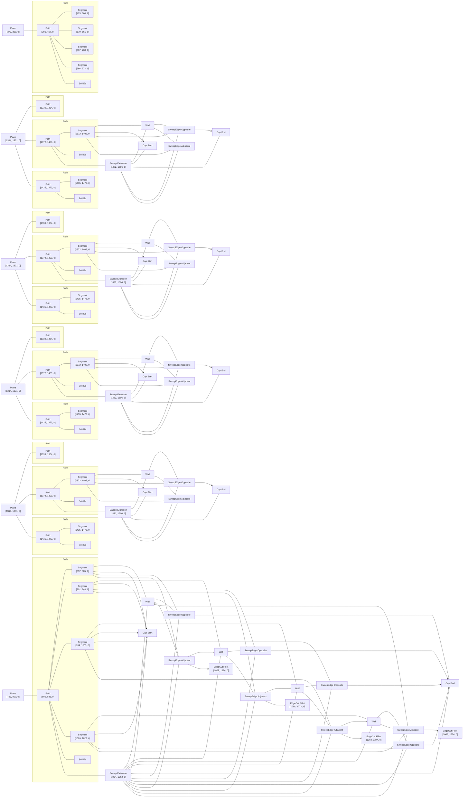

```mermaid
flowchart LR
  subgraph path7 [Path]
    7["Path<br>[396, 467, 0]"]
      %% [ProgramBodyItem { index: 16 }, VariableDeclarationDeclaration, VariableDeclarationInit, PipeBodyItem { index: 1 }]
    21["Segment<br>[473, 564, 0]"]
      %% [ProgramBodyItem { index: 16 }, VariableDeclarationDeclaration, VariableDeclarationInit, PipeBodyItem { index: 2 }]
    22["Segment<br>[570, 661, 0]"]
      %% [ProgramBodyItem { index: 16 }, VariableDeclarationDeclaration, VariableDeclarationInit, PipeBodyItem { index: 3 }]
    23["Segment<br>[667, 760, 0]"]
      %% [ProgramBodyItem { index: 16 }, VariableDeclarationDeclaration, VariableDeclarationInit, PipeBodyItem { index: 4 }]
    24["Segment<br>[766, 774, 0]"]
      %% [ProgramBodyItem { index: 16 }, VariableDeclarationDeclaration, VariableDeclarationInit, PipeBodyItem { index: 5 }]
    42[Solid2d]
  end
  subgraph path8 [Path]
    8["Path<br>[806, 831, 0]"]
      %% [ProgramBodyItem { index: 17 }, VariableDeclarationDeclaration, VariableDeclarationInit, PipeBodyItem { index: 1 }]
    25["Segment<br>[837, 885, 0]"]
      %% [ProgramBodyItem { index: 17 }, VariableDeclarationDeclaration, VariableDeclarationInit, PipeBodyItem { index: 2 }]
    26["Segment<br>[891, 948, 0]"]
      %% [ProgramBodyItem { index: 17 }, VariableDeclarationDeclaration, VariableDeclarationInit, PipeBodyItem { index: 3 }]
    27["Segment<br>[954, 1003, 0]"]
      %% [ProgramBodyItem { index: 17 }, VariableDeclarationDeclaration, VariableDeclarationInit, PipeBodyItem { index: 4 }]
    28["Segment<br>[1009, 1028, 0]"]
      %% [ProgramBodyItem { index: 17 }, VariableDeclarationDeclaration, VariableDeclarationInit, PipeBodyItem { index: 5 }]
    46[Solid2d]
  end
  subgraph path9 [Path]
    9["Path<br>[1339, 1364, 0]"]
      %% [ProgramBodyItem { index: 18 }, VariableDeclarationDeclaration, VariableDeclarationInit, FunctionExpressionBody, FunctionExpressionBodyItem { index: 0 }, VariableDeclarationDeclaration, VariableDeclarationInit, PipeBodyItem { index: 1 }]
  end
  subgraph path10 [Path]
    10["Path<br>[1339, 1364, 0]"]
      %% [ProgramBodyItem { index: 18 }, VariableDeclarationDeclaration, VariableDeclarationInit, FunctionExpressionBody, FunctionExpressionBodyItem { index: 0 }, VariableDeclarationDeclaration, VariableDeclarationInit, PipeBodyItem { index: 1 }]
  end
  subgraph path11 [Path]
    11["Path<br>[1339, 1364, 0]"]
      %% [ProgramBodyItem { index: 18 }, VariableDeclarationDeclaration, VariableDeclarationInit, FunctionExpressionBody, FunctionExpressionBodyItem { index: 0 }, VariableDeclarationDeclaration, VariableDeclarationInit, PipeBodyItem { index: 1 }]
  end
  subgraph path12 [Path]
    12["Path<br>[1339, 1364, 0]"]
      %% [ProgramBodyItem { index: 18 }, VariableDeclarationDeclaration, VariableDeclarationInit, FunctionExpressionBody, FunctionExpressionBodyItem { index: 0 }, VariableDeclarationDeclaration, VariableDeclarationInit, PipeBodyItem { index: 1 }]
  end
  subgraph path13 [Path]
    13["Path<br>[1372, 1409, 0]"]
      %% [ProgramBodyItem { index: 18 }, VariableDeclarationDeclaration, VariableDeclarationInit, FunctionExpressionBody, FunctionExpressionBodyItem { index: 0 }, VariableDeclarationDeclaration, VariableDeclarationInit, PipeBodyItem { index: 2 }]
    31["Segment<br>[1372, 1409, 0]"]
      %% [ProgramBodyItem { index: 18 }, VariableDeclarationDeclaration, VariableDeclarationInit, FunctionExpressionBody, FunctionExpressionBodyItem { index: 0 }, VariableDeclarationDeclaration, VariableDeclarationInit, PipeBodyItem { index: 2 }]
    38[Solid2d]
  end
  subgraph path14 [Path]
    14["Path<br>[1372, 1409, 0]"]
      %% [ProgramBodyItem { index: 18 }, VariableDeclarationDeclaration, VariableDeclarationInit, FunctionExpressionBody, FunctionExpressionBodyItem { index: 0 }, VariableDeclarationDeclaration, VariableDeclarationInit, PipeBodyItem { index: 2 }]
    30["Segment<br>[1372, 1409, 0]"]
      %% [ProgramBodyItem { index: 18 }, VariableDeclarationDeclaration, VariableDeclarationInit, FunctionExpressionBody, FunctionExpressionBodyItem { index: 0 }, VariableDeclarationDeclaration, VariableDeclarationInit, PipeBodyItem { index: 2 }]
    39[Solid2d]
  end
  subgraph path15 [Path]
    15["Path<br>[1372, 1409, 0]"]
      %% [ProgramBodyItem { index: 18 }, VariableDeclarationDeclaration, VariableDeclarationInit, FunctionExpressionBody, FunctionExpressionBodyItem { index: 0 }, VariableDeclarationDeclaration, VariableDeclarationInit, PipeBodyItem { index: 2 }]
    29["Segment<br>[1372, 1409, 0]"]
      %% [ProgramBodyItem { index: 18 }, VariableDeclarationDeclaration, VariableDeclarationInit, FunctionExpressionBody, FunctionExpressionBodyItem { index: 0 }, VariableDeclarationDeclaration, VariableDeclarationInit, PipeBodyItem { index: 2 }]
    40[Solid2d]
  end
  subgraph path16 [Path]
    16["Path<br>[1372, 1409, 0]"]
      %% [ProgramBodyItem { index: 18 }, VariableDeclarationDeclaration, VariableDeclarationInit, FunctionExpressionBody, FunctionExpressionBodyItem { index: 0 }, VariableDeclarationDeclaration, VariableDeclarationInit, PipeBodyItem { index: 2 }]
    32["Segment<br>[1372, 1409, 0]"]
      %% [ProgramBodyItem { index: 18 }, VariableDeclarationDeclaration, VariableDeclarationInit, FunctionExpressionBody, FunctionExpressionBodyItem { index: 0 }, VariableDeclarationDeclaration, VariableDeclarationInit, PipeBodyItem { index: 2 }]
    41[Solid2d]
  end
  subgraph path17 [Path]
    17["Path<br>[1435, 1473, 0]"]
      %% [ProgramBodyItem { index: 18 }, VariableDeclarationDeclaration, VariableDeclarationInit, FunctionExpressionBody, FunctionExpressionBodyItem { index: 0 }, VariableDeclarationDeclaration, VariableDeclarationInit, PipeBodyItem { index: 3 }, CallKwArg { index: 0 }]
    35["Segment<br>[1435, 1473, 0]"]
      %% [ProgramBodyItem { index: 18 }, VariableDeclarationDeclaration, VariableDeclarationInit, FunctionExpressionBody, FunctionExpressionBodyItem { index: 0 }, VariableDeclarationDeclaration, VariableDeclarationInit, PipeBodyItem { index: 3 }, CallKwArg { index: 0 }]
    37[Solid2d]
  end
  subgraph path18 [Path]
    18["Path<br>[1435, 1473, 0]"]
      %% [ProgramBodyItem { index: 18 }, VariableDeclarationDeclaration, VariableDeclarationInit, FunctionExpressionBody, FunctionExpressionBodyItem { index: 0 }, VariableDeclarationDeclaration, VariableDeclarationInit, PipeBodyItem { index: 3 }, CallKwArg { index: 0 }]
    33["Segment<br>[1435, 1473, 0]"]
      %% [ProgramBodyItem { index: 18 }, VariableDeclarationDeclaration, VariableDeclarationInit, FunctionExpressionBody, FunctionExpressionBodyItem { index: 0 }, VariableDeclarationDeclaration, VariableDeclarationInit, PipeBodyItem { index: 3 }, CallKwArg { index: 0 }]
    43[Solid2d]
  end
  subgraph path19 [Path]
    19["Path<br>[1435, 1473, 0]"]
      %% [ProgramBodyItem { index: 18 }, VariableDeclarationDeclaration, VariableDeclarationInit, FunctionExpressionBody, FunctionExpressionBodyItem { index: 0 }, VariableDeclarationDeclaration, VariableDeclarationInit, PipeBodyItem { index: 3 }, CallKwArg { index: 0 }]
    36["Segment<br>[1435, 1473, 0]"]
      %% [ProgramBodyItem { index: 18 }, VariableDeclarationDeclaration, VariableDeclarationInit, FunctionExpressionBody, FunctionExpressionBodyItem { index: 0 }, VariableDeclarationDeclaration, VariableDeclarationInit, PipeBodyItem { index: 3 }, CallKwArg { index: 0 }]
    44[Solid2d]
  end
  subgraph path20 [Path]
    20["Path<br>[1435, 1473, 0]"]
      %% [ProgramBodyItem { index: 18 }, VariableDeclarationDeclaration, VariableDeclarationInit, FunctionExpressionBody, FunctionExpressionBodyItem { index: 0 }, VariableDeclarationDeclaration, VariableDeclarationInit, PipeBodyItem { index: 3 }, CallKwArg { index: 0 }]
    34["Segment<br>[1435, 1473, 0]"]
      %% [ProgramBodyItem { index: 18 }, VariableDeclarationDeclaration, VariableDeclarationInit, FunctionExpressionBody, FunctionExpressionBodyItem { index: 0 }, VariableDeclarationDeclaration, VariableDeclarationInit, PipeBodyItem { index: 3 }, CallKwArg { index: 0 }]
    45[Solid2d]
  end
  1["Plane<br>[373, 390, 0]"]
    %% [ProgramBodyItem { index: 16 }, VariableDeclarationDeclaration, VariableDeclarationInit, PipeBodyItem { index: 0 }]
  2["Plane<br>[783, 800, 0]"]
    %% [ProgramBodyItem { index: 17 }, VariableDeclarationDeclaration, VariableDeclarationInit, PipeBodyItem { index: 0 }]
  3["Plane<br>[1314, 1331, 0]"]
    %% [ProgramBodyItem { index: 18 }, VariableDeclarationDeclaration, VariableDeclarationInit, FunctionExpressionBody, FunctionExpressionBodyItem { index: 0 }, VariableDeclarationDeclaration, VariableDeclarationInit, PipeBodyItem { index: 0 }]
  4["Plane<br>[1314, 1331, 0]"]
    %% [ProgramBodyItem { index: 18 }, VariableDeclarationDeclaration, VariableDeclarationInit, FunctionExpressionBody, FunctionExpressionBodyItem { index: 0 }, VariableDeclarationDeclaration, VariableDeclarationInit, PipeBodyItem { index: 0 }]
  5["Plane<br>[1314, 1331, 0]"]
    %% [ProgramBodyItem { index: 18 }, VariableDeclarationDeclaration, VariableDeclarationInit, FunctionExpressionBody, FunctionExpressionBodyItem { index: 0 }, VariableDeclarationDeclaration, VariableDeclarationInit, PipeBodyItem { index: 0 }]
  6["Plane<br>[1314, 1331, 0]"]
    %% [ProgramBodyItem { index: 18 }, VariableDeclarationDeclaration, VariableDeclarationInit, FunctionExpressionBody, FunctionExpressionBodyItem { index: 0 }, VariableDeclarationDeclaration, VariableDeclarationInit, PipeBodyItem { index: 0 }]
  47["Sweep Extrusion<br>[1034, 1062, 0]"]
    %% [ProgramBodyItem { index: 17 }, VariableDeclarationDeclaration, VariableDeclarationInit, PipeBodyItem { index: 6 }]
  48["Sweep Extrusion<br>[1482, 1506, 0]"]
    %% [ProgramBodyItem { index: 18 }, VariableDeclarationDeclaration, VariableDeclarationInit, FunctionExpressionBody, FunctionExpressionBodyItem { index: 0 }, VariableDeclarationDeclaration, VariableDeclarationInit, PipeBodyItem { index: 4 }]
  49["Sweep Extrusion<br>[1482, 1506, 0]"]
    %% [ProgramBodyItem { index: 18 }, VariableDeclarationDeclaration, VariableDeclarationInit, FunctionExpressionBody, FunctionExpressionBodyItem { index: 0 }, VariableDeclarationDeclaration, VariableDeclarationInit, PipeBodyItem { index: 4 }]
  50["Sweep Extrusion<br>[1482, 1506, 0]"]
    %% [ProgramBodyItem { index: 18 }, VariableDeclarationDeclaration, VariableDeclarationInit, FunctionExpressionBody, FunctionExpressionBodyItem { index: 0 }, VariableDeclarationDeclaration, VariableDeclarationInit, PipeBodyItem { index: 4 }]
  51["Sweep Extrusion<br>[1482, 1506, 0]"]
    %% [ProgramBodyItem { index: 18 }, VariableDeclarationDeclaration, VariableDeclarationInit, FunctionExpressionBody, FunctionExpressionBodyItem { index: 0 }, VariableDeclarationDeclaration, VariableDeclarationInit, PipeBodyItem { index: 4 }]
  52[Wall]
    %% face_code_ref=Missing NodePath
  53[Wall]
    %% face_code_ref=Missing NodePath
  54[Wall]
    %% face_code_ref=Missing NodePath
  55[Wall]
    %% face_code_ref=Missing NodePath
  56[Wall]
    %% face_code_ref=Missing NodePath
  57[Wall]
    %% face_code_ref=Missing NodePath
  58[Wall]
    %% face_code_ref=Missing NodePath
  59[Wall]
    %% face_code_ref=Missing NodePath
  60["Cap Start"]
    %% face_code_ref=Missing NodePath
  61["Cap Start"]
    %% face_code_ref=Missing NodePath
  62["Cap Start"]
    %% face_code_ref=Missing NodePath
  63["Cap Start"]
    %% face_code_ref=Missing NodePath
  64["Cap Start"]
    %% face_code_ref=Missing NodePath
  65["Cap End"]
    %% face_code_ref=Missing NodePath
  66["Cap End"]
    %% face_code_ref=Missing NodePath
  67["Cap End"]
    %% face_code_ref=Missing NodePath
  68["Cap End"]
    %% face_code_ref=Missing NodePath
  69["Cap End"]
    %% face_code_ref=Missing NodePath
  70["SweepEdge Opposite"]
  71["SweepEdge Opposite"]
  72["SweepEdge Opposite"]
  73["SweepEdge Opposite"]
  74["SweepEdge Opposite"]
  75["SweepEdge Opposite"]
  76["SweepEdge Opposite"]
  77["SweepEdge Opposite"]
  78["SweepEdge Adjacent"]
  79["SweepEdge Adjacent"]
  80["SweepEdge Adjacent"]
  81["SweepEdge Adjacent"]
  82["SweepEdge Adjacent"]
  83["SweepEdge Adjacent"]
  84["SweepEdge Adjacent"]
  85["SweepEdge Adjacent"]
  86["EdgeCut Fillet<br>[1068, 1274, 0]"]
    %% [ProgramBodyItem { index: 17 }, VariableDeclarationDeclaration, VariableDeclarationInit, PipeBodyItem { index: 7 }]
  87["EdgeCut Fillet<br>[1068, 1274, 0]"]
    %% [ProgramBodyItem { index: 17 }, VariableDeclarationDeclaration, VariableDeclarationInit, PipeBodyItem { index: 7 }]
  88["EdgeCut Fillet<br>[1068, 1274, 0]"]
    %% [ProgramBodyItem { index: 17 }, VariableDeclarationDeclaration, VariableDeclarationInit, PipeBodyItem { index: 7 }]
  89["EdgeCut Fillet<br>[1068, 1274, 0]"]
    %% [ProgramBodyItem { index: 17 }, VariableDeclarationDeclaration, VariableDeclarationInit, PipeBodyItem { index: 7 }]
  1 --- 7
  2 --- 8
  3 --- 10
  3 --- 14
  3 --- 17
  4 --- 12
  4 --- 16
  4 --- 20
  5 --- 9
  5 --- 15
  5 --- 19
  6 --- 11
  6 --- 13
  6 --- 18
  7 --- 21
  7 --- 22
  7 --- 23
  7 --- 24
  7 --- 42
  8 --- 25
  8 --- 26
  8 --- 27
  8 --- 28
  8 --- 46
  8 ---- 47
  13 --- 31
  13 --- 38
  13 ---- 50
  14 --- 30
  14 --- 39
  14 ---- 49
  15 --- 29
  15 --- 40
  15 ---- 51
  16 --- 32
  16 --- 41
  16 ---- 48
  17 --- 35
  17 --- 37
  18 --- 33
  18 --- 43
  19 --- 36
  19 --- 44
  20 --- 34
  20 --- 45
  25 --- 55
  25 x--> 64
  25 --- 73
  25 --- 81
  26 --- 56
  26 x--> 64
  26 --- 74
  26 --- 82
  27 --- 58
  27 x--> 64
  27 --- 75
  27 --- 83
  28 --- 57
  28 x--> 64
  28 --- 76
  28 --- 84
  29 --- 59
  29 x--> 60
  29 --- 77
  29 --- 85
  30 --- 53
  30 x--> 61
  30 --- 71
  30 --- 79
  31 --- 54
  31 x--> 62
  31 --- 72
  31 --- 80
  32 --- 52
  32 x--> 63
  32 --- 70
  32 --- 78
  47 --- 55
  47 --- 56
  47 --- 57
  47 --- 58
  47 --- 64
  47 --- 69
  47 --- 73
  47 --- 74
  47 --- 75
  47 --- 76
  47 --- 81
  47 --- 82
  47 --- 83
  47 --- 84
  48 --- 52
  48 --- 63
  48 --- 68
  48 --- 70
  48 --- 78
  49 --- 53
  49 --- 61
  49 --- 66
  49 --- 71
  49 --- 79
  50 --- 54
  50 --- 62
  50 --- 67
  50 --- 72
  50 --- 80
  51 --- 59
  51 --- 60
  51 --- 65
  51 --- 77
  51 --- 85
  52 --- 70
  52 --- 78
  53 --- 71
  53 --- 79
  54 --- 72
  54 --- 80
  55 --- 73
  55 --- 81
  84 <--x 55
  56 --- 74
  81 <--x 56
  56 --- 82
  57 --- 76
  83 <--x 57
  57 --- 84
  58 --- 75
  82 <--x 58
  58 --- 83
  59 --- 77
  59 --- 85
  77 <--x 65
  71 <--x 66
  72 <--x 67
  70 <--x 68
  73 <--x 69
  74 <--x 69
  75 <--x 69
  76 <--x 69
  81 <--x 89
  82 <--x 87
  83 <--x 88
  84 <--x 86
```
