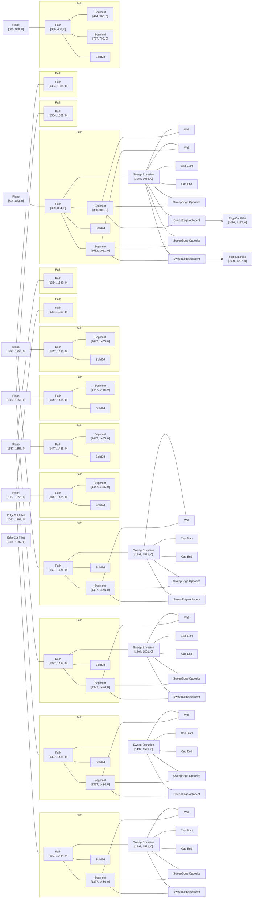

```mermaid
flowchart LR
  subgraph path2 [Path]
    2["Path<br>[396, 488, 0]"]
    3["Segment<br>[494, 585, 0]"]
    4["Segment<br>[787, 795, 0]"]
    5[Solid2d]
  end
  subgraph path7 [Path]
    7["Path<br>[829, 854, 0]"]
    8["Segment<br>[860, 908, 0]"]
    9["Segment<br>[1032, 1051, 0]"]
    10[Solid2d]
  end
  subgraph path21 [Path]
    21["Path<br>[1364, 1389, 0]"]
  end
  subgraph path22 [Path]
    22["Path<br>[1397, 1434, 0]"]
    23["Segment<br>[1397, 1434, 0]"]
    24[Solid2d]
  end
  subgraph path25 [Path]
    25["Path<br>[1447, 1485, 0]"]
    26["Segment<br>[1447, 1485, 0]"]
    27[Solid2d]
  end
  subgraph path35 [Path]
    35["Path<br>[1364, 1389, 0]"]
  end
  subgraph path36 [Path]
    36["Path<br>[1397, 1434, 0]"]
    37["Segment<br>[1397, 1434, 0]"]
    38[Solid2d]
  end
  subgraph path39 [Path]
    39["Path<br>[1447, 1485, 0]"]
    40["Segment<br>[1447, 1485, 0]"]
    41[Solid2d]
  end
  subgraph path49 [Path]
    49["Path<br>[1364, 1389, 0]"]
  end
  subgraph path50 [Path]
    50["Path<br>[1397, 1434, 0]"]
    51["Segment<br>[1397, 1434, 0]"]
    52[Solid2d]
  end
  subgraph path53 [Path]
    53["Path<br>[1447, 1485, 0]"]
    54["Segment<br>[1447, 1485, 0]"]
    55[Solid2d]
  end
  subgraph path63 [Path]
    63["Path<br>[1364, 1389, 0]"]
  end
  subgraph path64 [Path]
    64["Path<br>[1397, 1434, 0]"]
    65["Segment<br>[1397, 1434, 0]"]
    66[Solid2d]
  end
  subgraph path67 [Path]
    67["Path<br>[1447, 1485, 0]"]
    68["Segment<br>[1447, 1485, 0]"]
    69[Solid2d]
  end
  1["Plane<br>[373, 390, 0]"]
  6["Plane<br>[804, 823, 0]"]
  11["Sweep Extrusion<br>[1057, 1085, 0]"]
  12[Wall]
  13[Wall]
  14["Cap Start"]
  15["Cap End"]
  16["SweepEdge Opposite"]
  17["SweepEdge Adjacent"]
  18["SweepEdge Opposite"]
  19["SweepEdge Adjacent"]
  20["Plane<br>[1337, 1356, 0]"]
  28["Sweep Extrusion<br>[1497, 1521, 0]"]
  29[Wall]
  30["Cap Start"]
  31["Cap End"]
  32["SweepEdge Opposite"]
  33["SweepEdge Adjacent"]
  34["Plane<br>[1337, 1356, 0]"]
  42["Sweep Extrusion<br>[1497, 1521, 0]"]
  43[Wall]
  44["Cap Start"]
  45["Cap End"]
  46["SweepEdge Opposite"]
  47["SweepEdge Adjacent"]
  48["Plane<br>[1337, 1356, 0]"]
  56["Sweep Extrusion<br>[1497, 1521, 0]"]
  57[Wall]
  58["Cap Start"]
  59["Cap End"]
  60["SweepEdge Opposite"]
  61["SweepEdge Adjacent"]
  62["Plane<br>[1337, 1356, 0]"]
  70["Sweep Extrusion<br>[1497, 1521, 0]"]
  71[Wall]
  72["Cap Start"]
  73["Cap End"]
  74["SweepEdge Opposite"]
  75["SweepEdge Adjacent"]
  76["EdgeCut Fillet<br>[1091, 1297, 0]"]
  77["EdgeCut Fillet<br>[1091, 1297, 0]"]
  78["EdgeCut Fillet<br>[1091, 1297, 0]"]
  79["EdgeCut Fillet<br>[1091, 1297, 0]"]
  1 --- 2
  2 --- 3
  2 --- 4
  2 --- 5
  6 --- 7
  7 --- 8
  7 --- 9
  7 ---- 11
  7 --- 10
  8 --- 12
  8 --- 16
  8 --- 17
  9 --- 13
  9 --- 18
  9 --- 19
  11 --- 12
  11 --- 13
  11 --- 14
  11 --- 15
  11 --- 16
  11 --- 17
  11 --- 18
  11 --- 19
  20 --- 21
  20 --- 22
  20 --- 25
  22 --- 23
  22 ---- 28
  22 --- 24
  23 --- 29
  23 --- 32
  23 --- 33
  25 --- 26
  25 --- 27
  28 --- 29
  28 --- 30
  28 --- 31
  28 --- 32
  28 --- 33
  34 --- 35
  34 --- 36
  34 --- 39
  36 --- 37
  36 ---- 42
  36 --- 38
  37 --- 43
  37 --- 46
  37 --- 47
  39 --- 40
  39 --- 41
  42 --- 43
  42 --- 44
  42 --- 45
  42 --- 46
  42 --- 47
  48 --- 49
  48 --- 50
  48 --- 53
  50 --- 51
  50 ---- 56
  50 --- 52
  51 --- 57
  51 --- 60
  51 --- 61
  53 --- 54
  53 --- 55
  56 --- 57
  56 --- 58
  56 --- 59
  56 --- 60
  56 --- 61
  62 --- 63
  62 --- 64
  62 --- 67
  64 --- 65
  64 ---- 70
  64 --- 66
  65 --- 71
  65 --- 74
  65 --- 75
  67 --- 68
  67 --- 69
  70 --- 71
  70 --- 72
  70 --- 73
  70 --- 74
  70 --- 75
  17 <--x 76
  19 <--x 79
```
