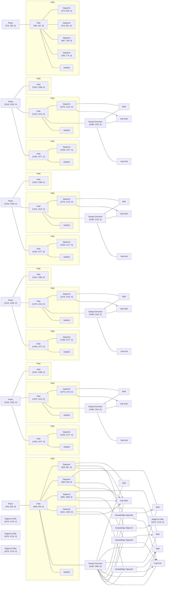

```mermaid
flowchart LR
  subgraph path2 [Path]
    2["Path<br>[396, 467, 0]"]
    3["Segment<br>[473, 564, 0]"]
    4["Segment<br>[570, 661, 0]"]
    5["Segment<br>[667, 760, 0]"]
    6["Segment<br>[766, 774, 0]"]
    7[Solid2d]
  end
  subgraph path9 [Path]
    9["Path<br>[808, 833, 0]"]
    10["Segment<br>[839, 887, 0]"]
    11["Segment<br>[893, 950, 0]"]
    12["Segment<br>[956, 1005, 0]"]
    13["Segment<br>[1011, 1030, 0]"]
    14[Solid2d]
  end
  subgraph path27 [Path]
    27["Path<br>[1343, 1368, 0]"]
  end
  subgraph path28 [Path]
    28["Path<br>[1376, 1413, 0]"]
    29["Segment<br>[1376, 1413, 0]"]
    30[Solid2d]
  end
  subgraph path31 [Path]
    31["Path<br>[1439, 1477, 0]"]
    32["Segment<br>[1439, 1477, 0]"]
    33[Solid2d]
  end
  subgraph path39 [Path]
    39["Path<br>[1343, 1368, 0]"]
  end
  subgraph path40 [Path]
    40["Path<br>[1376, 1413, 0]"]
    41["Segment<br>[1376, 1413, 0]"]
    42[Solid2d]
  end
  subgraph path43 [Path]
    43["Path<br>[1439, 1477, 0]"]
    44["Segment<br>[1439, 1477, 0]"]
    45[Solid2d]
  end
  subgraph path51 [Path]
    51["Path<br>[1343, 1368, 0]"]
  end
  subgraph path52 [Path]
    52["Path<br>[1376, 1413, 0]"]
    53["Segment<br>[1376, 1413, 0]"]
    54[Solid2d]
  end
  subgraph path55 [Path]
    55["Path<br>[1439, 1477, 0]"]
    56["Segment<br>[1439, 1477, 0]"]
    57[Solid2d]
  end
  subgraph path63 [Path]
    63["Path<br>[1343, 1368, 0]"]
  end
  subgraph path64 [Path]
    64["Path<br>[1376, 1413, 0]"]
    65["Segment<br>[1376, 1413, 0]"]
    66[Solid2d]
  end
  subgraph path67 [Path]
    67["Path<br>[1439, 1477, 0]"]
    68["Segment<br>[1439, 1477, 0]"]
    69[Solid2d]
  end
  1["Plane<br>[373, 390, 0]"]
  8["Plane<br>[783, 802, 0]"]
  15["Sweep Extrusion<br>[1036, 1064, 0]"]
  16[Wall]
  17[Wall]
  18[Wall]
  19[Wall]
  20["Cap Start"]
  21["Cap End"]
  22["SweepEdge Opposite"]
  23["SweepEdge Opposite"]
  24["SweepEdge Opposite"]
  25["SweepEdge Adjacent"]
  26["Plane<br>[1316, 1335, 0]"]
  34["Sweep Extrusion<br>[1486, 1510, 0]"]
  35[Wall]
  36["Cap Start"]
  37["Cap End"]
  38["Plane<br>[1316, 1335, 0]"]
  46["Sweep Extrusion<br>[1486, 1510, 0]"]
  47[Wall]
  48["Cap Start"]
  49["Cap End"]
  50["Plane<br>[1316, 1335, 0]"]
  58["Sweep Extrusion<br>[1486, 1510, 0]"]
  59[Wall]
  60["Cap Start"]
  61["Cap End"]
  62["Plane<br>[1316, 1335, 0]"]
  70["Sweep Extrusion<br>[1486, 1510, 0]"]
  71[Wall]
  72["Cap Start"]
  73["Cap End"]
  74["EdgeCut Fillet<br>[1070, 1276, 0]"]
  75["EdgeCut Fillet<br>[1070, 1276, 0]"]
  76["EdgeCut Fillet<br>[1070, 1276, 0]"]
  77["EdgeCut Fillet<br>[1070, 1276, 0]"]
  1 --- 2
  2 --- 3
  2 --- 4
  2 --- 5
  2 --- 6
  2 --- 7
  8 --- 9
  9 --- 10
  9 --- 11
  9 --- 12
  9 --- 13
  9 ---- 15
  9 --- 14
  10 --- 16
  10 --- 25
  10 x--> 20
  11 --- 17
  11 --- 22
  11 x--> 20
  12 --- 18
  12 --- 23
  12 x--> 20
  13 --- 19
  13 --- 24
  13 x--> 20
  15 --- 16
  15 --- 17
  15 --- 18
  15 --- 19
  15 --- 20
  15 --- 21
  15 --- 22
  15 --- 23
  15 --- 24
  15 --- 25
  22 <--x 17
  22 <--x 21
  23 <--x 18
  23 <--x 21
  24 <--x 19
  24 <--x 21
  26 --- 27
  26 --- 28
  26 --- 31
  28 --- 29
  28 ---- 34
  28 --- 30
  29 --- 35
  29 x--> 36
  31 --- 32
  31 --- 33
  34 --- 35
  34 --- 36
  34 --- 37
  38 --- 39
  38 --- 40
  38 --- 43
  40 --- 41
  40 ---- 46
  40 --- 42
  41 --- 47
  41 x--> 48
  43 --- 44
  43 --- 45
  46 --- 47
  46 --- 48
  46 --- 49
  50 --- 51
  50 --- 52
  50 --- 55
  52 --- 53
  52 ---- 58
  52 --- 54
  53 --- 59
  53 x--> 60
  55 --- 56
  55 --- 57
  58 --- 59
  58 --- 60
  58 --- 61
  62 --- 63
  62 --- 64
  62 --- 67
  64 --- 65
  64 ---- 70
  64 --- 66
  65 --- 71
  65 x--> 72
  67 --- 68
  67 --- 69
  70 --- 71
  70 --- 72
  70 --- 73
  25 <--x 74
```
