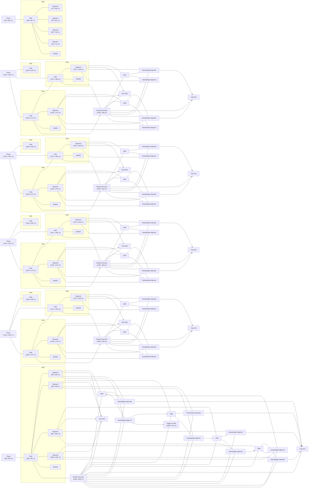

```mermaid
flowchart LR
  subgraph path2 [Path]
    2["Path<br>[396, 467, 0]"]
      %% [ProgramBodyItem { index: 16 }, VariableDeclarationDeclaration, VariableDeclarationInit, PipeBodyItem { index: 1 }]
    3["Segment<br>[473, 564, 0]"]
      %% [ProgramBodyItem { index: 16 }, VariableDeclarationDeclaration, VariableDeclarationInit, PipeBodyItem { index: 2 }]
    4["Segment<br>[570, 661, 0]"]
      %% [ProgramBodyItem { index: 16 }, VariableDeclarationDeclaration, VariableDeclarationInit, PipeBodyItem { index: 3 }]
    5["Segment<br>[667, 760, 0]"]
      %% [ProgramBodyItem { index: 16 }, VariableDeclarationDeclaration, VariableDeclarationInit, PipeBodyItem { index: 4 }]
    6["Segment<br>[766, 774, 0]"]
      %% [ProgramBodyItem { index: 16 }, VariableDeclarationDeclaration, VariableDeclarationInit, PipeBodyItem { index: 5 }]
    7[Solid2d]
  end
  subgraph path9 [Path]
    9["Path<br>[806, 831, 0]"]
      %% [ProgramBodyItem { index: 17 }, VariableDeclarationDeclaration, VariableDeclarationInit, PipeBodyItem { index: 1 }]
    10["Segment<br>[837, 885, 0]"]
      %% [ProgramBodyItem { index: 17 }, VariableDeclarationDeclaration, VariableDeclarationInit, PipeBodyItem { index: 2 }]
    11["Segment<br>[891, 948, 0]"]
      %% [ProgramBodyItem { index: 17 }, VariableDeclarationDeclaration, VariableDeclarationInit, PipeBodyItem { index: 3 }]
    12["Segment<br>[954, 1003, 0]"]
      %% [ProgramBodyItem { index: 17 }, VariableDeclarationDeclaration, VariableDeclarationInit, PipeBodyItem { index: 4 }]
    13["Segment<br>[1009, 1028, 0]"]
      %% [ProgramBodyItem { index: 17 }, VariableDeclarationDeclaration, VariableDeclarationInit, PipeBodyItem { index: 5 }]
    14[Solid2d]
  end
  subgraph path32 [Path]
    32["Path<br>[1339, 1364, 0]"]
      %% [ProgramBodyItem { index: 18 }, VariableDeclarationDeclaration, VariableDeclarationInit, FunctionExpressionBody, FunctionExpressionBodyItem { index: 0 }, VariableDeclarationDeclaration, VariableDeclarationInit, PipeBodyItem { index: 1 }]
  end
  subgraph path33 [Path]
    33["Path<br>[1372, 1409, 0]"]
      %% [ProgramBodyItem { index: 18 }, VariableDeclarationDeclaration, VariableDeclarationInit, FunctionExpressionBody, FunctionExpressionBodyItem { index: 0 }, VariableDeclarationDeclaration, VariableDeclarationInit, PipeBodyItem { index: 2 }]
    34["Segment<br>[1372, 1409, 0]"]
      %% [ProgramBodyItem { index: 18 }, VariableDeclarationDeclaration, VariableDeclarationInit, FunctionExpressionBody, FunctionExpressionBodyItem { index: 0 }, VariableDeclarationDeclaration, VariableDeclarationInit, PipeBodyItem { index: 2 }]
    35[Solid2d]
  end
  subgraph path36 [Path]
    36["Path<br>[1435, 1473, 0]"]
      %% [ProgramBodyItem { index: 18 }, VariableDeclarationDeclaration, VariableDeclarationInit, FunctionExpressionBody, FunctionExpressionBodyItem { index: 0 }, VariableDeclarationDeclaration, VariableDeclarationInit, PipeBodyItem { index: 3 }, CallKwArg { index: 0 }]
    37["Segment<br>[1435, 1473, 0]"]
      %% [ProgramBodyItem { index: 18 }, VariableDeclarationDeclaration, VariableDeclarationInit, FunctionExpressionBody, FunctionExpressionBodyItem { index: 0 }, VariableDeclarationDeclaration, VariableDeclarationInit, PipeBodyItem { index: 3 }, CallKwArg { index: 0 }]
    38[Solid2d]
  end
  subgraph path49 [Path]
    49["Path<br>[1339, 1364, 0]"]
      %% [ProgramBodyItem { index: 18 }, VariableDeclarationDeclaration, VariableDeclarationInit, FunctionExpressionBody, FunctionExpressionBodyItem { index: 0 }, VariableDeclarationDeclaration, VariableDeclarationInit, PipeBodyItem { index: 1 }]
  end
  subgraph path50 [Path]
    50["Path<br>[1372, 1409, 0]"]
      %% [ProgramBodyItem { index: 18 }, VariableDeclarationDeclaration, VariableDeclarationInit, FunctionExpressionBody, FunctionExpressionBodyItem { index: 0 }, VariableDeclarationDeclaration, VariableDeclarationInit, PipeBodyItem { index: 2 }]
    51["Segment<br>[1372, 1409, 0]"]
      %% [ProgramBodyItem { index: 18 }, VariableDeclarationDeclaration, VariableDeclarationInit, FunctionExpressionBody, FunctionExpressionBodyItem { index: 0 }, VariableDeclarationDeclaration, VariableDeclarationInit, PipeBodyItem { index: 2 }]
    52[Solid2d]
  end
  subgraph path53 [Path]
    53["Path<br>[1435, 1473, 0]"]
      %% [ProgramBodyItem { index: 18 }, VariableDeclarationDeclaration, VariableDeclarationInit, FunctionExpressionBody, FunctionExpressionBodyItem { index: 0 }, VariableDeclarationDeclaration, VariableDeclarationInit, PipeBodyItem { index: 3 }, CallKwArg { index: 0 }]
    54["Segment<br>[1435, 1473, 0]"]
      %% [ProgramBodyItem { index: 18 }, VariableDeclarationDeclaration, VariableDeclarationInit, FunctionExpressionBody, FunctionExpressionBodyItem { index: 0 }, VariableDeclarationDeclaration, VariableDeclarationInit, PipeBodyItem { index: 3 }, CallKwArg { index: 0 }]
    55[Solid2d]
  end
  subgraph path66 [Path]
    66["Path<br>[1339, 1364, 0]"]
      %% [ProgramBodyItem { index: 18 }, VariableDeclarationDeclaration, VariableDeclarationInit, FunctionExpressionBody, FunctionExpressionBodyItem { index: 0 }, VariableDeclarationDeclaration, VariableDeclarationInit, PipeBodyItem { index: 1 }]
  end
  subgraph path67 [Path]
    67["Path<br>[1372, 1409, 0]"]
      %% [ProgramBodyItem { index: 18 }, VariableDeclarationDeclaration, VariableDeclarationInit, FunctionExpressionBody, FunctionExpressionBodyItem { index: 0 }, VariableDeclarationDeclaration, VariableDeclarationInit, PipeBodyItem { index: 2 }]
    68["Segment<br>[1372, 1409, 0]"]
      %% [ProgramBodyItem { index: 18 }, VariableDeclarationDeclaration, VariableDeclarationInit, FunctionExpressionBody, FunctionExpressionBodyItem { index: 0 }, VariableDeclarationDeclaration, VariableDeclarationInit, PipeBodyItem { index: 2 }]
    69[Solid2d]
  end
  subgraph path70 [Path]
    70["Path<br>[1435, 1473, 0]"]
      %% [ProgramBodyItem { index: 18 }, VariableDeclarationDeclaration, VariableDeclarationInit, FunctionExpressionBody, FunctionExpressionBodyItem { index: 0 }, VariableDeclarationDeclaration, VariableDeclarationInit, PipeBodyItem { index: 3 }, CallKwArg { index: 0 }]
    71["Segment<br>[1435, 1473, 0]"]
      %% [ProgramBodyItem { index: 18 }, VariableDeclarationDeclaration, VariableDeclarationInit, FunctionExpressionBody, FunctionExpressionBodyItem { index: 0 }, VariableDeclarationDeclaration, VariableDeclarationInit, PipeBodyItem { index: 3 }, CallKwArg { index: 0 }]
    72[Solid2d]
  end
  subgraph path83 [Path]
    83["Path<br>[1339, 1364, 0]"]
      %% [ProgramBodyItem { index: 18 }, VariableDeclarationDeclaration, VariableDeclarationInit, FunctionExpressionBody, FunctionExpressionBodyItem { index: 0 }, VariableDeclarationDeclaration, VariableDeclarationInit, PipeBodyItem { index: 1 }]
  end
  subgraph path84 [Path]
    84["Path<br>[1372, 1409, 0]"]
      %% [ProgramBodyItem { index: 18 }, VariableDeclarationDeclaration, VariableDeclarationInit, FunctionExpressionBody, FunctionExpressionBodyItem { index: 0 }, VariableDeclarationDeclaration, VariableDeclarationInit, PipeBodyItem { index: 2 }]
    85["Segment<br>[1372, 1409, 0]"]
      %% [ProgramBodyItem { index: 18 }, VariableDeclarationDeclaration, VariableDeclarationInit, FunctionExpressionBody, FunctionExpressionBodyItem { index: 0 }, VariableDeclarationDeclaration, VariableDeclarationInit, PipeBodyItem { index: 2 }]
    86[Solid2d]
  end
  subgraph path87 [Path]
    87["Path<br>[1435, 1473, 0]"]
      %% [ProgramBodyItem { index: 18 }, VariableDeclarationDeclaration, VariableDeclarationInit, FunctionExpressionBody, FunctionExpressionBodyItem { index: 0 }, VariableDeclarationDeclaration, VariableDeclarationInit, PipeBodyItem { index: 3 }, CallKwArg { index: 0 }]
    88["Segment<br>[1435, 1473, 0]"]
      %% [ProgramBodyItem { index: 18 }, VariableDeclarationDeclaration, VariableDeclarationInit, FunctionExpressionBody, FunctionExpressionBodyItem { index: 0 }, VariableDeclarationDeclaration, VariableDeclarationInit, PipeBodyItem { index: 3 }, CallKwArg { index: 0 }]
    89[Solid2d]
  end
  1["Plane<br>[373, 390, 0]"]
    %% [ProgramBodyItem { index: 16 }, VariableDeclarationDeclaration, VariableDeclarationInit, PipeBodyItem { index: 0 }]
  8["Plane<br>[783, 800, 0]"]
    %% [ProgramBodyItem { index: 17 }, VariableDeclarationDeclaration, VariableDeclarationInit, PipeBodyItem { index: 0 }]
  15["Sweep Extrusion<br>[1034, 1062, 0]"]
    %% [ProgramBodyItem { index: 17 }, VariableDeclarationDeclaration, VariableDeclarationInit, PipeBodyItem { index: 6 }]
  16[Wall]
    %% face_code_ref=Missing NodePath
  17[Wall]
    %% face_code_ref=Missing NodePath
  18[Wall]
    %% face_code_ref=Missing NodePath
  19[Wall]
    %% face_code_ref=Missing NodePath
  20["Cap Start"]
    %% face_code_ref=Missing NodePath
  21["Cap End"]
    %% face_code_ref=Missing NodePath
  22["SweepEdge Opposite"]
  23["SweepEdge Adjacent"]
  24["SweepEdge Opposite"]
  25["SweepEdge Adjacent"]
  26["SweepEdge Opposite"]
  27["SweepEdge Adjacent"]
  28["SweepEdge Opposite"]
  29["SweepEdge Adjacent"]
  30["EdgeCut Fillet<br>[1068, 1274, 0]"]
    %% [ProgramBodyItem { index: 17 }, VariableDeclarationDeclaration, VariableDeclarationInit, PipeBodyItem { index: 7 }]
  31["Plane<br>[1314, 1331, 0]"]
    %% [ProgramBodyItem { index: 18 }, VariableDeclarationDeclaration, VariableDeclarationInit, FunctionExpressionBody, FunctionExpressionBodyItem { index: 0 }, VariableDeclarationDeclaration, VariableDeclarationInit, PipeBodyItem { index: 0 }]
  39["Sweep Extrusion<br>[1482, 1506, 0]"]
    %% [ProgramBodyItem { index: 18 }, VariableDeclarationDeclaration, VariableDeclarationInit, FunctionExpressionBody, FunctionExpressionBodyItem { index: 0 }, VariableDeclarationDeclaration, VariableDeclarationInit, PipeBodyItem { index: 4 }]
  40[Wall]
    %% face_code_ref=Missing NodePath
  41[Wall]
    %% face_code_ref=Missing NodePath
  42["Cap Start"]
    %% face_code_ref=Missing NodePath
  43["Cap End"]
    %% face_code_ref=Missing NodePath
  44["SweepEdge Opposite"]
  45["SweepEdge Adjacent"]
  46["SweepEdge Opposite"]
  47["SweepEdge Adjacent"]
  48["Plane<br>[1314, 1331, 0]"]
    %% [ProgramBodyItem { index: 18 }, VariableDeclarationDeclaration, VariableDeclarationInit, FunctionExpressionBody, FunctionExpressionBodyItem { index: 0 }, VariableDeclarationDeclaration, VariableDeclarationInit, PipeBodyItem { index: 0 }]
  56["Sweep Extrusion<br>[1482, 1506, 0]"]
    %% [ProgramBodyItem { index: 18 }, VariableDeclarationDeclaration, VariableDeclarationInit, FunctionExpressionBody, FunctionExpressionBodyItem { index: 0 }, VariableDeclarationDeclaration, VariableDeclarationInit, PipeBodyItem { index: 4 }]
  57[Wall]
    %% face_code_ref=Missing NodePath
  58[Wall]
    %% face_code_ref=Missing NodePath
  59["Cap Start"]
    %% face_code_ref=Missing NodePath
  60["Cap End"]
    %% face_code_ref=Missing NodePath
  61["SweepEdge Opposite"]
  62["SweepEdge Adjacent"]
  63["SweepEdge Opposite"]
  64["SweepEdge Adjacent"]
  65["Plane<br>[1314, 1331, 0]"]
    %% [ProgramBodyItem { index: 18 }, VariableDeclarationDeclaration, VariableDeclarationInit, FunctionExpressionBody, FunctionExpressionBodyItem { index: 0 }, VariableDeclarationDeclaration, VariableDeclarationInit, PipeBodyItem { index: 0 }]
  73["Sweep Extrusion<br>[1482, 1506, 0]"]
    %% [ProgramBodyItem { index: 18 }, VariableDeclarationDeclaration, VariableDeclarationInit, FunctionExpressionBody, FunctionExpressionBodyItem { index: 0 }, VariableDeclarationDeclaration, VariableDeclarationInit, PipeBodyItem { index: 4 }]
  74[Wall]
    %% face_code_ref=Missing NodePath
  75[Wall]
    %% face_code_ref=Missing NodePath
  76["Cap Start"]
    %% face_code_ref=Missing NodePath
  77["Cap End"]
    %% face_code_ref=Missing NodePath
  78["SweepEdge Opposite"]
  79["SweepEdge Adjacent"]
  80["SweepEdge Opposite"]
  81["SweepEdge Adjacent"]
  82["Plane<br>[1314, 1331, 0]"]
    %% [ProgramBodyItem { index: 18 }, VariableDeclarationDeclaration, VariableDeclarationInit, FunctionExpressionBody, FunctionExpressionBodyItem { index: 0 }, VariableDeclarationDeclaration, VariableDeclarationInit, PipeBodyItem { index: 0 }]
  90["Sweep Extrusion<br>[1482, 1506, 0]"]
    %% [ProgramBodyItem { index: 18 }, VariableDeclarationDeclaration, VariableDeclarationInit, FunctionExpressionBody, FunctionExpressionBodyItem { index: 0 }, VariableDeclarationDeclaration, VariableDeclarationInit, PipeBodyItem { index: 4 }]
  91[Wall]
    %% face_code_ref=Missing NodePath
  92[Wall]
    %% face_code_ref=Missing NodePath
  93["Cap Start"]
    %% face_code_ref=Missing NodePath
  94["Cap End"]
    %% face_code_ref=Missing NodePath
  95["SweepEdge Opposite"]
  96["SweepEdge Adjacent"]
  97["SweepEdge Opposite"]
  98["SweepEdge Adjacent"]
  1 --- 2
  2 --- 3
  2 --- 4
  2 --- 5
  2 --- 6
  2 --- 7
  8 --- 9
  9 --- 10
  9 --- 11
  9 --- 12
  9 --- 13
  9 --- 14
  9 ---- 15
  10 --- 16
  10 x--> 20
  10 --- 22
  10 --- 23
  11 --- 17
  11 x--> 20
  11 --- 24
  11 --- 25
  12 --- 18
  12 x--> 20
  12 --- 26
  12 --- 27
  13 --- 19
  13 x--> 20
  13 --- 28
  13 --- 29
  15 --- 16
  15 --- 17
  15 --- 18
  15 --- 19
  15 --- 20
  15 --- 21
  15 --- 22
  15 --- 23
  15 --- 24
  15 --- 25
  15 --- 26
  15 --- 27
  15 --- 28
  15 --- 29
  16 --- 22
  16 --- 23
  29 <--x 16
  23 <--x 17
  17 --- 24
  17 --- 25
  25 <--x 18
  18 --- 26
  18 --- 27
  27 <--x 19
  19 --- 28
  19 --- 29
  22 <--x 21
  24 <--x 21
  26 <--x 21
  28 <--x 21
  23 <--x 30
  31 --- 32
  31 --- 33
  31 --- 36
  33 --- 34
  33 --- 35
  36 --- 33
  33 ---- 39
  34 --- 40
  34 x--> 42
  34 --- 44
  34 --- 45
  36 --- 37
  36 --- 38
  36 x---> 39
  37 --- 41
  37 x--> 42
  37 --- 46
  37 --- 47
  39 --- 40
  39 --- 41
  39 --- 42
  39 --- 43
  39 --- 44
  39 --- 45
  39 --- 46
  39 --- 47
  40 --- 44
  40 --- 45
  41 --- 46
  41 --- 47
  44 <--x 43
  46 <--x 43
  48 --- 49
  48 --- 50
  48 --- 53
  50 --- 51
  50 --- 52
  53 --- 50
  50 ---- 56
  51 --- 57
  51 x--> 59
  51 --- 61
  51 --- 62
  53 --- 54
  53 --- 55
  53 x---> 56
  54 --- 58
  54 x--> 59
  54 --- 63
  54 --- 64
  56 --- 57
  56 --- 58
  56 --- 59
  56 --- 60
  56 --- 61
  56 --- 62
  56 --- 63
  56 --- 64
  57 --- 61
  57 --- 62
  58 --- 63
  58 --- 64
  61 <--x 60
  63 <--x 60
  65 --- 66
  65 --- 67
  65 --- 70
  67 --- 68
  67 --- 69
  70 --- 67
  67 ---- 73
  68 --- 74
  68 x--> 76
  68 --- 78
  68 --- 79
  70 --- 71
  70 --- 72
  70 x---> 73
  71 --- 75
  71 x--> 76
  71 --- 80
  71 --- 81
  73 --- 74
  73 --- 75
  73 --- 76
  73 --- 77
  73 --- 78
  73 --- 79
  73 --- 80
  73 --- 81
  74 --- 78
  74 --- 79
  75 --- 80
  75 --- 81
  78 <--x 77
  80 <--x 77
  82 --- 83
  82 --- 84
  82 --- 87
  84 --- 85
  84 --- 86
  87 --- 84
  84 ---- 90
  85 --- 91
  85 x--> 93
  85 --- 95
  85 --- 96
  87 --- 88
  87 --- 89
  87 x---> 90
  88 --- 92
  88 x--> 93
  88 --- 97
  88 --- 98
  90 --- 91
  90 --- 92
  90 --- 93
  90 --- 94
  90 --- 95
  90 --- 96
  90 --- 97
  90 --- 98
  91 --- 95
  91 --- 96
  92 --- 97
  92 --- 98
  95 <--x 94
  97 <--x 94
```
