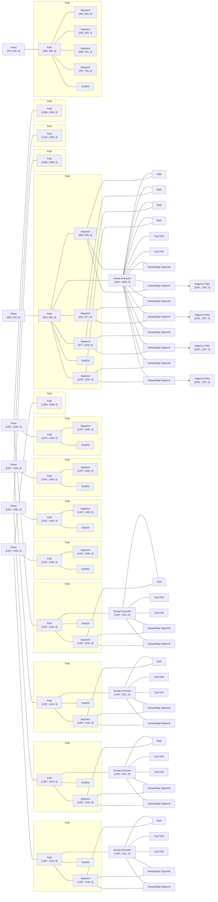

```mermaid
flowchart LR
  subgraph path2 [Path]
    2["Path<br>[396, 488, 0]"]
    3["Segment<br>[494, 585, 0]"]
    4["Segment<br>[591, 682, 0]"]
    5["Segment<br>[688, 781, 0]"]
    6["Segment<br>[787, 795, 0]"]
    7[Solid2d]
  end
  subgraph path9 [Path]
    9["Path<br>[829, 854, 0]"]
    10["Segment<br>[860, 908, 0]"]
    11["Segment<br>[914, 971, 0]"]
    12["Segment<br>[977, 1026, 0]"]
    13["Segment<br>[1032, 1051, 0]"]
    14[Solid2d]
  end
  subgraph path31 [Path]
    31["Path<br>[1364, 1389, 0]"]
  end
  subgraph path32 [Path]
    32["Path<br>[1397, 1434, 0]"]
    33["Segment<br>[1397, 1434, 0]"]
    34[Solid2d]
  end
  subgraph path35 [Path]
    35["Path<br>[1447, 1485, 0]"]
    36["Segment<br>[1447, 1485, 0]"]
    37[Solid2d]
  end
  subgraph path45 [Path]
    45["Path<br>[1364, 1389, 0]"]
  end
  subgraph path46 [Path]
    46["Path<br>[1397, 1434, 0]"]
    47["Segment<br>[1397, 1434, 0]"]
    48[Solid2d]
  end
  subgraph path49 [Path]
    49["Path<br>[1447, 1485, 0]"]
    50["Segment<br>[1447, 1485, 0]"]
    51[Solid2d]
  end
  subgraph path59 [Path]
    59["Path<br>[1364, 1389, 0]"]
  end
  subgraph path60 [Path]
    60["Path<br>[1397, 1434, 0]"]
    61["Segment<br>[1397, 1434, 0]"]
    62[Solid2d]
  end
  subgraph path63 [Path]
    63["Path<br>[1447, 1485, 0]"]
    64["Segment<br>[1447, 1485, 0]"]
    65[Solid2d]
  end
  subgraph path73 [Path]
    73["Path<br>[1364, 1389, 0]"]
  end
  subgraph path74 [Path]
    74["Path<br>[1397, 1434, 0]"]
    75["Segment<br>[1397, 1434, 0]"]
    76[Solid2d]
  end
  subgraph path77 [Path]
    77["Path<br>[1447, 1485, 0]"]
    78["Segment<br>[1447, 1485, 0]"]
    79[Solid2d]
  end
  1["Plane<br>[373, 390, 0]"]
  8["Plane<br>[804, 823, 0]"]
  15["Sweep Extrusion<br>[1057, 1085, 0]"]
  16[Wall]
  17[Wall]
  18[Wall]
  19[Wall]
  20["Cap Start"]
  21["Cap End"]
  22["SweepEdge Opposite"]
  23["SweepEdge Adjacent"]
  24["SweepEdge Opposite"]
  25["SweepEdge Adjacent"]
  26["SweepEdge Opposite"]
  27["SweepEdge Adjacent"]
  28["SweepEdge Opposite"]
  29["SweepEdge Adjacent"]
  30["Plane<br>[1337, 1356, 0]"]
  38["Sweep Extrusion<br>[1497, 1521, 0]"]
  39[Wall]
  40["Cap Start"]
  41["Cap End"]
  42["SweepEdge Opposite"]
  43["SweepEdge Adjacent"]
  44["Plane<br>[1337, 1356, 0]"]
  52["Sweep Extrusion<br>[1497, 1521, 0]"]
  53[Wall]
  54["Cap Start"]
  55["Cap End"]
  56["SweepEdge Opposite"]
  57["SweepEdge Adjacent"]
  58["Plane<br>[1337, 1356, 0]"]
  66["Sweep Extrusion<br>[1497, 1521, 0]"]
  67[Wall]
  68["Cap Start"]
  69["Cap End"]
  70["SweepEdge Opposite"]
  71["SweepEdge Adjacent"]
  72["Plane<br>[1337, 1356, 0]"]
  80["Sweep Extrusion<br>[1497, 1521, 0]"]
  81[Wall]
  82["Cap Start"]
  83["Cap End"]
  84["SweepEdge Opposite"]
  85["SweepEdge Adjacent"]
  86["EdgeCut Fillet<br>[1091, 1297, 0]"]
  87["EdgeCut Fillet<br>[1091, 1297, 0]"]
  88["EdgeCut Fillet<br>[1091, 1297, 0]"]
  89["EdgeCut Fillet<br>[1091, 1297, 0]"]
  1 --- 2
  2 --- 3
  2 --- 4
  2 --- 5
  2 --- 6
  2 --- 7
  8 --- 9
  9 --- 10
  9 --- 11
  9 --- 12
  9 --- 13
  9 ---- 15
  9 --- 14
  10 --- 16
  10 --- 22
  10 --- 23
  11 --- 17
  11 --- 24
  11 --- 25
  12 --- 18
  12 --- 26
  12 --- 27
  13 --- 19
  13 --- 28
  13 --- 29
  15 --- 16
  15 --- 17
  15 --- 18
  15 --- 19
  15 --- 20
  15 --- 21
  15 --- 22
  15 --- 23
  15 --- 24
  15 --- 25
  15 --- 26
  15 --- 27
  15 --- 28
  15 --- 29
  30 --- 31
  30 --- 32
  30 --- 35
  32 --- 33
  32 ---- 38
  32 --- 34
  33 --- 39
  33 --- 42
  33 --- 43
  35 --- 36
  35 --- 37
  38 --- 39
  38 --- 40
  38 --- 41
  38 --- 42
  38 --- 43
  44 --- 45
  44 --- 46
  44 --- 49
  46 --- 47
  46 ---- 52
  46 --- 48
  47 --- 53
  47 --- 56
  47 --- 57
  49 --- 50
  49 --- 51
  52 --- 53
  52 --- 54
  52 --- 55
  52 --- 56
  52 --- 57
  58 --- 59
  58 --- 60
  58 --- 63
  60 --- 61
  60 ---- 66
  60 --- 62
  61 --- 67
  61 --- 70
  61 --- 71
  63 --- 64
  63 --- 65
  66 --- 67
  66 --- 68
  66 --- 69
  66 --- 70
  66 --- 71
  72 --- 73
  72 --- 74
  72 --- 77
  74 --- 75
  74 ---- 80
  74 --- 76
  75 --- 81
  75 --- 84
  75 --- 85
  77 --- 78
  77 --- 79
  80 --- 81
  80 --- 82
  80 --- 83
  80 --- 84
  80 --- 85
  23 <--x 86
  25 <--x 87
  27 <--x 88
  29 <--x 89
```
