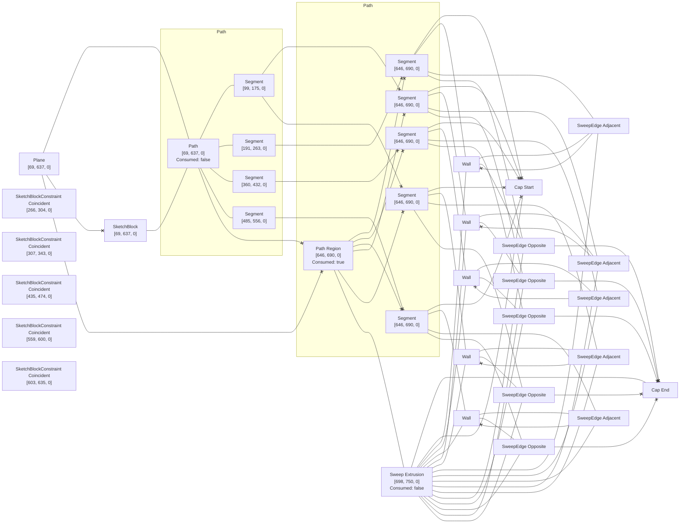

```mermaid
flowchart LR
  subgraph path8 [Path]
    8["Path<br>[69, 637, 0]<br>Consumed: false"]
      %% [ProgramBodyItem { index: 0 }, VariableDeclarationDeclaration, VariableDeclarationInit]
    11["Segment<br>[99, 175, 0]"]
      %% [ProgramBodyItem { index: 0 }, VariableDeclarationDeclaration, VariableDeclarationInit, SketchBlockBody, SketchBlockBodyItem { index: 0 }, VariableDeclarationDeclaration, VariableDeclarationInit]
    12["Segment<br>[191, 263, 0]"]
      %% [ProgramBodyItem { index: 0 }, VariableDeclarationDeclaration, VariableDeclarationInit, SketchBlockBody, SketchBlockBodyItem { index: 1 }, VariableDeclarationDeclaration, VariableDeclarationInit]
    15["Segment<br>[360, 432, 0]"]
      %% [ProgramBodyItem { index: 0 }, VariableDeclarationDeclaration, VariableDeclarationInit, SketchBlockBody, SketchBlockBodyItem { index: 4 }, VariableDeclarationDeclaration, VariableDeclarationInit]
    17["Segment<br>[485, 556, 0]"]
      %% [ProgramBodyItem { index: 0 }, VariableDeclarationDeclaration, VariableDeclarationInit, SketchBlockBody, SketchBlockBodyItem { index: 6 }, VariableDeclarationDeclaration, VariableDeclarationInit]
  end
  subgraph path20 [Path]
    20["Path Region<br>[646, 690, 0]<br>Consumed: true"]
      %% [ProgramBodyItem { index: 1 }, VariableDeclarationDeclaration, VariableDeclarationInit]
    21["Segment<br>[646, 690, 0]"]
      %% [ProgramBodyItem { index: 1 }, VariableDeclarationDeclaration, VariableDeclarationInit]
    22["Segment<br>[646, 690, 0]"]
      %% [ProgramBodyItem { index: 1 }, VariableDeclarationDeclaration, VariableDeclarationInit]
    23["Segment<br>[646, 690, 0]"]
      %% [ProgramBodyItem { index: 1 }, VariableDeclarationDeclaration, VariableDeclarationInit]
    24["Segment<br>[646, 690, 0]"]
      %% [ProgramBodyItem { index: 1 }, VariableDeclarationDeclaration, VariableDeclarationInit]
    25["Segment<br>[646, 690, 0]"]
      %% [ProgramBodyItem { index: 1 }, VariableDeclarationDeclaration, VariableDeclarationInit]
  end
  1["Cap End"]
    %% face_code_ref=Missing NodePath
  2["Cap Start"]
    %% face_code_ref=Missing NodePath
  3[Wall]
    %% face_code_ref=Missing NodePath
  4[Wall]
    %% face_code_ref=Missing NodePath
  5[Wall]
    %% face_code_ref=Missing NodePath
  6[Wall]
    %% face_code_ref=Missing NodePath
  7[Wall]
    %% face_code_ref=Missing NodePath
  9["Plane<br>[69, 637, 0]"]
    %% [ProgramBodyItem { index: 0 }, VariableDeclarationDeclaration, VariableDeclarationInit]
  10["SketchBlock<br>[69, 637, 0]"]
    %% [ProgramBodyItem { index: 0 }, VariableDeclarationDeclaration, VariableDeclarationInit]
  13["SketchBlockConstraint Coincident<br>[266, 304, 0]"]
    %% [ProgramBodyItem { index: 0 }, VariableDeclarationDeclaration, VariableDeclarationInit, SketchBlockBody, SketchBlockBodyItem { index: 2 }, ExpressionStatementExpr]
  14["SketchBlockConstraint Coincident<br>[307, 343, 0]"]
    %% [ProgramBodyItem { index: 0 }, VariableDeclarationDeclaration, VariableDeclarationInit, SketchBlockBody, SketchBlockBodyItem { index: 3 }, ExpressionStatementExpr]
  16["SketchBlockConstraint Coincident<br>[435, 474, 0]"]
    %% [ProgramBodyItem { index: 0 }, VariableDeclarationDeclaration, VariableDeclarationInit, SketchBlockBody, SketchBlockBodyItem { index: 5 }, ExpressionStatementExpr]
  18["SketchBlockConstraint Coincident<br>[559, 600, 0]"]
    %% [ProgramBodyItem { index: 0 }, VariableDeclarationDeclaration, VariableDeclarationInit, SketchBlockBody, SketchBlockBodyItem { index: 7 }, ExpressionStatementExpr]
  19["SketchBlockConstraint Coincident<br>[603, 635, 0]"]
    %% [ProgramBodyItem { index: 0 }, VariableDeclarationDeclaration, VariableDeclarationInit, SketchBlockBody, SketchBlockBodyItem { index: 8 }, ExpressionStatementExpr]
  26["Sweep Extrusion<br>[698, 750, 0]<br>Consumed: false"]
    %% [ProgramBodyItem { index: 2 }, VariableDeclarationDeclaration, VariableDeclarationInit]
  27["SweepEdge Adjacent"]
  28["SweepEdge Adjacent"]
  29["SweepEdge Adjacent"]
  30["SweepEdge Adjacent"]
  31["SweepEdge Adjacent"]
  32["SweepEdge Opposite"]
  33["SweepEdge Opposite"]
  34["SweepEdge Opposite"]
  35["SweepEdge Opposite"]
  36["SweepEdge Opposite"]
  26 --- 1
  32 <--x 1
  33 <--x 1
  34 <--x 1
  35 <--x 1
  36 <--x 1
  21 <--x 2
  22 <--x 2
  23 <--x 2
  24 <--x 2
  25 <--x 2
  26 --- 2
  21 --- 3
  26 --- 3
  3 --- 27
  27 <--x 3
  3 --- 32
  22 --- 4
  26 --- 4
  4 --- 28
  28 <--x 4
  4 --- 33
  23 --- 5
  26 --- 5
  5 --- 29
  29 <--x 5
  5 --- 34
  24 --- 6
  26 --- 6
  6 --- 30
  30 <--x 6
  6 --- 35
  25 --- 7
  26 --- 7
  7 --- 31
  31 <--x 7
  7 --- 36
  9 --- 8
  10 --- 8
  8 --- 11
  8 --- 12
  8 --- 15
  8 --- 17
  8 <--x 20
  9 <--x 10
  9 <--x 20
  11 <--x 24
  11 <--x 25
  12 <--x 21
  15 <--x 22
  17 <--x 23
  20 <--x 21
  20 <--x 22
  20 <--x 23
  20 <--x 24
  20 <--x 25
  20 ---- 26
  21 --- 27
  21 --- 32
  22 --- 28
  22 --- 33
  23 --- 29
  23 --- 34
  24 --- 30
  24 --- 35
  25 --- 31
  25 --- 36
  26 --- 27
  26 --- 28
  26 --- 29
  26 --- 30
  26 --- 31
  26 --- 32
  26 --- 33
  26 --- 34
  26 --- 35
  26 --- 36
```
