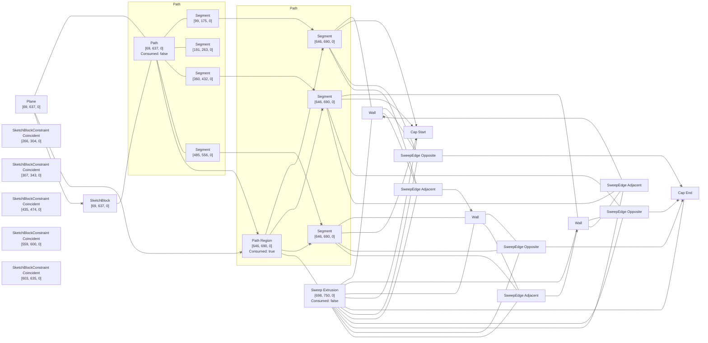

```mermaid
flowchart LR
  subgraph path2 [Path]
    2["Path<br>[69, 637, 0]<br>Consumed: false"]
      %% [ProgramBodyItem { index: 0 }, VariableDeclarationDeclaration, VariableDeclarationInit]
    3["Segment<br>[99, 175, 0]"]
      %% [ProgramBodyItem { index: 0 }, VariableDeclarationDeclaration, VariableDeclarationInit, SketchBlockBody, SketchBlockBodyItem { index: 0 }, VariableDeclarationDeclaration, VariableDeclarationInit]
    4["Segment<br>[191, 263, 0]"]
      %% [ProgramBodyItem { index: 0 }, VariableDeclarationDeclaration, VariableDeclarationInit, SketchBlockBody, SketchBlockBodyItem { index: 1 }, VariableDeclarationDeclaration, VariableDeclarationInit]
    5["Segment<br>[360, 432, 0]"]
      %% [ProgramBodyItem { index: 0 }, VariableDeclarationDeclaration, VariableDeclarationInit, SketchBlockBody, SketchBlockBodyItem { index: 4 }, VariableDeclarationDeclaration, VariableDeclarationInit]
    6["Segment<br>[485, 556, 0]"]
      %% [ProgramBodyItem { index: 0 }, VariableDeclarationDeclaration, VariableDeclarationInit, SketchBlockBody, SketchBlockBodyItem { index: 6 }, VariableDeclarationDeclaration, VariableDeclarationInit]
  end
  subgraph path7 [Path]
    7["Path Region<br>[646, 690, 0]<br>Consumed: true"]
      %% [ProgramBodyItem { index: 1 }, VariableDeclarationDeclaration, VariableDeclarationInit]
    8["Segment<br>[646, 690, 0]"]
      %% [ProgramBodyItem { index: 1 }, VariableDeclarationDeclaration, VariableDeclarationInit]
    9["Segment<br>[646, 690, 0]"]
      %% [ProgramBodyItem { index: 1 }, VariableDeclarationDeclaration, VariableDeclarationInit]
    10["Segment<br>[646, 690, 0]"]
      %% [ProgramBodyItem { index: 1 }, VariableDeclarationDeclaration, VariableDeclarationInit]
  end
  1["Plane<br>[69, 637, 0]"]
    %% [ProgramBodyItem { index: 0 }, VariableDeclarationDeclaration, VariableDeclarationInit]
  11["Sweep Extrusion<br>[698, 750, 0]<br>Consumed: false"]
    %% [ProgramBodyItem { index: 2 }, VariableDeclarationDeclaration, VariableDeclarationInit]
  12[Wall]
    %% face_code_ref=Missing NodePath
  13[Wall]
    %% face_code_ref=Missing NodePath
  14[Wall]
    %% face_code_ref=Missing NodePath
  15["Cap Start"]
    %% face_code_ref=Missing NodePath
  16["Cap End"]
    %% face_code_ref=Missing NodePath
  17["SweepEdge Opposite"]
  18["SweepEdge Adjacent"]
  19["SweepEdge Opposite"]
  20["SweepEdge Adjacent"]
  21["SweepEdge Opposite"]
  22["SweepEdge Adjacent"]
  23["SketchBlock<br>[69, 637, 0]"]
    %% [ProgramBodyItem { index: 0 }, VariableDeclarationDeclaration, VariableDeclarationInit]
  24["SketchBlockConstraint Coincident<br>[266, 304, 0]"]
    %% [ProgramBodyItem { index: 0 }, VariableDeclarationDeclaration, VariableDeclarationInit, SketchBlockBody, SketchBlockBodyItem { index: 2 }, ExpressionStatementExpr]
  25["SketchBlockConstraint Coincident<br>[307, 343, 0]"]
    %% [ProgramBodyItem { index: 0 }, VariableDeclarationDeclaration, VariableDeclarationInit, SketchBlockBody, SketchBlockBodyItem { index: 3 }, ExpressionStatementExpr]
  26["SketchBlockConstraint Coincident<br>[435, 474, 0]"]
    %% [ProgramBodyItem { index: 0 }, VariableDeclarationDeclaration, VariableDeclarationInit, SketchBlockBody, SketchBlockBodyItem { index: 5 }, ExpressionStatementExpr]
  27["SketchBlockConstraint Coincident<br>[559, 600, 0]"]
    %% [ProgramBodyItem { index: 0 }, VariableDeclarationDeclaration, VariableDeclarationInit, SketchBlockBody, SketchBlockBodyItem { index: 7 }, ExpressionStatementExpr]
  28["SketchBlockConstraint Coincident<br>[603, 635, 0]"]
    %% [ProgramBodyItem { index: 0 }, VariableDeclarationDeclaration, VariableDeclarationInit, SketchBlockBody, SketchBlockBodyItem { index: 8 }, ExpressionStatementExpr]
  1 --- 2
  1 <--x 7
  1 <--x 23
  2 --- 3
  2 --- 4
  2 --- 5
  2 --- 6
  2 <--x 7
  23 --- 2
  3 <--x 8
  5 <--x 9
  6 <--x 10
  7 <--x 8
  7 <--x 9
  7 <--x 10
  7 ---- 11
  8 --- 12
  8 x--> 15
  8 --- 17
  8 --- 18
  9 --- 13
  9 x--> 15
  9 --- 19
  9 --- 20
  10 --- 14
  10 x--> 15
  10 --- 21
  10 --- 22
  11 --- 12
  11 --- 13
  11 --- 14
  11 --- 15
  11 --- 16
  11 --- 17
  11 --- 18
  11 --- 19
  11 --- 20
  11 --- 21
  11 --- 22
  12 --- 17
  12 --- 18
  20 <--x 12
  13 --- 19
  13 --- 20
  22 <--x 13
  18 <--x 14
  14 --- 21
  14 --- 22
  17 <--x 16
  19 <--x 16
  21 <--x 16
```
