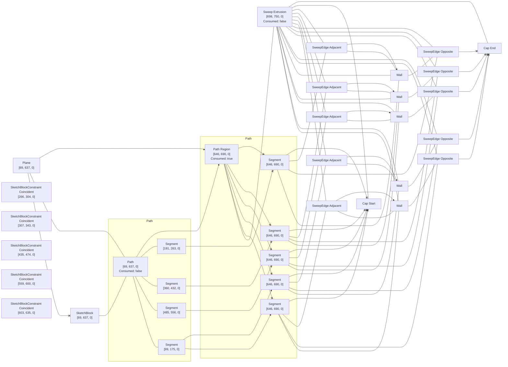

```mermaid
flowchart LR
  subgraph path4 [Path]
    4["Path<br>[69, 637, 0]<br>Consumed: false"]
      %% [ProgramBodyItem { index: 0 }, VariableDeclarationDeclaration, VariableDeclarationInit]
    14["Segment<br>[99, 175, 0]"]
      %% [ProgramBodyItem { index: 0 }, VariableDeclarationDeclaration, VariableDeclarationInit, SketchBlockBody, SketchBlockBodyItem { index: 0 }, VariableDeclarationDeclaration, VariableDeclarationInit]
    6["Segment<br>[191, 263, 0]"]
      %% [ProgramBodyItem { index: 0 }, VariableDeclarationDeclaration, VariableDeclarationInit, SketchBlockBody, SketchBlockBodyItem { index: 1 }, VariableDeclarationDeclaration, VariableDeclarationInit]
    7["Segment<br>[360, 432, 0]"]
      %% [ProgramBodyItem { index: 0 }, VariableDeclarationDeclaration, VariableDeclarationInit, SketchBlockBody, SketchBlockBodyItem { index: 4 }, VariableDeclarationDeclaration, VariableDeclarationInit]
    8["Segment<br>[485, 556, 0]"]
      %% [ProgramBodyItem { index: 0 }, VariableDeclarationDeclaration, VariableDeclarationInit, SketchBlockBody, SketchBlockBodyItem { index: 6 }, VariableDeclarationDeclaration, VariableDeclarationInit]
  end
  subgraph path3 [Path]
    3["Path Region<br>[646, 690, 0]<br>Consumed: true"]
      %% [ProgramBodyItem { index: 1 }, VariableDeclarationDeclaration, VariableDeclarationInit]
    12["Segment<br>[646, 690, 0]"]
      %% [ProgramBodyItem { index: 1 }, VariableDeclarationDeclaration, VariableDeclarationInit]
    13["Segment<br>[646, 690, 0]"]
      %% [ProgramBodyItem { index: 1 }, VariableDeclarationDeclaration, VariableDeclarationInit]
    9["Segment<br>[646, 690, 0]"]
      %% [ProgramBodyItem { index: 1 }, VariableDeclarationDeclaration, VariableDeclarationInit]
    10["Segment<br>[646, 690, 0]"]
      %% [ProgramBodyItem { index: 1 }, VariableDeclarationDeclaration, VariableDeclarationInit]
    11["Segment<br>[646, 690, 0]"]
      %% [ProgramBodyItem { index: 1 }, VariableDeclarationDeclaration, VariableDeclarationInit]
  end
  5["Plane<br>[69, 637, 0]"]
    %% [ProgramBodyItem { index: 0 }, VariableDeclarationDeclaration, VariableDeclarationInit]
  21["Sweep Extrusion<br>[698, 750, 0]<br>Consumed: false"]
    %% [ProgramBodyItem { index: 2 }, VariableDeclarationDeclaration, VariableDeclarationInit]
  32[Wall]
    %% face_code_ref=Missing NodePath
  33[Wall]
    %% face_code_ref=Missing NodePath
  34[Wall]
    %% face_code_ref=Missing NodePath
  35[Wall]
    %% face_code_ref=Missing NodePath
  36[Wall]
    %% face_code_ref=Missing NodePath
  2["Cap Start"]
    %% face_code_ref=Missing NodePath
  1["Cap End"]
    %% face_code_ref=Missing NodePath
  27["SweepEdge Opposite"]
  22["SweepEdge Adjacent"]
  28["SweepEdge Opposite"]
  23["SweepEdge Adjacent"]
  29["SweepEdge Opposite"]
  24["SweepEdge Adjacent"]
  30["SweepEdge Opposite"]
  25["SweepEdge Adjacent"]
  31["SweepEdge Opposite"]
  26["SweepEdge Adjacent"]
  15["SketchBlock<br>[69, 637, 0]"]
    %% [ProgramBodyItem { index: 0 }, VariableDeclarationDeclaration, VariableDeclarationInit]
  16["SketchBlockConstraint Coincident<br>[266, 304, 0]"]
    %% [ProgramBodyItem { index: 0 }, VariableDeclarationDeclaration, VariableDeclarationInit, SketchBlockBody, SketchBlockBodyItem { index: 2 }, ExpressionStatementExpr]
  17["SketchBlockConstraint Coincident<br>[307, 343, 0]"]
    %% [ProgramBodyItem { index: 0 }, VariableDeclarationDeclaration, VariableDeclarationInit, SketchBlockBody, SketchBlockBodyItem { index: 3 }, ExpressionStatementExpr]
  18["SketchBlockConstraint Coincident<br>[435, 474, 0]"]
    %% [ProgramBodyItem { index: 0 }, VariableDeclarationDeclaration, VariableDeclarationInit, SketchBlockBody, SketchBlockBodyItem { index: 5 }, ExpressionStatementExpr]
  19["SketchBlockConstraint Coincident<br>[559, 600, 0]"]
    %% [ProgramBodyItem { index: 0 }, VariableDeclarationDeclaration, VariableDeclarationInit, SketchBlockBody, SketchBlockBodyItem { index: 7 }, ExpressionStatementExpr]
  20["SketchBlockConstraint Coincident<br>[603, 635, 0]"]
    %% [ProgramBodyItem { index: 0 }, VariableDeclarationDeclaration, VariableDeclarationInit, SketchBlockBody, SketchBlockBodyItem { index: 8 }, ExpressionStatementExpr]
  21 --- 1
  27 <--x 1
  28 <--x 1
  29 <--x 1
  30 <--x 1
  31 <--x 1
  9 <--x 2
  10 <--x 2
  11 <--x 2
  12 <--x 2
  13 <--x 2
  21 --- 2
  4 x--> 3
  5 x--> 3
  3 <--x 9
  3 <--x 10
  3 <--x 11
  3 <--x 12
  3 <--x 13
  3 ---- 21
  5 --- 4
  4 --- 6
  4 --- 7
  4 --- 8
  4 --- 14
  15 --- 4
  5 <--x 15
  6 <--x 9
  7 <--x 10
  8 <--x 11
  9 --- 22
  9 --- 27
  9 --- 32
  10 --- 23
  10 --- 28
  10 --- 33
  11 --- 24
  11 --- 29
  11 --- 34
  14 x--> 12
  12 --- 25
  12 --- 30
  12 --- 35
  14 x--> 13
  13 --- 26
  13 --- 31
  13 --- 36
  21 --- 22
  21 --- 23
  21 --- 24
  21 --- 25
  21 --- 26
  21 --- 27
  21 --- 28
  21 --- 29
  21 --- 30
  21 --- 31
  21 --- 32
  21 --- 33
  21 --- 34
  21 --- 35
  21 --- 36
  32 --- 22
  22 x--> 32
  33 --- 23
  23 x--> 33
  34 --- 24
  24 x--> 34
  35 --- 25
  25 x--> 35
  36 --- 26
  26 x--> 36
  32 --- 27
  33 --- 28
  34 --- 29
  35 --- 30
  36 --- 31
```
