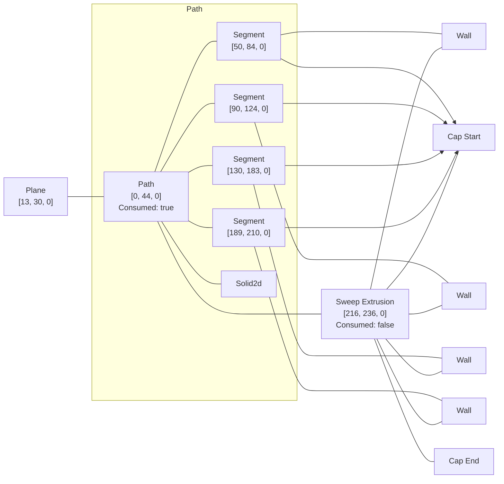

```mermaid
flowchart LR
  subgraph path2 [Path]
    2["Path<br>[0, 44, 0]<br>Consumed: true"]
      %% [ProgramBodyItem { index: 0 }, ExpressionStatementExpr, PipeBodyItem { index: 0 }]
    3["Segment<br>[50, 84, 0]"]
      %% [ProgramBodyItem { index: 0 }, ExpressionStatementExpr, PipeBodyItem { index: 1 }]
    4["Segment<br>[90, 124, 0]"]
      %% [ProgramBodyItem { index: 0 }, ExpressionStatementExpr, PipeBodyItem { index: 2 }]
    5["Segment<br>[130, 183, 0]"]
      %% [ProgramBodyItem { index: 0 }, ExpressionStatementExpr, PipeBodyItem { index: 3 }]
    6["Segment<br>[189, 210, 0]"]
      %% [ProgramBodyItem { index: 0 }, ExpressionStatementExpr, PipeBodyItem { index: 4 }]
    7[Solid2d]
  end
  1["Plane<br>[13, 30, 0]"]
    %% [ProgramBodyItem { index: 0 }, ExpressionStatementExpr, PipeBodyItem { index: 0 }, CallKwUnlabeledArg]
  8["Sweep Extrusion<br>[216, 236, 0]<br>Consumed: false"]
    %% [ProgramBodyItem { index: 0 }, ExpressionStatementExpr, PipeBodyItem { index: 5 }]
  9[Wall]
    %% face_code_ref=Missing NodePath
  10[Wall]
    %% face_code_ref=Missing NodePath
  11[Wall]
    %% face_code_ref=Missing NodePath
  12[Wall]
    %% face_code_ref=Missing NodePath
  13["Cap Start"]
    %% face_code_ref=Missing NodePath
  14["Cap End"]
    %% face_code_ref=Missing NodePath
  1 --- 2
  2 --- 3
  2 --- 4
  2 --- 5
  2 --- 6
  2 --- 7
  2 ---- 8
  3 --- 9
  3 x--> 13
  4 --- 10
  4 x--> 13
  5 --- 11
  5 x--> 13
  6 --- 12
  6 x--> 13
  8 --- 9
  8 --- 10
  8 --- 11
  8 --- 12
  8 --- 13
  8 --- 14
```
