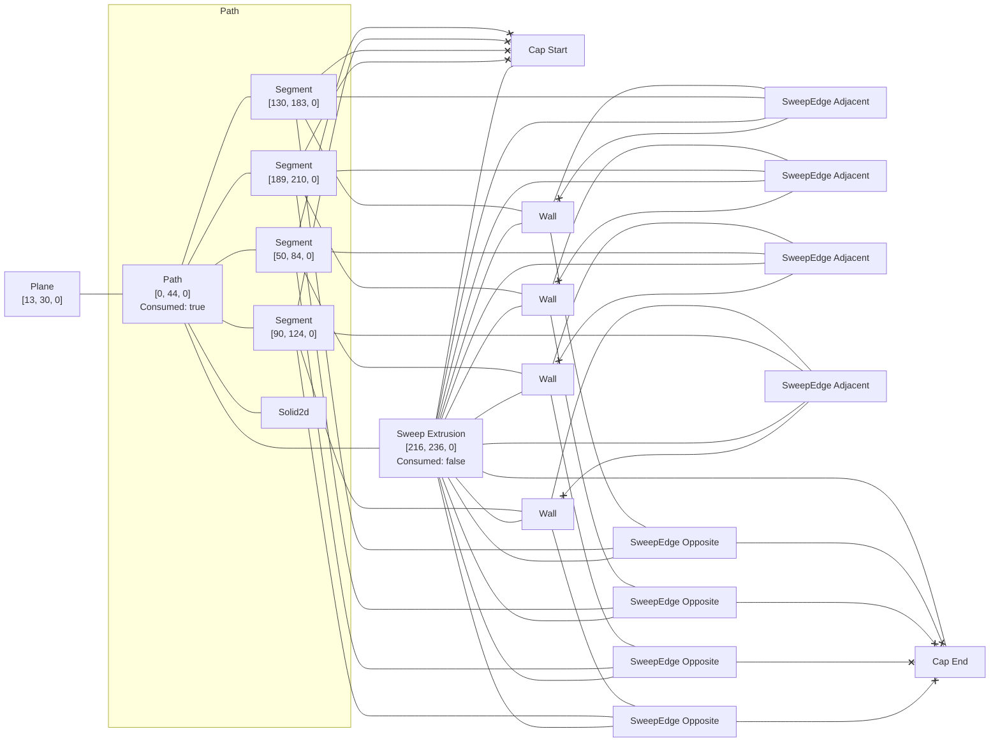

```mermaid
flowchart LR
  subgraph path7 [Path]
    7["Path<br>[0, 44, 0]<br>Consumed: true"]
      %% [ProgramBodyItem { index: 0 }, ExpressionStatementExpr, PipeBodyItem { index: 0 }]
    9["Segment<br>[50, 84, 0]"]
      %% [ProgramBodyItem { index: 0 }, ExpressionStatementExpr, PipeBodyItem { index: 1 }]
    10["Segment<br>[90, 124, 0]"]
      %% [ProgramBodyItem { index: 0 }, ExpressionStatementExpr, PipeBodyItem { index: 2 }]
    11["Segment<br>[130, 183, 0]"]
      %% [ProgramBodyItem { index: 0 }, ExpressionStatementExpr, PipeBodyItem { index: 3 }]
    12["Segment<br>[189, 210, 0]"]
      %% [ProgramBodyItem { index: 0 }, ExpressionStatementExpr, PipeBodyItem { index: 4 }]
    14[Solid2d]
  end
  1["Cap End"]
    %% face_code_ref=Missing NodePath
  2["Cap Start"]
    %% face_code_ref=Missing NodePath
  3[Wall]
    %% face_code_ref=Missing NodePath
  4[Wall]
    %% face_code_ref=Missing NodePath
  5[Wall]
    %% face_code_ref=Missing NodePath
  6[Wall]
    %% face_code_ref=Missing NodePath
  8["Plane<br>[13, 30, 0]"]
    %% [ProgramBodyItem { index: 0 }, ExpressionStatementExpr, PipeBodyItem { index: 0 }, CallKwUnlabeledArg]
  13["Sweep Extrusion<br>[216, 236, 0]<br>Consumed: false"]
    %% [ProgramBodyItem { index: 0 }, ExpressionStatementExpr, PipeBodyItem { index: 5 }]
  15["SweepEdge Adjacent"]
  16["SweepEdge Adjacent"]
  17["SweepEdge Adjacent"]
  18["SweepEdge Adjacent"]
  19["SweepEdge Opposite"]
  20["SweepEdge Opposite"]
  21["SweepEdge Opposite"]
  22["SweepEdge Opposite"]
  13 --- 1
  19 <--x 1
  20 <--x 1
  21 <--x 1
  22 <--x 1
  9 <--x 2
  10 <--x 2
  11 <--x 2
  12 <--x 2
  13 --- 2
  11 --- 3
  13 --- 3
  3 --- 15
  15 <--x 3
  3 --- 19
  12 --- 4
  13 --- 4
  4 --- 16
  16 <--x 4
  4 --- 20
  9 --- 5
  13 --- 5
  5 --- 17
  17 <--x 5
  5 --- 21
  10 --- 6
  13 --- 6
  6 --- 18
  18 <--x 6
  6 --- 22
  8 --- 7
  7 --- 9
  7 --- 10
  7 --- 11
  7 --- 12
  7 ---- 13
  7 --- 14
  9 --- 17
  9 --- 21
  10 --- 18
  10 --- 22
  11 --- 15
  11 --- 19
  12 --- 16
  12 --- 20
  13 --- 15
  13 --- 16
  13 --- 17
  13 --- 18
  13 --- 19
  13 --- 20
  13 --- 21
  13 --- 22
```
