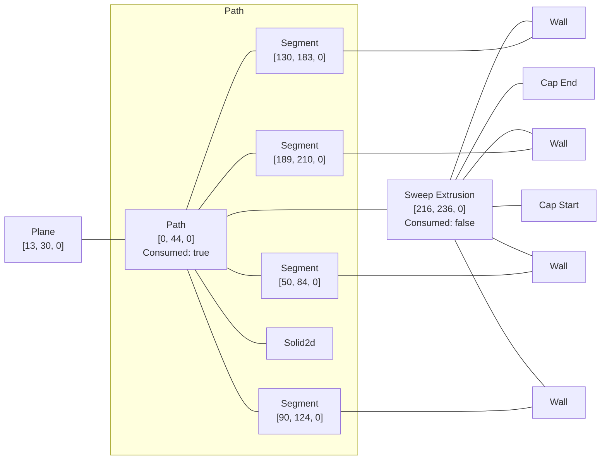

```mermaid
flowchart LR
  subgraph path3 [Path]
    3["Path<br>[0, 44, 0]<br>Consumed: true"]
      %% [ProgramBodyItem { index: 0 }, ExpressionStatementExpr, PipeBodyItem { index: 0 }]
    5["Segment<br>[130, 183, 0]"]
      %% [ProgramBodyItem { index: 0 }, ExpressionStatementExpr, PipeBodyItem { index: 3 }]
    6["Segment<br>[189, 210, 0]"]
      %% [ProgramBodyItem { index: 0 }, ExpressionStatementExpr, PipeBodyItem { index: 4 }]
    7["Segment<br>[50, 84, 0]"]
      %% [ProgramBodyItem { index: 0 }, ExpressionStatementExpr, PipeBodyItem { index: 1 }]
    8["Segment<br>[90, 124, 0]"]
      %% [ProgramBodyItem { index: 0 }, ExpressionStatementExpr, PipeBodyItem { index: 2 }]
    9[Solid2d]
  end
  1["Cap End"]
    %% face_code_ref=Missing NodePath
  2["Cap Start"]
    %% face_code_ref=Missing NodePath
  4["Plane<br>[13, 30, 0]"]
    %% [ProgramBodyItem { index: 0 }, ExpressionStatementExpr, PipeBodyItem { index: 0 }, CallKwUnlabeledArg]
  10["Sweep Extrusion<br>[216, 236, 0]<br>Consumed: false"]
    %% [ProgramBodyItem { index: 0 }, ExpressionStatementExpr, PipeBodyItem { index: 5 }]
  11[Wall]
    %% face_code_ref=Missing NodePath
  12[Wall]
    %% face_code_ref=Missing NodePath
  13[Wall]
    %% face_code_ref=Missing NodePath
  14[Wall]
    %% face_code_ref=Missing NodePath
  10 --- 1
  10 --- 2
  4 --- 3
  3 --- 5
  3 --- 6
  3 --- 7
  3 --- 8
  3 --- 9
  3 ---- 10
  5 --- 11
  6 --- 12
  7 --- 13
  8 --- 14
  10 --- 11
  10 --- 12
  10 --- 13
  10 --- 14
```
