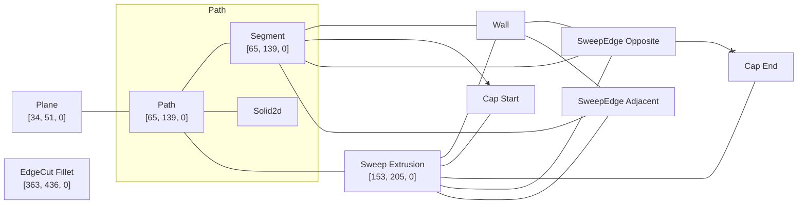

```mermaid
flowchart LR
  subgraph path2 [Path]
    2["Path<br>[65, 139, 0]"]
      %% [ProgramBodyItem { index: 1 }, VariableDeclarationDeclaration, VariableDeclarationInit]
    3["Segment<br>[65, 139, 0]"]
      %% [ProgramBodyItem { index: 1 }, VariableDeclarationDeclaration, VariableDeclarationInit]
    4[Solid2d]
  end
  1["Plane<br>[34, 51, 0]"]
    %% [ProgramBodyItem { index: 0 }, VariableDeclarationDeclaration, VariableDeclarationInit]
  5["Sweep Extrusion<br>[153, 205, 0]"]
    %% [ProgramBodyItem { index: 2 }, VariableDeclarationDeclaration, VariableDeclarationInit]
  6[Wall]
    %% face_code_ref=Missing NodePath
  7["Cap Start"]
    %% face_code_ref=Missing NodePath
  8["Cap End"]
    %% face_code_ref=Missing NodePath
  9["SweepEdge Opposite"]
  10["SweepEdge Adjacent"]
  11["EdgeCut Fillet<br>[363, 436, 0]"]
    %% [ProgramBodyItem { index: 4 }, VariableDeclarationDeclaration, VariableDeclarationInit]
  1 --- 2
  2 --- 3
  2 --- 4
  2 ---- 5
  3 --- 6
  3 x--> 7
  3 --- 9
  3 --- 10
  5 --- 6
  5 --- 7
  5 --- 8
  5 --- 9
  5 --- 10
  6 --- 9
  6 --- 10
  9 <--x 8
```
