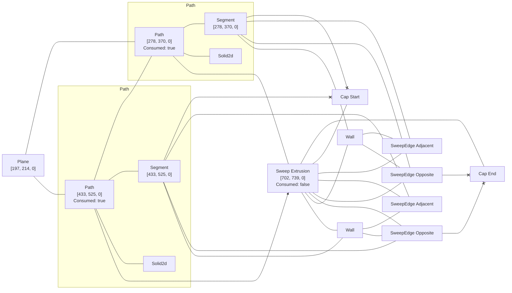

```mermaid
flowchart LR
  subgraph path3 [Path]
    3["Path<br>[278, 370, 0]<br>Consumed: true"]
      %% [ProgramBodyItem { index: 4 }, VariableDeclarationDeclaration, VariableDeclarationInit]
    6["Segment<br>[278, 370, 0]"]
      %% [ProgramBodyItem { index: 4 }, VariableDeclarationDeclaration, VariableDeclarationInit]
    8[Solid2d]
  end
  subgraph path4 [Path]
    4["Path<br>[433, 525, 0]<br>Consumed: true"]
      %% [ProgramBodyItem { index: 5 }, VariableDeclarationDeclaration, VariableDeclarationInit]
    7["Segment<br>[433, 525, 0]"]
      %% [ProgramBodyItem { index: 5 }, VariableDeclarationDeclaration, VariableDeclarationInit]
    9[Solid2d]
  end
  5["Plane<br>[197, 214, 0]"]
    %% [ProgramBodyItem { index: 3 }, VariableDeclarationDeclaration, VariableDeclarationInit]
  10["Sweep Extrusion<br>[702, 739, 0]<br>Consumed: false"]
    %% [ProgramBodyItem { index: 7 }, VariableDeclarationDeclaration, VariableDeclarationInit]
  15[Wall]
    %% face_code_ref=Missing NodePath
  16[Wall]
    %% face_code_ref=Missing NodePath
  2["Cap Start"]
    %% face_code_ref=Missing NodePath
  1["Cap End"]
    %% face_code_ref=Missing NodePath
  13["SweepEdge Opposite"]
  11["SweepEdge Adjacent"]
  14["SweepEdge Opposite"]
  12["SweepEdge Adjacent"]
  10 --- 1
  13 <--x 1
  14 <--x 1
  6 <--x 2
  7 <--x 2
  10 --- 2
  4 --- 3
  5 --- 3
  3 --- 6
  3 --- 8
  3 ---- 10
  5 --- 4
  4 --- 7
  4 --- 9
  4 x---> 10
  6 --- 11
  6 --- 13
  6 --- 15
  7 --- 12
  7 --- 14
  7 --- 16
  10 --- 11
  10 --- 12
  10 --- 13
  10 --- 14
  10 --- 15
  10 --- 16
  15 --- 11
  16 --- 12
  15 --- 13
  16 --- 14
```
