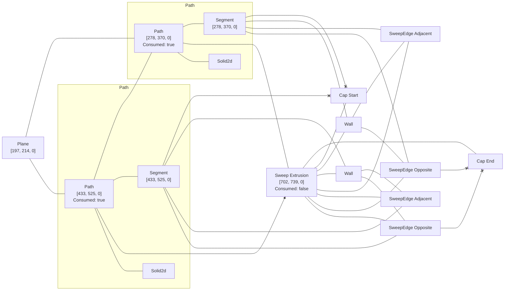

```mermaid
flowchart LR
  subgraph path6 [Path]
    6["Path<br>[278, 370, 0]<br>Consumed: true"]
      %% [ProgramBodyItem { index: 4 }, VariableDeclarationDeclaration, VariableDeclarationInit]
    7["Segment<br>[278, 370, 0]"]
      %% [ProgramBodyItem { index: 4 }, VariableDeclarationDeclaration, VariableDeclarationInit]
    11[Solid2d]
  end
  subgraph path8 [Path]
    8["Path<br>[433, 525, 0]<br>Consumed: true"]
      %% [ProgramBodyItem { index: 5 }, VariableDeclarationDeclaration, VariableDeclarationInit]
    9["Segment<br>[433, 525, 0]"]
      %% [ProgramBodyItem { index: 5 }, VariableDeclarationDeclaration, VariableDeclarationInit]
    12[Solid2d]
  end
  1["Cap End"]
    %% face_code_ref=Missing NodePath
  2["Cap Start"]
    %% face_code_ref=Missing NodePath
  3[Wall]
    %% face_code_ref=Missing NodePath
  4[Wall]
    %% face_code_ref=Missing NodePath
  5["Plane<br>[197, 214, 0]"]
    %% [ProgramBodyItem { index: 3 }, VariableDeclarationDeclaration, VariableDeclarationInit]
  10["Sweep Extrusion<br>[702, 739, 0]<br>Consumed: false"]
    %% [ProgramBodyItem { index: 7 }, VariableDeclarationDeclaration, VariableDeclarationInit]
  13["SweepEdge Adjacent"]
  14["SweepEdge Adjacent"]
  15["SweepEdge Opposite"]
  16["SweepEdge Opposite"]
  10 --- 1
  15 <--x 1
  16 <--x 1
  7 <--x 2
  9 <--x 2
  10 --- 2
  7 --- 3
  10 --- 3
  3 --- 13
  3 --- 15
  9 --- 4
  10 --- 4
  4 --- 14
  4 --- 16
  5 --- 6
  5 --- 8
  6 --- 7
  8 --- 6
  6 ---- 10
  6 --- 11
  7 --- 13
  7 --- 15
  8 --- 9
  8 x---> 10
  8 --- 12
  9 --- 14
  9 --- 16
  10 --- 13
  10 --- 14
  10 --- 15
  10 --- 16
```
