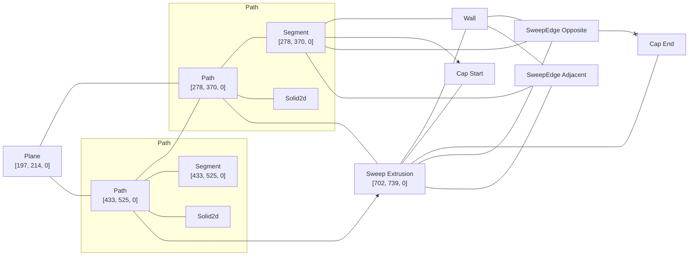

```mermaid
flowchart LR
  subgraph path2 [Path]
    2["Path<br>[278, 370, 0]"]
      %% [ProgramBodyItem { index: 4 }, VariableDeclarationDeclaration, VariableDeclarationInit]
    3["Segment<br>[278, 370, 0]"]
      %% [ProgramBodyItem { index: 4 }, VariableDeclarationDeclaration, VariableDeclarationInit]
    4[Solid2d]
  end
  subgraph path5 [Path]
    5["Path<br>[433, 525, 0]"]
      %% [ProgramBodyItem { index: 5 }, VariableDeclarationDeclaration, VariableDeclarationInit]
    6["Segment<br>[433, 525, 0]"]
      %% [ProgramBodyItem { index: 5 }, VariableDeclarationDeclaration, VariableDeclarationInit]
    7[Solid2d]
  end
  1["Plane<br>[197, 214, 0]"]
    %% [ProgramBodyItem { index: 3 }, VariableDeclarationDeclaration, VariableDeclarationInit]
  8["Sweep Extrusion<br>[702, 739, 0]"]
    %% [ProgramBodyItem { index: 7 }, VariableDeclarationDeclaration, VariableDeclarationInit]
  9[Wall]
    %% face_code_ref=Missing NodePath
  10["Cap Start"]
    %% face_code_ref=Missing NodePath
  11["Cap End"]
    %% face_code_ref=Missing NodePath
  12["SweepEdge Opposite"]
  13["SweepEdge Adjacent"]
  1 --- 2
  1 --- 5
  2 --- 3
  2 --- 4
  5 --- 2
  2 ---- 8
  3 --- 9
  3 x--> 10
  3 --- 12
  3 --- 13
  5 --- 6
  5 --- 7
  5 x---> 8
  8 --- 9
  8 --- 10
  8 --- 11
  8 --- 12
  8 --- 13
  9 --- 12
  9 --- 13
  12 <--x 11
```
