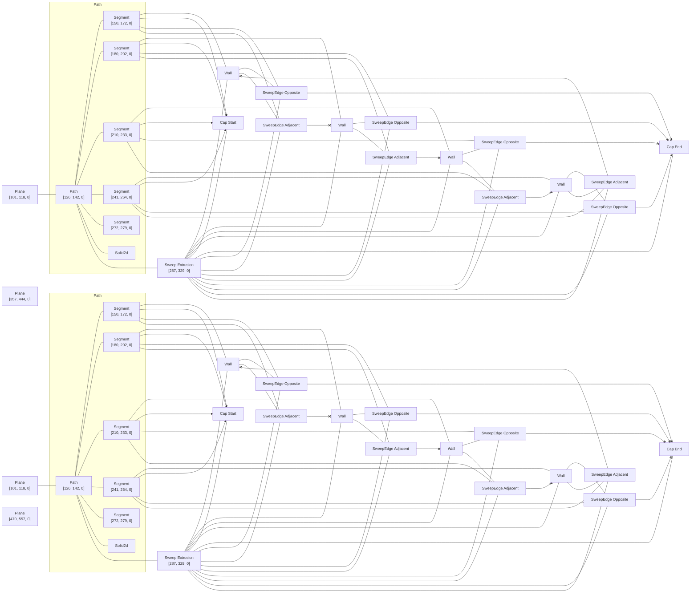

```mermaid
flowchart LR
  subgraph path2 [Path]
    2["Path<br>[126, 142, 0]"]
      %% [ProgramBodyItem { index: 0 }, VariableDeclarationDeclaration, VariableDeclarationInit, FunctionExpressionBody, FunctionExpressionBodyItem { index: 1 }, ReturnStatementArg, PipeBodyItem { index: 1 }]
    3["Segment<br>[150, 172, 0]"]
      %% [ProgramBodyItem { index: 0 }, VariableDeclarationDeclaration, VariableDeclarationInit, FunctionExpressionBody, FunctionExpressionBodyItem { index: 1 }, ReturnStatementArg, PipeBodyItem { index: 2 }]
    4["Segment<br>[180, 202, 0]"]
      %% [ProgramBodyItem { index: 0 }, VariableDeclarationDeclaration, VariableDeclarationInit, FunctionExpressionBody, FunctionExpressionBodyItem { index: 1 }, ReturnStatementArg, PipeBodyItem { index: 3 }]
    5["Segment<br>[210, 233, 0]"]
      %% [ProgramBodyItem { index: 0 }, VariableDeclarationDeclaration, VariableDeclarationInit, FunctionExpressionBody, FunctionExpressionBodyItem { index: 1 }, ReturnStatementArg, PipeBodyItem { index: 4 }]
    6["Segment<br>[241, 264, 0]"]
      %% [ProgramBodyItem { index: 0 }, VariableDeclarationDeclaration, VariableDeclarationInit, FunctionExpressionBody, FunctionExpressionBodyItem { index: 1 }, ReturnStatementArg, PipeBodyItem { index: 5 }]
    7["Segment<br>[272, 279, 0]"]
      %% [ProgramBodyItem { index: 0 }, VariableDeclarationDeclaration, VariableDeclarationInit, FunctionExpressionBody, FunctionExpressionBodyItem { index: 1 }, ReturnStatementArg, PipeBodyItem { index: 6 }]
    8[Solid2d]
  end
  subgraph path26 [Path]
    26["Path<br>[126, 142, 0]"]
      %% [ProgramBodyItem { index: 0 }, VariableDeclarationDeclaration, VariableDeclarationInit, FunctionExpressionBody, FunctionExpressionBodyItem { index: 1 }, ReturnStatementArg, PipeBodyItem { index: 1 }]
    27["Segment<br>[150, 172, 0]"]
      %% [ProgramBodyItem { index: 0 }, VariableDeclarationDeclaration, VariableDeclarationInit, FunctionExpressionBody, FunctionExpressionBodyItem { index: 1 }, ReturnStatementArg, PipeBodyItem { index: 2 }]
    28["Segment<br>[180, 202, 0]"]
      %% [ProgramBodyItem { index: 0 }, VariableDeclarationDeclaration, VariableDeclarationInit, FunctionExpressionBody, FunctionExpressionBodyItem { index: 1 }, ReturnStatementArg, PipeBodyItem { index: 3 }]
    29["Segment<br>[210, 233, 0]"]
      %% [ProgramBodyItem { index: 0 }, VariableDeclarationDeclaration, VariableDeclarationInit, FunctionExpressionBody, FunctionExpressionBodyItem { index: 1 }, ReturnStatementArg, PipeBodyItem { index: 4 }]
    30["Segment<br>[241, 264, 0]"]
      %% [ProgramBodyItem { index: 0 }, VariableDeclarationDeclaration, VariableDeclarationInit, FunctionExpressionBody, FunctionExpressionBodyItem { index: 1 }, ReturnStatementArg, PipeBodyItem { index: 5 }]
    31["Segment<br>[272, 279, 0]"]
      %% [ProgramBodyItem { index: 0 }, VariableDeclarationDeclaration, VariableDeclarationInit, FunctionExpressionBody, FunctionExpressionBodyItem { index: 1 }, ReturnStatementArg, PipeBodyItem { index: 6 }]
    32[Solid2d]
  end
  1["Plane<br>[101, 118, 0]"]
    %% [ProgramBodyItem { index: 0 }, VariableDeclarationDeclaration, VariableDeclarationInit, FunctionExpressionBody, FunctionExpressionBodyItem { index: 1 }, ReturnStatementArg, PipeBodyItem { index: 0 }]
  9["Sweep Extrusion<br>[287, 329, 0]"]
    %% [ProgramBodyItem { index: 0 }, VariableDeclarationDeclaration, VariableDeclarationInit, FunctionExpressionBody, FunctionExpressionBodyItem { index: 1 }, ReturnStatementArg, PipeBodyItem { index: 7 }]
  10[Wall]
    %% face_code_ref=Missing NodePath
  11[Wall]
    %% face_code_ref=Missing NodePath
  12[Wall]
    %% face_code_ref=Missing NodePath
  13[Wall]
    %% face_code_ref=Missing NodePath
  14["Cap Start"]
    %% face_code_ref=Missing NodePath
  15["Cap End"]
    %% face_code_ref=Missing NodePath
  16["SweepEdge Opposite"]
  17["SweepEdge Adjacent"]
  18["SweepEdge Opposite"]
  19["SweepEdge Adjacent"]
  20["SweepEdge Opposite"]
  21["SweepEdge Adjacent"]
  22["SweepEdge Opposite"]
  23["SweepEdge Adjacent"]
  24["Plane<br>[357, 444, 0]"]
    %% [ProgramBodyItem { index: 2 }, ExpressionStatementExpr]
  25["Plane<br>[101, 118, 0]"]
    %% [ProgramBodyItem { index: 0 }, VariableDeclarationDeclaration, VariableDeclarationInit, FunctionExpressionBody, FunctionExpressionBodyItem { index: 1 }, ReturnStatementArg, PipeBodyItem { index: 0 }]
  33["Sweep Extrusion<br>[287, 329, 0]"]
    %% [ProgramBodyItem { index: 0 }, VariableDeclarationDeclaration, VariableDeclarationInit, FunctionExpressionBody, FunctionExpressionBodyItem { index: 1 }, ReturnStatementArg, PipeBodyItem { index: 7 }]
  34[Wall]
    %% face_code_ref=Missing NodePath
  35[Wall]
    %% face_code_ref=Missing NodePath
  36[Wall]
    %% face_code_ref=Missing NodePath
  37[Wall]
    %% face_code_ref=Missing NodePath
  38["Cap Start"]
    %% face_code_ref=Missing NodePath
  39["Cap End"]
    %% face_code_ref=Missing NodePath
  40["SweepEdge Opposite"]
  41["SweepEdge Adjacent"]
  42["SweepEdge Opposite"]
  43["SweepEdge Adjacent"]
  44["SweepEdge Opposite"]
  45["SweepEdge Adjacent"]
  46["SweepEdge Opposite"]
  47["SweepEdge Adjacent"]
  48["Plane<br>[470, 557, 0]"]
    %% [ProgramBodyItem { index: 4 }, ExpressionStatementExpr]
  1 --- 2
  2 --- 3
  2 --- 4
  2 --- 5
  2 --- 6
  2 --- 7
  2 --- 8
  2 ---- 9
  3 --- 10
  3 x--> 14
  3 --- 16
  3 --- 17
  4 --- 11
  4 x--> 14
  4 --- 18
  4 --- 19
  5 --- 12
  5 x--> 14
  5 --- 20
  5 --- 21
  6 --- 13
  6 x--> 14
  6 --- 22
  6 --- 23
  9 --- 10
  9 --- 11
  9 --- 12
  9 --- 13
  9 --- 14
  9 --- 15
  9 --- 16
  9 --- 17
  9 --- 18
  9 --- 19
  9 --- 20
  9 --- 21
  9 --- 22
  9 --- 23
  10 --- 16
  10 --- 17
  23 <--x 10
  17 <--x 11
  11 --- 18
  11 --- 19
  19 <--x 12
  12 --- 20
  12 --- 21
  21 <--x 13
  13 --- 22
  13 --- 23
  16 <--x 15
  18 <--x 15
  20 <--x 15
  22 <--x 15
  25 --- 26
  26 --- 27
  26 --- 28
  26 --- 29
  26 --- 30
  26 --- 31
  26 --- 32
  26 ---- 33
  27 --- 34
  27 x--> 38
  27 --- 40
  27 --- 41
  28 --- 35
  28 x--> 38
  28 --- 42
  28 --- 43
  29 --- 36
  29 x--> 38
  29 --- 44
  29 --- 45
  30 --- 37
  30 x--> 38
  30 --- 46
  30 --- 47
  33 --- 34
  33 --- 35
  33 --- 36
  33 --- 37
  33 --- 38
  33 --- 39
  33 --- 40
  33 --- 41
  33 --- 42
  33 --- 43
  33 --- 44
  33 --- 45
  33 --- 46
  33 --- 47
  34 --- 40
  34 --- 41
  47 <--x 34
  41 <--x 35
  35 --- 42
  35 --- 43
  43 <--x 36
  36 --- 44
  36 --- 45
  45 <--x 37
  37 --- 46
  37 --- 47
  40 <--x 39
  42 <--x 39
  44 <--x 39
  46 <--x 39
```
