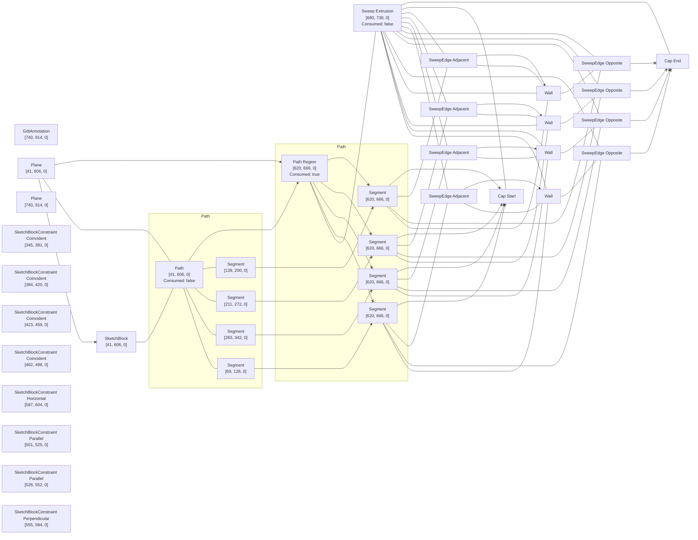

```mermaid
flowchart LR
  subgraph path4 [Path]
    4["Path Region<br>[620, 666, 0]<br>Consumed: true"]
      %% [ProgramBodyItem { index: 1 }, VariableDeclarationDeclaration, VariableDeclarationInit]
    11["Segment<br>[620, 666, 0]"]
      %% [ProgramBodyItem { index: 1 }, VariableDeclarationDeclaration, VariableDeclarationInit]
    12["Segment<br>[620, 666, 0]"]
      %% [ProgramBodyItem { index: 1 }, VariableDeclarationDeclaration, VariableDeclarationInit]
    13["Segment<br>[620, 666, 0]"]
      %% [ProgramBodyItem { index: 1 }, VariableDeclarationDeclaration, VariableDeclarationInit]
    14["Segment<br>[620, 666, 0]"]
      %% [ProgramBodyItem { index: 1 }, VariableDeclarationDeclaration, VariableDeclarationInit]
  end
  subgraph path5 [Path]
    5["Path<br>[41, 606, 0]<br>Consumed: false"]
      %% [ProgramBodyItem { index: 0 }, VariableDeclarationDeclaration, VariableDeclarationInit]
    8["Segment<br>[139, 200, 0]"]
      %% [ProgramBodyItem { index: 0 }, VariableDeclarationDeclaration, VariableDeclarationInit, SketchBlockBody, SketchBlockBodyItem { index: 1 }, VariableDeclarationDeclaration, VariableDeclarationInit]
    9["Segment<br>[211, 272, 0]"]
      %% [ProgramBodyItem { index: 0 }, VariableDeclarationDeclaration, VariableDeclarationInit, SketchBlockBody, SketchBlockBodyItem { index: 2 }, VariableDeclarationDeclaration, VariableDeclarationInit]
    10["Segment<br>[283, 342, 0]"]
      %% [ProgramBodyItem { index: 0 }, VariableDeclarationDeclaration, VariableDeclarationInit, SketchBlockBody, SketchBlockBodyItem { index: 3 }, VariableDeclarationDeclaration, VariableDeclarationInit]
    15["Segment<br>[69, 128, 0]"]
      %% [ProgramBodyItem { index: 0 }, VariableDeclarationDeclaration, VariableDeclarationInit, SketchBlockBody, SketchBlockBodyItem { index: 0 }, VariableDeclarationDeclaration, VariableDeclarationInit]
  end
  1["Cap End"]
    %% face_code_ref=Missing NodePath
  2["Cap Start"]
    %% face_code_ref=Missing NodePath
  3["GdtAnnotation<br>[740, 914, 0]"]
    %% [ProgramBodyItem { index: 3 }, ExpressionStatementExpr]
  6["Plane<br>[41, 606, 0]"]
    %% [ProgramBodyItem { index: 0 }, VariableDeclarationDeclaration, VariableDeclarationInit]
  7["Plane<br>[740, 914, 0]"]
    %% [ProgramBodyItem { index: 3 }, ExpressionStatementExpr]
  16["SketchBlock<br>[41, 606, 0]"]
    %% [ProgramBodyItem { index: 0 }, VariableDeclarationDeclaration, VariableDeclarationInit]
  17["SketchBlockConstraint Coincident<br>[345, 381, 0]"]
    %% [ProgramBodyItem { index: 0 }, VariableDeclarationDeclaration, VariableDeclarationInit, SketchBlockBody, SketchBlockBodyItem { index: 4 }, ExpressionStatementExpr]
  18["SketchBlockConstraint Coincident<br>[384, 420, 0]"]
    %% [ProgramBodyItem { index: 0 }, VariableDeclarationDeclaration, VariableDeclarationInit, SketchBlockBody, SketchBlockBodyItem { index: 5 }, ExpressionStatementExpr]
  19["SketchBlockConstraint Coincident<br>[423, 459, 0]"]
    %% [ProgramBodyItem { index: 0 }, VariableDeclarationDeclaration, VariableDeclarationInit, SketchBlockBody, SketchBlockBodyItem { index: 6 }, ExpressionStatementExpr]
  20["SketchBlockConstraint Coincident<br>[462, 498, 0]"]
    %% [ProgramBodyItem { index: 0 }, VariableDeclarationDeclaration, VariableDeclarationInit, SketchBlockBody, SketchBlockBodyItem { index: 7 }, ExpressionStatementExpr]
  21["SketchBlockConstraint Horizontal<br>[587, 604, 0]"]
    %% [ProgramBodyItem { index: 0 }, VariableDeclarationDeclaration, VariableDeclarationInit, SketchBlockBody, SketchBlockBodyItem { index: 11 }, ExpressionStatementExpr]
  22["SketchBlockConstraint Parallel<br>[501, 525, 0]"]
    %% [ProgramBodyItem { index: 0 }, VariableDeclarationDeclaration, VariableDeclarationInit, SketchBlockBody, SketchBlockBodyItem { index: 8 }, ExpressionStatementExpr]
  23["SketchBlockConstraint Parallel<br>[528, 552, 0]"]
    %% [ProgramBodyItem { index: 0 }, VariableDeclarationDeclaration, VariableDeclarationInit, SketchBlockBody, SketchBlockBodyItem { index: 9 }, ExpressionStatementExpr]
  24["SketchBlockConstraint Perpendicular<br>[555, 584, 0]"]
    %% [ProgramBodyItem { index: 0 }, VariableDeclarationDeclaration, VariableDeclarationInit, SketchBlockBody, SketchBlockBodyItem { index: 10 }, ExpressionStatementExpr]
  25["Sweep Extrusion<br>[680, 738, 0]<br>Consumed: false"]
    %% [ProgramBodyItem { index: 2 }, VariableDeclarationDeclaration, VariableDeclarationInit]
  26["SweepEdge Adjacent"]
  27["SweepEdge Adjacent"]
  28["SweepEdge Adjacent"]
  29["SweepEdge Adjacent"]
  30["SweepEdge Opposite"]
  31["SweepEdge Opposite"]
  32["SweepEdge Opposite"]
  33["SweepEdge Opposite"]
  34[Wall]
    %% face_code_ref=Missing NodePath
  35[Wall]
    %% face_code_ref=Missing NodePath
  36[Wall]
    %% face_code_ref=Missing NodePath
  37[Wall]
    %% face_code_ref=Missing NodePath
  25 --- 1
  30 <--x 1
  31 <--x 1
  32 <--x 1
  33 <--x 1
  11 <--x 2
  12 <--x 2
  13 <--x 2
  14 <--x 2
  25 --- 2
  5 x--> 4
  6 x--> 4
  4 <--x 11
  4 <--x 12
  4 <--x 13
  4 <--x 14
  4 ---- 25
  6 --- 5
  5 --- 8
  5 --- 9
  5 --- 10
  5 --- 15
  16 --- 5
  6 <--x 16
  8 <--x 11
  9 <--x 12
  10 <--x 13
  11 --- 26
  11 --- 30
  11 --- 34
  12 --- 27
  12 --- 31
  12 --- 35
  13 --- 28
  13 --- 32
  13 --- 36
  15 x--> 14
  14 --- 29
  14 --- 33
  14 --- 37
  25 --- 26
  25 --- 27
  25 --- 28
  25 --- 29
  25 --- 30
  25 --- 31
  25 --- 32
  25 --- 33
  25 --- 34
  25 --- 35
  25 --- 36
  25 --- 37
  34 --- 26
  26 x--> 34
  27 x--> 35
  35 --- 27
  28 x--> 36
  36 --- 28
  29 x--> 37
  37 --- 29
  34 --- 30
  35 --- 31
  36 --- 32
  37 --- 33
```
