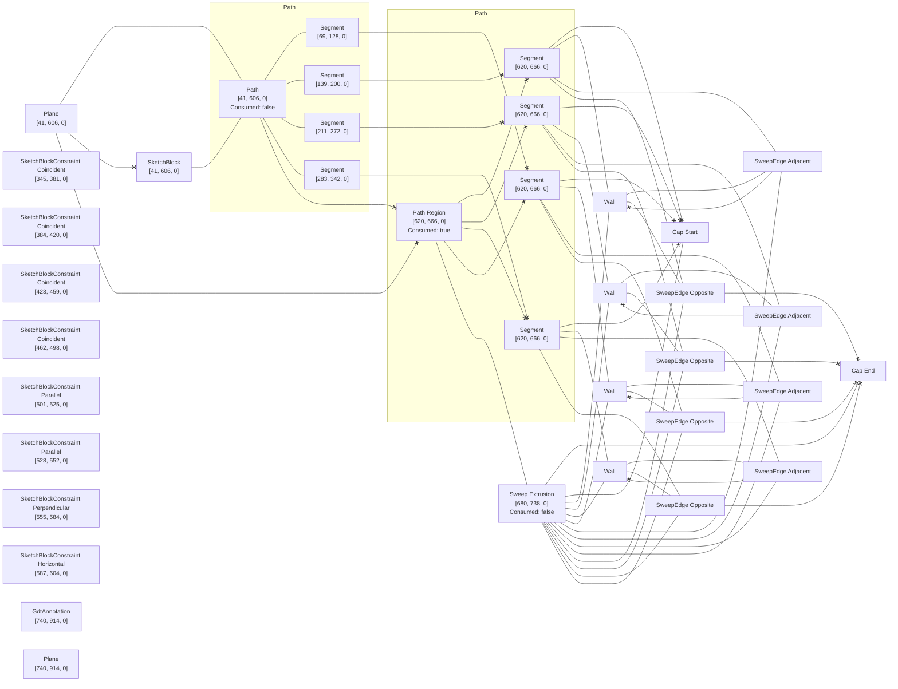

```mermaid
flowchart LR
  subgraph path7 [Path]
    7["Path<br>[41, 606, 0]<br>Consumed: false"]
      %% [ProgramBodyItem { index: 0 }, VariableDeclarationDeclaration, VariableDeclarationInit]
    10["Segment<br>[69, 128, 0]"]
      %% [ProgramBodyItem { index: 0 }, VariableDeclarationDeclaration, VariableDeclarationInit, SketchBlockBody, SketchBlockBodyItem { index: 0 }, VariableDeclarationDeclaration, VariableDeclarationInit]
    11["Segment<br>[139, 200, 0]"]
      %% [ProgramBodyItem { index: 0 }, VariableDeclarationDeclaration, VariableDeclarationInit, SketchBlockBody, SketchBlockBodyItem { index: 1 }, VariableDeclarationDeclaration, VariableDeclarationInit]
    12["Segment<br>[211, 272, 0]"]
      %% [ProgramBodyItem { index: 0 }, VariableDeclarationDeclaration, VariableDeclarationInit, SketchBlockBody, SketchBlockBodyItem { index: 2 }, VariableDeclarationDeclaration, VariableDeclarationInit]
    13["Segment<br>[283, 342, 0]"]
      %% [ProgramBodyItem { index: 0 }, VariableDeclarationDeclaration, VariableDeclarationInit, SketchBlockBody, SketchBlockBodyItem { index: 3 }, VariableDeclarationDeclaration, VariableDeclarationInit]
  end
  subgraph path22 [Path]
    22["Path Region<br>[620, 666, 0]<br>Consumed: true"]
      %% [ProgramBodyItem { index: 1 }, VariableDeclarationDeclaration, VariableDeclarationInit]
    23["Segment<br>[620, 666, 0]"]
      %% [ProgramBodyItem { index: 1 }, VariableDeclarationDeclaration, VariableDeclarationInit]
    24["Segment<br>[620, 666, 0]"]
      %% [ProgramBodyItem { index: 1 }, VariableDeclarationDeclaration, VariableDeclarationInit]
    25["Segment<br>[620, 666, 0]"]
      %% [ProgramBodyItem { index: 1 }, VariableDeclarationDeclaration, VariableDeclarationInit]
    26["Segment<br>[620, 666, 0]"]
      %% [ProgramBodyItem { index: 1 }, VariableDeclarationDeclaration, VariableDeclarationInit]
  end
  1["Cap End"]
    %% face_code_ref=Missing NodePath
  2["Cap Start"]
    %% face_code_ref=Missing NodePath
  3[Wall]
    %% face_code_ref=Missing NodePath
  4[Wall]
    %% face_code_ref=Missing NodePath
  5[Wall]
    %% face_code_ref=Missing NodePath
  6[Wall]
    %% face_code_ref=Missing NodePath
  8["Plane<br>[41, 606, 0]"]
    %% [ProgramBodyItem { index: 0 }, VariableDeclarationDeclaration, VariableDeclarationInit]
  9["SketchBlock<br>[41, 606, 0]"]
    %% [ProgramBodyItem { index: 0 }, VariableDeclarationDeclaration, VariableDeclarationInit]
  14["SketchBlockConstraint Coincident<br>[345, 381, 0]"]
    %% [ProgramBodyItem { index: 0 }, VariableDeclarationDeclaration, VariableDeclarationInit, SketchBlockBody, SketchBlockBodyItem { index: 4 }, ExpressionStatementExpr]
  15["SketchBlockConstraint Coincident<br>[384, 420, 0]"]
    %% [ProgramBodyItem { index: 0 }, VariableDeclarationDeclaration, VariableDeclarationInit, SketchBlockBody, SketchBlockBodyItem { index: 5 }, ExpressionStatementExpr]
  16["SketchBlockConstraint Coincident<br>[423, 459, 0]"]
    %% [ProgramBodyItem { index: 0 }, VariableDeclarationDeclaration, VariableDeclarationInit, SketchBlockBody, SketchBlockBodyItem { index: 6 }, ExpressionStatementExpr]
  17["SketchBlockConstraint Coincident<br>[462, 498, 0]"]
    %% [ProgramBodyItem { index: 0 }, VariableDeclarationDeclaration, VariableDeclarationInit, SketchBlockBody, SketchBlockBodyItem { index: 7 }, ExpressionStatementExpr]
  18["SketchBlockConstraint Parallel<br>[501, 525, 0]"]
    %% [ProgramBodyItem { index: 0 }, VariableDeclarationDeclaration, VariableDeclarationInit, SketchBlockBody, SketchBlockBodyItem { index: 8 }, ExpressionStatementExpr]
  19["SketchBlockConstraint Parallel<br>[528, 552, 0]"]
    %% [ProgramBodyItem { index: 0 }, VariableDeclarationDeclaration, VariableDeclarationInit, SketchBlockBody, SketchBlockBodyItem { index: 9 }, ExpressionStatementExpr]
  20["SketchBlockConstraint Perpendicular<br>[555, 584, 0]"]
    %% [ProgramBodyItem { index: 0 }, VariableDeclarationDeclaration, VariableDeclarationInit, SketchBlockBody, SketchBlockBodyItem { index: 10 }, ExpressionStatementExpr]
  21["SketchBlockConstraint Horizontal<br>[587, 604, 0]"]
    %% [ProgramBodyItem { index: 0 }, VariableDeclarationDeclaration, VariableDeclarationInit, SketchBlockBody, SketchBlockBodyItem { index: 11 }, ExpressionStatementExpr]
  27["Sweep Extrusion<br>[680, 738, 0]<br>Consumed: false"]
    %% [ProgramBodyItem { index: 2 }, VariableDeclarationDeclaration, VariableDeclarationInit]
  28["GdtAnnotation<br>[740, 914, 0]"]
    %% [ProgramBodyItem { index: 3 }, ExpressionStatementExpr]
  29["Plane<br>[740, 914, 0]"]
    %% [ProgramBodyItem { index: 3 }, ExpressionStatementExpr]
  30["SweepEdge Adjacent"]
  31["SweepEdge Adjacent"]
  32["SweepEdge Adjacent"]
  33["SweepEdge Adjacent"]
  34["SweepEdge Opposite"]
  35["SweepEdge Opposite"]
  36["SweepEdge Opposite"]
  37["SweepEdge Opposite"]
  27 --- 1
  34 <--x 1
  35 <--x 1
  36 <--x 1
  37 <--x 1
  23 <--x 2
  24 <--x 2
  25 <--x 2
  26 <--x 2
  27 --- 2
  23 --- 3
  27 --- 3
  3 --- 30
  30 <--x 3
  3 --- 34
  24 --- 4
  27 --- 4
  4 --- 31
  31 <--x 4
  4 --- 35
  25 --- 5
  27 --- 5
  5 --- 32
  32 <--x 5
  5 --- 36
  26 --- 6
  27 --- 6
  6 --- 33
  33 <--x 6
  6 --- 37
  8 --- 7
  9 --- 7
  7 --- 10
  7 --- 11
  7 --- 12
  7 --- 13
  7 <--x 22
  8 <--x 9
  8 <--x 22
  10 <--x 26
  11 <--x 23
  12 <--x 24
  13 <--x 25
  22 <--x 23
  22 <--x 24
  22 <--x 25
  22 <--x 26
  22 ---- 27
  23 --- 30
  23 --- 34
  24 --- 31
  24 --- 35
  25 --- 32
  25 --- 36
  26 --- 33
  26 --- 37
  27 --- 30
  27 --- 31
  27 --- 32
  27 --- 33
  27 --- 34
  27 --- 35
  27 --- 36
  27 --- 37
```
