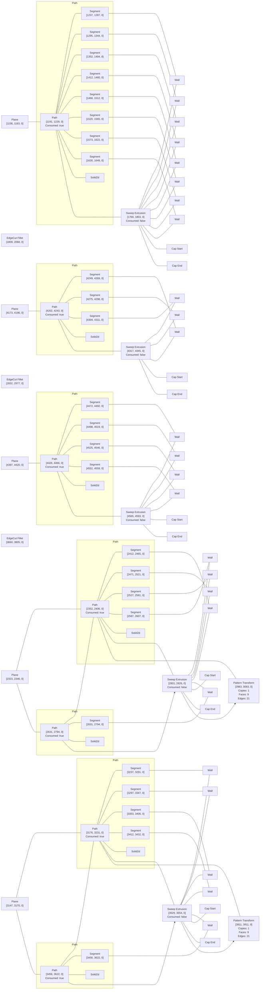

```mermaid
flowchart LR
  subgraph path2 [Path]
    2["Path<br>[1191, 1229, 0]<br>Consumed: true"]
      %% [ProgramBodyItem { index: 11 }, VariableDeclarationDeclaration, VariableDeclarationInit, FunctionExpressionBody, FunctionExpressionBodyItem { index: 0 }, VariableDeclarationDeclaration, VariableDeclarationInit, PipeBodyItem { index: 1 }]
    3["Segment<br>[1237, 1287, 0]"]
      %% [ProgramBodyItem { index: 11 }, VariableDeclarationDeclaration, VariableDeclarationInit, FunctionExpressionBody, FunctionExpressionBodyItem { index: 0 }, VariableDeclarationDeclaration, VariableDeclarationInit, PipeBodyItem { index: 2 }]
    4["Segment<br>[1295, 1344, 0]"]
      %% [ProgramBodyItem { index: 11 }, VariableDeclarationDeclaration, VariableDeclarationInit, FunctionExpressionBody, FunctionExpressionBodyItem { index: 0 }, VariableDeclarationDeclaration, VariableDeclarationInit, PipeBodyItem { index: 3 }]
    5["Segment<br>[1352, 1404, 0]"]
      %% [ProgramBodyItem { index: 11 }, VariableDeclarationDeclaration, VariableDeclarationInit, FunctionExpressionBody, FunctionExpressionBodyItem { index: 0 }, VariableDeclarationDeclaration, VariableDeclarationInit, PipeBodyItem { index: 4 }]
    6["Segment<br>[1412, 1460, 0]"]
      %% [ProgramBodyItem { index: 11 }, VariableDeclarationDeclaration, VariableDeclarationInit, FunctionExpressionBody, FunctionExpressionBodyItem { index: 0 }, VariableDeclarationDeclaration, VariableDeclarationInit, PipeBodyItem { index: 5 }]
    7["Segment<br>[1468, 1512, 0]"]
      %% [ProgramBodyItem { index: 11 }, VariableDeclarationDeclaration, VariableDeclarationInit, FunctionExpressionBody, FunctionExpressionBodyItem { index: 0 }, VariableDeclarationDeclaration, VariableDeclarationInit, PipeBodyItem { index: 6 }]
    8["Segment<br>[1520, 1565, 0]"]
      %% [ProgramBodyItem { index: 11 }, VariableDeclarationDeclaration, VariableDeclarationInit, FunctionExpressionBody, FunctionExpressionBodyItem { index: 0 }, VariableDeclarationDeclaration, VariableDeclarationInit, PipeBodyItem { index: 7 }]
    9["Segment<br>[1573, 1622, 0]"]
      %% [ProgramBodyItem { index: 11 }, VariableDeclarationDeclaration, VariableDeclarationInit, FunctionExpressionBody, FunctionExpressionBodyItem { index: 0 }, VariableDeclarationDeclaration, VariableDeclarationInit, PipeBodyItem { index: 8 }]
    10["Segment<br>[1630, 1649, 0]"]
      %% [ProgramBodyItem { index: 11 }, VariableDeclarationDeclaration, VariableDeclarationInit, FunctionExpressionBody, FunctionExpressionBodyItem { index: 0 }, VariableDeclarationDeclaration, VariableDeclarationInit, PipeBodyItem { index: 9 }]
    11[Solid2d]
  end
  subgraph path25 [Path]
    25["Path<br>[2352, 2406, 0]<br>Consumed: true"]
      %% [ProgramBodyItem { index: 15 }, VariableDeclarationDeclaration, VariableDeclarationInit, PipeBodyItem { index: 1 }]
    26["Segment<br>[2412, 2465, 0]"]
      %% [ProgramBodyItem { index: 15 }, VariableDeclarationDeclaration, VariableDeclarationInit, PipeBodyItem { index: 2 }]
    27["Segment<br>[2471, 2521, 0]"]
      %% [ProgramBodyItem { index: 15 }, VariableDeclarationDeclaration, VariableDeclarationInit, PipeBodyItem { index: 3 }]
    28["Segment<br>[2527, 2581, 0]"]
      %% [ProgramBodyItem { index: 15 }, VariableDeclarationDeclaration, VariableDeclarationInit, PipeBodyItem { index: 4 }]
    29["Segment<br>[2587, 2607, 0]"]
      %% [ProgramBodyItem { index: 15 }, VariableDeclarationDeclaration, VariableDeclarationInit, PipeBodyItem { index: 5 }]
    30[Solid2d]
  end
  subgraph path31 [Path]
    31["Path<br>[2631, 2794, 0]<br>Consumed: true"]
      %% [ProgramBodyItem { index: 15 }, VariableDeclarationDeclaration, VariableDeclarationInit, PipeBodyItem { index: 6 }, CallKwArg { index: 0 }]
    32["Segment<br>[2631, 2794, 0]"]
      %% [ProgramBodyItem { index: 15 }, VariableDeclarationDeclaration, VariableDeclarationInit, PipeBodyItem { index: 6 }, CallKwArg { index: 0 }]
    33[Solid2d]
  end
  subgraph path45 [Path]
    45["Path<br>[3176, 3231, 0]<br>Consumed: true"]
      %% [ProgramBodyItem { index: 16 }, VariableDeclarationDeclaration, VariableDeclarationInit, PipeBodyItem { index: 1 }]
    46["Segment<br>[3237, 3291, 0]"]
      %% [ProgramBodyItem { index: 16 }, VariableDeclarationDeclaration, VariableDeclarationInit, PipeBodyItem { index: 2 }]
    47["Segment<br>[3297, 3347, 0]"]
      %% [ProgramBodyItem { index: 16 }, VariableDeclarationDeclaration, VariableDeclarationInit, PipeBodyItem { index: 3 }]
    48["Segment<br>[3353, 3406, 0]"]
      %% [ProgramBodyItem { index: 16 }, VariableDeclarationDeclaration, VariableDeclarationInit, PipeBodyItem { index: 4 }]
    49["Segment<br>[3412, 3432, 0]"]
      %% [ProgramBodyItem { index: 16 }, VariableDeclarationDeclaration, VariableDeclarationInit, PipeBodyItem { index: 5 }]
    50[Solid2d]
  end
  subgraph path51 [Path]
    51["Path<br>[3456, 3622, 0]<br>Consumed: true"]
      %% [ProgramBodyItem { index: 16 }, VariableDeclarationDeclaration, VariableDeclarationInit, PipeBodyItem { index: 6 }, CallKwArg { index: 0 }]
    52["Segment<br>[3456, 3622, 0]"]
      %% [ProgramBodyItem { index: 16 }, VariableDeclarationDeclaration, VariableDeclarationInit, PipeBodyItem { index: 6 }, CallKwArg { index: 0 }]
    53[Solid2d]
  end
  subgraph path65 [Path]
    65["Path<br>[4202, 4243, 0]<br>Consumed: true"]
      %% [ProgramBodyItem { index: 18 }, VariableDeclarationDeclaration, VariableDeclarationInit, PipeBodyItem { index: 1 }]
    66["Segment<br>[4249, 4269, 0]"]
      %% [ProgramBodyItem { index: 18 }, VariableDeclarationDeclaration, VariableDeclarationInit, PipeBodyItem { index: 2 }]
    67["Segment<br>[4275, 4298, 0]"]
      %% [ProgramBodyItem { index: 18 }, VariableDeclarationDeclaration, VariableDeclarationInit, PipeBodyItem { index: 3 }]
    68["Segment<br>[4304, 4311, 0]"]
      %% [ProgramBodyItem { index: 18 }, VariableDeclarationDeclaration, VariableDeclarationInit, PipeBodyItem { index: 4 }]
    69[Solid2d]
  end
  subgraph path77 [Path]
    77["Path<br>[4426, 4466, 0]<br>Consumed: true"]
      %% [ProgramBodyItem { index: 19 }, VariableDeclarationDeclaration, VariableDeclarationInit, PipeBodyItem { index: 1 }]
    78["Segment<br>[4472, 4492, 0]"]
      %% [ProgramBodyItem { index: 19 }, VariableDeclarationDeclaration, VariableDeclarationInit, PipeBodyItem { index: 2 }]
    79["Segment<br>[4498, 4519, 0]"]
      %% [ProgramBodyItem { index: 19 }, VariableDeclarationDeclaration, VariableDeclarationInit, PipeBodyItem { index: 3 }]
    80["Segment<br>[4525, 4546, 0]"]
      %% [ProgramBodyItem { index: 19 }, VariableDeclarationDeclaration, VariableDeclarationInit, PipeBodyItem { index: 4 }]
    81["Segment<br>[4552, 4559, 0]"]
      %% [ProgramBodyItem { index: 19 }, VariableDeclarationDeclaration, VariableDeclarationInit, PipeBodyItem { index: 5 }]
    82[Solid2d]
  end
  1["Plane<br>[1156, 1183, 0]"]
    %% [ProgramBodyItem { index: 11 }, VariableDeclarationDeclaration, VariableDeclarationInit, FunctionExpressionBody, FunctionExpressionBodyItem { index: 0 }, VariableDeclarationDeclaration, VariableDeclarationInit, PipeBodyItem { index: 0 }]
  12["Sweep Extrusion<br>[1769, 1803, 0]<br>Consumed: false"]
    %% [ProgramBodyItem { index: 13 }, VariableDeclarationDeclaration, VariableDeclarationInit, PipeBodyItem { index: 1 }]
  13[Wall]
    %% face_code_ref=Missing NodePath
  14[Wall]
    %% face_code_ref=Missing NodePath
  15[Wall]
    %% face_code_ref=Missing NodePath
  16[Wall]
    %% face_code_ref=Missing NodePath
  17[Wall]
    %% face_code_ref=Missing NodePath
  18[Wall]
    %% face_code_ref=Missing NodePath
  19[Wall]
    %% face_code_ref=Missing NodePath
  20[Wall]
    %% face_code_ref=Missing NodePath
  21["Cap Start"]
    %% face_code_ref=Missing NodePath
  22["Cap End"]
    %% face_code_ref=Missing NodePath
  23["EdgeCut Fillet<br>[1809, 2068, 0]"]
    %% [ProgramBodyItem { index: 13 }, VariableDeclarationDeclaration, VariableDeclarationInit, PipeBodyItem { index: 2 }]
  24["Plane<br>[2323, 2346, 0]"]
    %% [ProgramBodyItem { index: 15 }, VariableDeclarationDeclaration, VariableDeclarationInit, PipeBodyItem { index: 0 }]
  34["Sweep Extrusion<br>[2801, 2826, 0]<br>Consumed: false"]
    %% [ProgramBodyItem { index: 15 }, VariableDeclarationDeclaration, VariableDeclarationInit, PipeBodyItem { index: 7 }]
  35[Wall]
    %% face_code_ref=Missing NodePath
  36[Wall]
    %% face_code_ref=Missing NodePath
  37[Wall]
    %% face_code_ref=Missing NodePath
  38[Wall]
    %% face_code_ref=Missing NodePath
  39[Wall]
    %% face_code_ref=Missing NodePath
  40["Cap Start"]
    %% face_code_ref=Missing NodePath
  41["Cap End"]
    %% face_code_ref=Missing NodePath
  42["EdgeCut Fillet<br>[2832, 2977, 0]"]
    %% [ProgramBodyItem { index: 15 }, VariableDeclarationDeclaration, VariableDeclarationInit, PipeBodyItem { index: 8 }]
  43["Pattern Transform<br>[2983, 3083, 0]<br>Copies: 1<br>Faces: 9<br>Edges: 21"]
    %% [ProgramBodyItem { index: 15 }, VariableDeclarationDeclaration, VariableDeclarationInit, PipeBodyItem { index: 9 }]
  44["Plane<br>[3147, 3170, 0]"]
    %% [ProgramBodyItem { index: 16 }, VariableDeclarationDeclaration, VariableDeclarationInit, PipeBodyItem { index: 0 }]
  54["Sweep Extrusion<br>[3629, 3654, 0]<br>Consumed: false"]
    %% [ProgramBodyItem { index: 16 }, VariableDeclarationDeclaration, VariableDeclarationInit, PipeBodyItem { index: 7 }]
  55[Wall]
    %% face_code_ref=Missing NodePath
  56[Wall]
    %% face_code_ref=Missing NodePath
  57[Wall]
    %% face_code_ref=Missing NodePath
  58[Wall]
    %% face_code_ref=Missing NodePath
  59[Wall]
    %% face_code_ref=Missing NodePath
  60["Cap Start"]
    %% face_code_ref=Missing NodePath
  61["Cap End"]
    %% face_code_ref=Missing NodePath
  62["EdgeCut Fillet<br>[3660, 3805, 0]"]
    %% [ProgramBodyItem { index: 16 }, VariableDeclarationDeclaration, VariableDeclarationInit, PipeBodyItem { index: 8 }]
  63["Pattern Transform<br>[3811, 3911, 0]<br>Copies: 1<br>Faces: 9<br>Edges: 21"]
    %% [ProgramBodyItem { index: 16 }, VariableDeclarationDeclaration, VariableDeclarationInit, PipeBodyItem { index: 9 }]
  64["Plane<br>[4173, 4196, 0]"]
    %% [ProgramBodyItem { index: 18 }, VariableDeclarationDeclaration, VariableDeclarationInit, PipeBodyItem { index: 0 }]
  70["Sweep Extrusion<br>[4317, 4345, 0]<br>Consumed: false"]
    %% [ProgramBodyItem { index: 18 }, VariableDeclarationDeclaration, VariableDeclarationInit, PipeBodyItem { index: 5 }]
  71[Wall]
    %% face_code_ref=Missing NodePath
  72[Wall]
    %% face_code_ref=Missing NodePath
  73[Wall]
    %% face_code_ref=Missing NodePath
  74["Cap Start"]
    %% face_code_ref=Missing NodePath
  75["Cap End"]
    %% face_code_ref=Missing NodePath
  76["Plane<br>[4397, 4420, 0]"]
    %% [ProgramBodyItem { index: 19 }, VariableDeclarationDeclaration, VariableDeclarationInit, PipeBodyItem { index: 0 }]
  83["Sweep Extrusion<br>[4565, 4593, 0]<br>Consumed: false"]
    %% [ProgramBodyItem { index: 19 }, VariableDeclarationDeclaration, VariableDeclarationInit, PipeBodyItem { index: 6 }]
  84[Wall]
    %% face_code_ref=Missing NodePath
  85[Wall]
    %% face_code_ref=Missing NodePath
  86[Wall]
    %% face_code_ref=Missing NodePath
  87[Wall]
    %% face_code_ref=Missing NodePath
  88["Cap Start"]
    %% face_code_ref=Missing NodePath
  89["Cap End"]
    %% face_code_ref=Missing NodePath
  1 --- 2
  2 --- 3
  2 --- 4
  2 --- 5
  2 --- 6
  2 --- 7
  2 --- 8
  2 --- 9
  2 --- 10
  2 --- 11
  2 ---- 12
  3 --- 13
  4 --- 14
  5 --- 15
  6 --- 16
  7 --- 17
  8 --- 18
  9 --- 19
  10 --- 20
  12 --- 13
  12 --- 14
  12 --- 15
  12 --- 16
  12 --- 17
  12 --- 18
  12 --- 19
  12 --- 20
  12 --- 21
  12 --- 22
  24 --- 25
  24 --- 31
  25 --- 26
  25 --- 27
  25 --- 28
  25 --- 29
  25 --- 30
  31 --- 25
  25 ---- 34
  25 --- 43
  26 --- 38
  27 --- 37
  28 --- 36
  29 --- 35
  31 --- 32
  31 --- 33
  31 x---> 34
  32 --- 39
  34 --- 35
  34 --- 36
  34 --- 37
  34 --- 38
  34 --- 39
  34 --- 40
  34 --- 41
  34 x--> 43
  44 --- 45
  44 --- 51
  45 --- 46
  45 --- 47
  45 --- 48
  45 --- 49
  45 --- 50
  51 --- 45
  45 ---- 54
  45 --- 63
  46 --- 55
  47 --- 56
  48 --- 57
  49 --- 58
  51 --- 52
  51 --- 53
  51 x---> 54
  52 --- 59
  54 --- 55
  54 --- 56
  54 --- 57
  54 --- 58
  54 --- 59
  54 --- 60
  54 --- 61
  54 x--> 63
  64 --- 65
  65 --- 66
  65 --- 67
  65 --- 68
  65 --- 69
  65 ---- 70
  66 --- 73
  67 --- 72
  68 --- 71
  70 --- 71
  70 --- 72
  70 --- 73
  70 --- 74
  70 --- 75
  76 --- 77
  77 --- 78
  77 --- 79
  77 --- 80
  77 --- 81
  77 --- 82
  77 ---- 83
  78 --- 84
  79 --- 85
  80 --- 86
  81 --- 87
  83 --- 84
  83 --- 85
  83 --- 86
  83 --- 87
  83 --- 88
  83 --- 89
```
