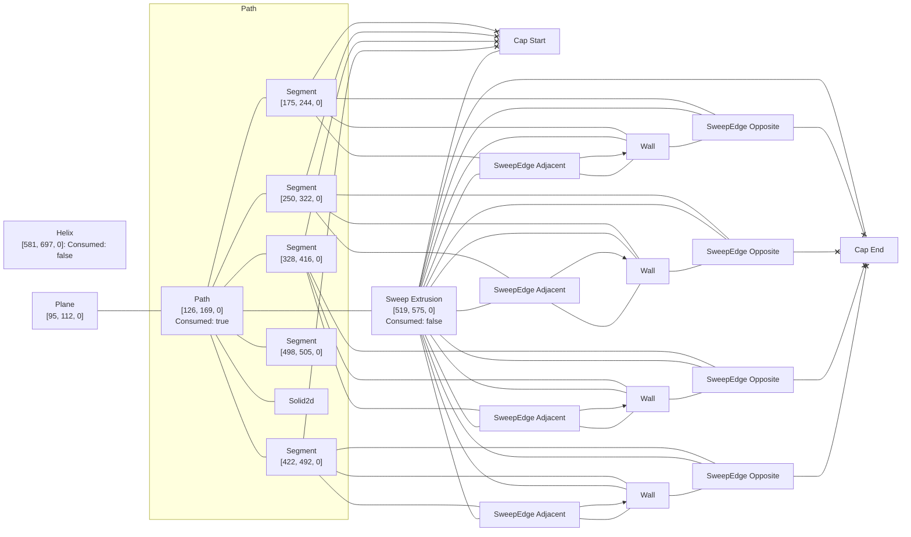

```mermaid
flowchart LR
  subgraph path4 [Path]
    4["Path<br>[126, 169, 0]<br>Consumed: true"]
      %% [ProgramBodyItem { index: 1 }, VariableDeclarationDeclaration, VariableDeclarationInit, PipeBodyItem { index: 0 }]
    6["Segment<br>[175, 244, 0]"]
      %% [ProgramBodyItem { index: 1 }, VariableDeclarationDeclaration, VariableDeclarationInit, PipeBodyItem { index: 1 }]
    7["Segment<br>[250, 322, 0]"]
      %% [ProgramBodyItem { index: 1 }, VariableDeclarationDeclaration, VariableDeclarationInit, PipeBodyItem { index: 2 }]
    8["Segment<br>[328, 416, 0]"]
      %% [ProgramBodyItem { index: 1 }, VariableDeclarationDeclaration, VariableDeclarationInit, PipeBodyItem { index: 3 }]
    9["Segment<br>[422, 492, 0]"]
      %% [ProgramBodyItem { index: 1 }, VariableDeclarationDeclaration, VariableDeclarationInit, PipeBodyItem { index: 4 }]
    10["Segment<br>[498, 505, 0]"]
      %% [ProgramBodyItem { index: 1 }, VariableDeclarationDeclaration, VariableDeclarationInit, PipeBodyItem { index: 5 }]
    11[Solid2d]
  end
  5["Plane<br>[95, 112, 0]"]
    %% [ProgramBodyItem { index: 0 }, VariableDeclarationDeclaration, VariableDeclarationInit]
  12["Sweep Extrusion<br>[519, 575, 0]<br>Consumed: false"]
    %% [ProgramBodyItem { index: 2 }, VariableDeclarationDeclaration, VariableDeclarationInit]
  24[Wall]
    %% face_code_ref=Missing NodePath
  23[Wall]
    %% face_code_ref=Missing NodePath
  22[Wall]
    %% face_code_ref=Missing NodePath
  21[Wall]
    %% face_code_ref=Missing NodePath
  2["Cap Start"]
    %% face_code_ref=Missing NodePath
  1["Cap End"]
    %% face_code_ref=Missing NodePath
  20["SweepEdge Opposite"]
  16["SweepEdge Adjacent"]
  19["SweepEdge Opposite"]
  15["SweepEdge Adjacent"]
  18["SweepEdge Opposite"]
  14["SweepEdge Adjacent"]
  17["SweepEdge Opposite"]
  13["SweepEdge Adjacent"]
  3["Helix<br>[581, 697, 0]: Consumed: false"]
    %% [ProgramBodyItem { index: 3 }, VariableDeclarationDeclaration, VariableDeclarationInit]
  12 --- 1
  17 <--x 1
  18 <--x 1
  19 <--x 1
  20 <--x 1
  6 <--x 2
  7 <--x 2
  8 <--x 2
  9 <--x 2
  12 --- 2
  5 --- 4
  4 --- 6
  4 --- 7
  4 --- 8
  4 --- 9
  4 --- 10
  4 --- 11
  4 ---- 12
  6 --- 13
  6 --- 17
  6 --- 21
  7 --- 14
  7 --- 18
  7 --- 22
  8 --- 15
  8 --- 19
  8 --- 23
  9 --- 16
  9 --- 20
  9 --- 24
  12 --- 13
  12 --- 14
  12 --- 15
  12 --- 16
  12 --- 17
  12 --- 18
  12 --- 19
  12 --- 20
  12 --- 21
  12 --- 22
  12 --- 23
  12 --- 24
  21 --- 13
  13 x--> 21
  22 --- 14
  14 x--> 22
  23 --- 15
  15 x--> 23
  24 --- 16
  16 x--> 24
  21 --- 17
  22 --- 18
  23 --- 19
  24 --- 20
```
