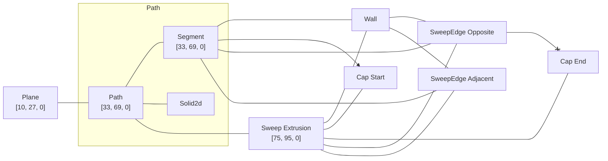

```mermaid
flowchart LR
  subgraph path2 [Path]
    2["Path<br>[33, 69, 0]"]
      %% [ProgramBodyItem { index: 0 }, VariableDeclarationDeclaration, VariableDeclarationInit, PipeBodyItem { index: 1 }]
    3["Segment<br>[33, 69, 0]"]
      %% [ProgramBodyItem { index: 0 }, VariableDeclarationDeclaration, VariableDeclarationInit, PipeBodyItem { index: 1 }]
    4[Solid2d]
  end
  1["Plane<br>[10, 27, 0]"]
    %% [ProgramBodyItem { index: 0 }, VariableDeclarationDeclaration, VariableDeclarationInit, PipeBodyItem { index: 0 }]
  5["Sweep Extrusion<br>[75, 95, 0]"]
    %% [ProgramBodyItem { index: 0 }, VariableDeclarationDeclaration, VariableDeclarationInit, PipeBodyItem { index: 2 }]
  6[Wall]
  7["Cap Start"]
  8["Cap End"]
  9["SweepEdge Opposite"]
  10["SweepEdge Adjacent"]
  1 --- 2
  2 --- 3
  2 --- 4
  2 ---- 5
  3 --- 6
  3 x--> 7
  3 --- 9
  3 --- 10
  5 --- 6
  5 --- 7
  5 --- 8
  5 --- 9
  5 --- 10
  6 --- 9
  6 --- 10
  9 <--x 8
```
