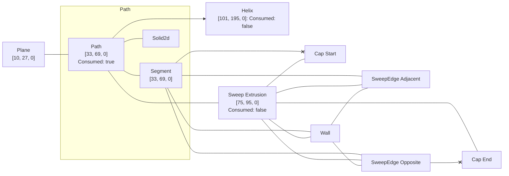

```mermaid
flowchart LR
  subgraph path4 [Path]
    4["Path<br>[33, 69, 0]<br>Consumed: true"]
      %% [ProgramBodyItem { index: 0 }, VariableDeclarationDeclaration, VariableDeclarationInit, PipeBodyItem { index: 1 }]
    6["Segment<br>[33, 69, 0]"]
      %% [ProgramBodyItem { index: 0 }, VariableDeclarationDeclaration, VariableDeclarationInit, PipeBodyItem { index: 1 }]
    7[Solid2d]
  end
  1["Cap End"]
    %% face_code_ref=Missing NodePath
  2["Cap Start"]
    %% face_code_ref=Missing NodePath
  3["Helix<br>[101, 195, 0]: Consumed: false"]
    %% [ProgramBodyItem { index: 0 }, VariableDeclarationDeclaration, VariableDeclarationInit, PipeBodyItem { index: 3 }]
  5["Plane<br>[10, 27, 0]"]
    %% [ProgramBodyItem { index: 0 }, VariableDeclarationDeclaration, VariableDeclarationInit, PipeBodyItem { index: 0 }]
  8["Sweep Extrusion<br>[75, 95, 0]<br>Consumed: false"]
    %% [ProgramBodyItem { index: 0 }, VariableDeclarationDeclaration, VariableDeclarationInit, PipeBodyItem { index: 2 }]
  9["SweepEdge Adjacent"]
  10["SweepEdge Opposite"]
  11[Wall]
    %% face_code_ref=Missing NodePath
  8 --- 1
  10 <--x 1
  6 <--x 2
  8 --- 2
  4 x--> 3
  5 --- 4
  4 --- 6
  4 --- 7
  4 ---- 8
  6 --- 9
  6 --- 10
  6 --- 11
  8 --- 9
  8 --- 10
  8 --- 11
  11 --- 9
  11 --- 10
```
