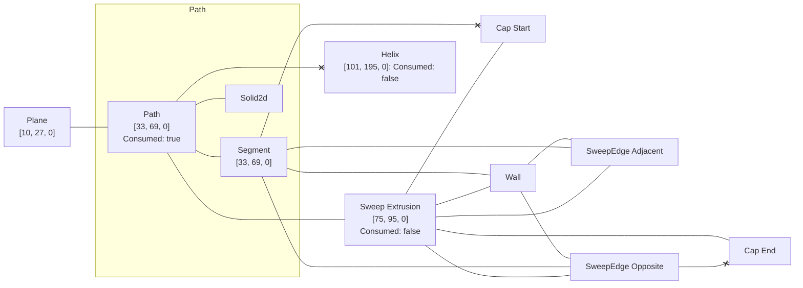

```mermaid
flowchart LR
  subgraph path5 [Path]
    5["Path<br>[33, 69, 0]<br>Consumed: true"]
      %% [ProgramBodyItem { index: 0 }, VariableDeclarationDeclaration, VariableDeclarationInit, PipeBodyItem { index: 1 }]
    6["Segment<br>[33, 69, 0]"]
      %% [ProgramBodyItem { index: 0 }, VariableDeclarationDeclaration, VariableDeclarationInit, PipeBodyItem { index: 1 }]
    9[Solid2d]
  end
  1["Cap End"]
    %% face_code_ref=Missing NodePath
  2["Cap Start"]
    %% face_code_ref=Missing NodePath
  3[Wall]
    %% face_code_ref=Missing NodePath
  4["Plane<br>[10, 27, 0]"]
    %% [ProgramBodyItem { index: 0 }, VariableDeclarationDeclaration, VariableDeclarationInit, PipeBodyItem { index: 0 }]
  7["Sweep Extrusion<br>[75, 95, 0]<br>Consumed: false"]
    %% [ProgramBodyItem { index: 0 }, VariableDeclarationDeclaration, VariableDeclarationInit, PipeBodyItem { index: 2 }]
  8["Helix<br>[101, 195, 0]: Consumed: false"]
    %% [ProgramBodyItem { index: 0 }, VariableDeclarationDeclaration, VariableDeclarationInit, PipeBodyItem { index: 3 }]
  10["SweepEdge Adjacent"]
  11["SweepEdge Opposite"]
  7 --- 1
  11 <--x 1
  6 <--x 2
  7 --- 2
  6 --- 3
  7 --- 3
  3 --- 10
  3 --- 11
  4 --- 5
  5 --- 6
  5 ---- 7
  5 <--x 8
  5 --- 9
  6 --- 10
  6 --- 11
  7 --- 10
  7 --- 11
```
