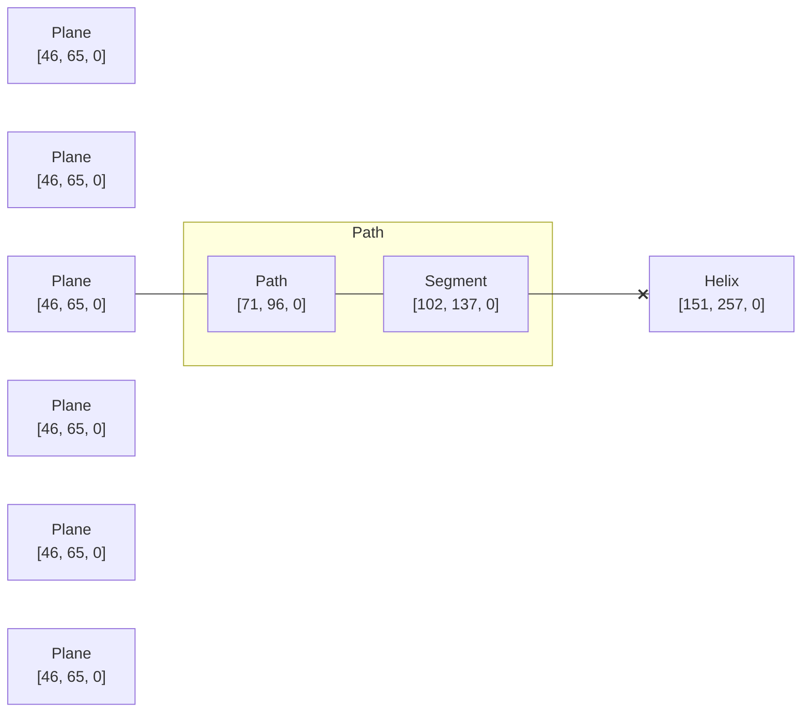

```mermaid
flowchart LR
  subgraph path7 [Path]
    7["Path<br>[71, 96, 0]"]
    8["Segment<br>[102, 137, 0]"]
  end
  1["Plane<br>[46, 65, 0]"]
  2["Plane<br>[46, 65, 0]"]
  3["Plane<br>[46, 65, 0]"]
  4["Plane<br>[46, 65, 0]"]
  5["Plane<br>[46, 65, 0]"]
  6["Plane<br>[46, 65, 0]"]
  9["Helix<br>[151, 257, 0]"]
  3 --- 7
  7 --- 8
  8 <--x 9
```
