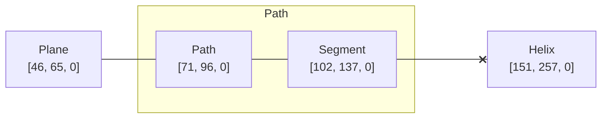

```mermaid
flowchart LR
  subgraph path2 [Path]
    2["Path<br>[71, 96, 0]"]
    3["Segment<br>[102, 137, 0]"]
  end
  1["Plane<br>[46, 65, 0]"]
  4["Helix<br>[151, 257, 0]"]
  1 --- 2
  2 --- 3
  3 <--x 4
```
