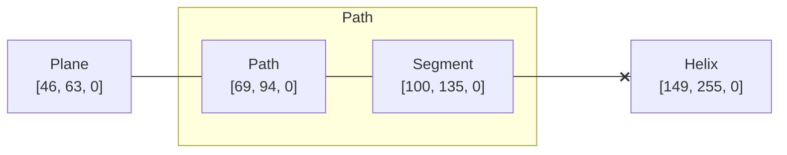

```mermaid
flowchart LR
  subgraph path2 [Path]
    2["Path<br>[69, 94, 0]"]
    3["Segment<br>[100, 135, 0]"]
  end
  1["Plane<br>[46, 63, 0]"]
  4["Helix<br>[149, 255, 0]"]
  1 --- 2
  2 --- 3
  3 <--x 4
```
